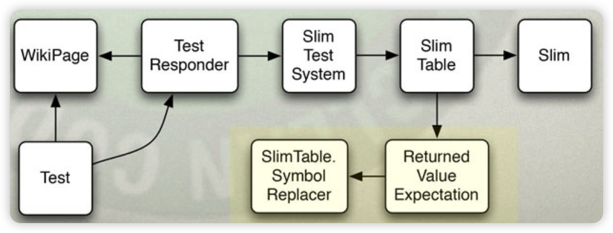

# Advanced TDD

- [Advanced TDD Workshop](https://learning.oreilly.com/live-events/advanced-test-driven-development-tdd/0636920239543/0790145055189/)

## THE THREE LAWS OF TEST DRIVEN DEVELOPMENT

### ARBITRARY DISCIPLINE

- Like a surgeon scrubbing for surgery
- Like a pilot following a checklist

### THE FIRST LAW

- You are not allowed to write any production code until you have written a unit test that fails due to its absence.

### THE SECOND LAW

- You are not allowed to write more of a unit test than is sufficient to fail, and not compiling is failing.

### THE THIRD LAW

- You are not allowed to write more production code than is sufficient to pass the currently failing test to pass.

### THE CODE EXAMPLES

- Have you integrated a third party package.
  - You read the code examples, not the manual.
- Unit tests are the code examples for the whole system

### DOCUMENTS!

- Written in a language you understand.
- Utterly unambiguous.
- So formal they execute.
- They cannot get out of sync with the application.
- Easy to understand. Not a system.

### TEST AFTER THE FACT?

- Boring
  - You've already tested manually. 
- The function that's hard to test...
  - Leave a hole in the test suite. 
  - And fi you do it...
- Do you shrug when your tests pass?

### TEST FIRST

- Fun. You make it work!
- You can't write the function that's hard to test.
- System is testable.
- System is decoupled.
- You trust the tests!

### OBJECTIONS HEARD (BUT NOT BELIEVED)
- "I know how to just write the class, but don't know how to test it."
- "We have to write twice as much code and provide two people to do it."
- "I have to debug twice as much code."
- "We have a testing department."
- "I can test my code after I write it."

### PROFESSIONALISM RANT.
- Laborers take orders.
- Professionals "Profess"
  - Hired for knowledge and expertise
- Managers will push, and want pushback.
  - Professionals push back.
### WHO ELSE HAS OUR PROBLEM
- We produce complex documents full of arcane symbols.
- Must be correct or terrible things happen.

### ACCOUNTANTS!
- The right digit, in the right place, at the right time...
- Brings the company down and sends the executives to jail.

### HOW DO ACCOUNTANTS PREVENT THIS?
- They have a discipline.
- 500 years old.
- Double Entry Bookkeeping.

### DOUBLE ENTRY BOOK KEEPING.

- Every transaction is entered twice.
- Once under Assets. Once under Liabilities and Equities.
- The two sides are summed.
- The sums are subtracted on the balance sheet.
- The result must be zero.

### THE PROCEDURE

- Accountants are taught to enter transactions one at a time.
- For obvious reasons.

### TDD IS DOUBLE ENTRY BOOKKEEPING.
- The practices are the same.
- They are done for the same reason.
- Every behavior is entered twice.
  - Once as a test, again as production code.
- The two entries must agree.

### IF ACCOUNTANTS CAN DO IT...
- Accountants have schedules and deadlines just like us.
- Our documents are not less important than the accountant's
- If they can do it...

## CLEAN TESTS

### WHAT DOES THIS TEST DO?

```java
@Test
public void tableWithSymbolSubstitution () throws Exception {
    getResultsForPageContents(
            "! |DT: fitnesse.slim.test.TestSlim/\n" +
                    "Istring|getStringArg?|\n" +
                    " |Bob| $V=|\n" +
                    "I$VI$VI\n" +
                    " [Bill I$V| \n" +
                    " | John | $Ql \n"
    );
    TableScanner ts = getScannedResults();
    Table dt = ts.getTable(0);
    assertEquals("$V<-[Bob]", unescape(dt.getCellContents(1, 2)));
    assertEquals("$V-> [Bob]", unescape(dt.getCellContents(0, 3)));
    assertEquals("<span class=\"pass\">$V->[Bob]</span>", unescape(dt.getCellContents(1, 3)));
    assertEquals("[Bill] ‹span class=\"fail\"›expected [$V->[Bob]]</span>", unescape(dt.getCellContents(1, 4)));
    assertEquals("[John] ‹span class=\"fail\"›expected [$Q]</span>", unescape(dt.getCellContents(1, 5)));
}
```

### PROBLEMS WITH THIS TEST.

- More than one logical assert
- Accidental Complexity(`getScannedResults()`. `getTable(0)`)
- Too Slow
- Wide Scope
  - 
- Colloquialisms

### BETTER TESTs

```java
@Test
public void matchedSymbolIsReplaced () throws Exception {
    testContext.setSymbol("S", "Value");
    assertExpectationMessage("$S", "Value", "pass ($S->[Value])");
}

@Test
public void mismatchedSymbolIsReplaced () throws Exception {
    testContext.setSymbol("S", "Value");
    assertExpectationMessage("$S", "WrongValue", "[WrongValue] fail (expected [$S->[Value]])");
}
```

- One Logical Assert
- No Accidental Complexity
- Fast
- Narrow Scope
- Meaningful Values

### COMPOSED ASSERTION

```java
private void assertExpectationMessage (String expected, String value, String message) throws Exception {
    TableScanner ts = new HtmlTableScanner("<table><tr>td>x</td></tr>/table>");
    Table t = ts.getTable(0);
    SlimTable slimTable = new DecisionTable(t, "id", testContext);
    SlimTable.Expectation expectation = slimTable.makeReturnedValueExpectation("instructionId", 1, 2);
    assertEquals(message, HtmiTable.colorize(expectation.evaluationMessage(value, expected)));
    assertEquals(message, expectation.getEvaluationMessage());
    assertEquals(2, expectation.getRow());
    assertEquals(1, expectation.getCol());
    assertEquals("instructionId", expectation.getInstructionTag());
}
```
- Changes many asserts into one.
- Hides accidental complexity.

### COMPOSED TEST RESULT

```java
@Test
public void turnOnHeaterAndBlowerIfTooCold() throws Exception {
    tooCold();
    assertState("HBch]");
}

public String getState () {
    String state = "";
    state += heater ? "H" : "h";
    state += blower ? "B" : "b";
    state += cooler ? "C" : "с";
    state += hiTempAlarm ? "H" : "h";
    state += loTempAlarm ? "L" : "1";
    return state;
}
```

- A test result that merges many variables into one. 
  - e.g. Booleans into an integer or a string.
- Human interpretation should be simple.
- Changes many asserts into one

## STUBBING VS MOCKING TESTING BEHAVIOR VS STATE

### Test Doubles

- Dummy: Do nothing. Return degenerate values.
  ```java
  public interface Authenticator {
      Boolean authenticate(String username, String password);
  }

  public class AuthenticatorStub implements Authenticator {
      public Boolean authenticate(String username, String password) {
          return null;
      }
  }
  ```
  
- STUBS: ADummy that returns Test Specific Values.
  ```java
  public class RejectingAuthenticatorStub implements Authenticator {
    public Boolean authenticate (String username, String password) {
        return false;
    }
  }
  
  public class PromiscuousAuthenticatorStub implements Authenticator {
    public Boolean authenticate (String username, String password) {
        return true;
    }
  }
  ```
- SPIES: Stub that remembers facts about the method calls.
```java
public class AuthenticatorSpy implements Authenticator {
  private Boolean result = null;
  private int count = 0;
  private String lastUsername;
  private String lastPassword;
  
  public String getLastUsername () { return lastUsername; }
  public String getLastPassword() { return lastPassword; }
  public int getCount () { return count; }
  public void setResult (Boolean result) { this.result = result; }
  
  public Boolean authenticate (String username, String password) {
    count++;
    lastUsername = username;
    lastPassword = password;
    return result;
  }
}

@Test
public void authenticatorCalledCorrectly() throws Exception {
  AuthenticatorSpy spy = new AuthenticatorSpy ();
  LoginPage page = new LoginPage (spy) ;
  spy.setResult (true) ;
  page.show () ;
  boolean success = page. submit ("user", "pw") ;
  assertTrue (success) ;
  assertEquals (1, spy.getCount ()) ;
  assertEquals ("user", spy.getLastUsername () ) ;
  assertEquals ("pw", spy.getlastPassword ()) ;
}
```
- МОСК:  Spy that knows how methods should be called.
- FAKE:  A Simple Simulator.
```java
public class AuthenticatorFake implements Authenticator {
  public Boolean authenticate(String username, String password) {
    return(username.equals("unclebobmartin") && password.equals("xyzzy"));
  }
}
```

### THE TDD UNCERTAINTY PRINCIPLE

- Testing State leaves you uncertain that all answers will be correct.
- Mocking provides certainty but leads to Fragile Tests.
    - Fragility increases with certainty.

### WISDOM

- Avoid Test Doubles except when crossing architectural boundaries.
- Avoid Mocking tools unless you need superpowers.

## F.I.R.S.T Principles

- Fast: test runs < 1 second.
    - DB, Web Container Isolation
    - 
- Isolated: fault is clearly isolated
    - Tests do not depend upon each other. Each tests can stand alone.
    - Tests can be run in any order.
    - Junit does not guarantee order.
    - Be careful of static variables.
- Repeatable: constant behavior
    - Tests should not be dependent upon environmental issues.
    - Should run the same in the lab, and at 30,000 feet over the Atlantic.
    - Never subject to network timing, memory usage, other processes, etc.
    - There should never be an excuse for a failure.
    - 외부 요인에 영향을 받지 않아야 함
- Self-verifying: pass or fail
    - The test has a binary result. Pass/ Fail.
    - No interpretation is required.
- Timely: 1 code change = 1 test
    - Tests are written first, before the code that passes them. (most of the time).

### THE REAL MEANING OF "FIRST"
- The Tests Come First.
  - They are written first.
  - They are refactored first.
  - They are higher priority than the application code.
- Because without the tests
  - The code must rot.

## 테스트 설계

### DECOUPLE TESTS FROM APPLICATION CODE
• Otherwise the tests become fragile.
• Al the same principles apply.
• Use a testing API to isolate the tests from the code.
• Do not allow the tests to be too intimate with the code.

### DECOUPLE THE STRUCTURE
- Do not create a test class for each production class!
- This couples the structure and creates fragility.

### ADD TESTS, BUT EXTRACT FUNCTIONS AND CLASSES.


> AS THE TESTS GET MORE SPECIFIC...
> THE CODE GETS MORE GENERIC.


## TEST PATTERNS

### TEST SPECIFIC SUBCLASS


### SELF-SHUNT


### HUMBLE OBJECT


## TEST CONVENTIONS

### TEST NAMES

- The WHEN_THEN convention
  - unboundSymbol_notReplaced 
  - boundSymbol_replaced
  - nullBuffer_noAction
  - nullSymbol_noAction
- [Naming standards for unit tests — Roy Osherove](https://osherove.com/blog/2005/4/3/naming-standards-for-unit-tests.html)

### TESTING PRIVATE OR PROTECTED METHODS

- Principle #1: Don't Test Private or Protected Methods.
  - Test public and extract private and protected methods.
  - Extracted methods are already tested.
- Principle #2: Testing Trumps Privacy
  - fI you have a private method that needs testing, make it protected and put the test in the same package.
  - Or, better yet, extract the private method into it's own class where it can be public.  
- Principle #3: Testing privates implies a design error.
  - You can't test through public interface.
  - Therefore private method does more than   public can ask

### HIERARCHICAL TESTS

- Junit: HierarchicalContextRunner


## COVERAGE AND METRICS

### COVERAGE

- Goal is 100%
  - Asymptotic
  - FitNesse is at 90% (Probably more)
- Coverage should be measured, plotted, and visible
  - Everyone should see the current test coverage numbers
- Coverage should not be mandated
  - Leads ot false positives, e.g. "no asserts"
- Tests should be regularly reviewed
  - To make sure they assert what is covered

### MUTATION TESTING

- pitest.org.
- Tool runs coverage. Sees tests pass.
- Tool makes one semantic mutation (byte code)
  - Re-runs tests and coverage.
  - Marks mutation as "living" fi tests pass.
  - Repeat for all possible semantic mutations.
- Finds all unasserted code.

## BEHAVIOR DRIVEN DEVELOPMENT
- BDD is TDD with an emphasis on Readability

## GUI TESTING

- Humble Object
- 눈으로 확인
- 하지만 가끔 GUI 테스트가 필요함

### TESTING THROUGH THE GUI


- Couples the tests to the GUI.

### TEST BUSINESS RULES THROUGH THE API


- Decouple the tests from the GUI.

### GUI TESTS TEST ONLY GUI
¡

- Stub out the application to prevent testing business rules.

## TESTING LEVELS

### LEVELS OF TESTING.


## LEGACY CODE

### GETTING LEGACY CODE UNDER TEST.

- No Magic Bullet.
- Took years to make the mess.
  - Will take a long time to undo it.
- Don't tackle as a single huge project.
  - Use the 'Boy Scout Rule'
- [Working Effectively with Legacy Code: Feathers, Michael](https://www.amazon.com/Working-Effectively-Legacy-Michael-Feathers/dp/0131177052?keywords=WORKING+EFFECTIVELY+WITH+LEGACY+CODE&qid=1707813392&sr=8-1)

## CONVINCING

### HOW DO I CONVINCE...

- You can't force people to believe.
- You can be a role model.
- You can exhort and encourage.
- You can give demos.
- You will convince some.
  - But not others.
- Divorce.

