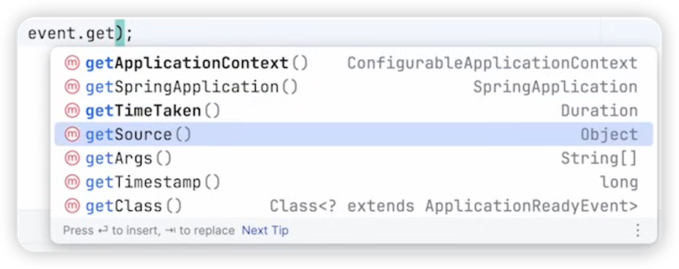

# Application Event Subsystem

[Spring Tips: Spring's Application Event Subsystem](https://www.youtube.com/watch?v=5YdjBWSGtbE)


```Java
@Slf4j
@SpringBootApplication
public class EventsApplication {
    public static void main(String[] args) { SpringApplication.run(EventsApplication.class, args); }
    
    @EventListener
    void ready(ApplicationReadyEvent are) {
        System.out.println("application ready event (take 3): " + are.toString());
    }

    @Bean
    ApplicationListener<ApplicationReadyEvent> applicationReadyEventApplicationListener) {
        return event → System.out.println("application ready event (take 2): " + event. getTimeTaken ().tostring());
    }
    
    @Component
    static class MyListener implements ApplicationListener‹ApplicationReadyEvent> {
        @Override
        public void onApplicationEvent(ApplicationReadyEvent event) {
            System.out.println("application ready event: " + event.getTimeTaken().toString()) ;
        }
    }        
    
	@Bean
	ApplicationListener<ApplicationReadyEvent> publisher(ApplicationEventPublisher publisher) {
		return args -> {
			log.error("xxx-before publish event");
			publisher.publishEvent(new MyCustomEvent("xxx-Happy New Year!"));
			log.error("xxx-after publish event");
		};
	}
}

record MyCustomEvent(String messag↓e) {
}

@Slf4j
@Component
@EnableAsync
public class TestListener {
    @Async
    @EventListener
    public void handle(MyCustomEvent event) {
        log.error("xxx-TestListener: before sleep");
        try {
            Thread.currentThread().sleep(3_000);
        } catch (InterruptedException e) {
            throw new RuntimeException(e);
        }
        log.error("xxx-TestListener: after sleep");
        log.error("xxx-TestListener: " + event.message());
    }
}
```

비동기 리스너
- `@Async`를 지정해도 `@EnableAsync`를 설정하지 않으면 비동기로 동작하지↓ 않음

```shell
// @EnableAsync가 없을 때
59 xxx-before publish event
59 xxx-TestListener: before sleep
02 xxx-TestListener: after sleep
02 xxx-TestListener: xxx-Happy New Year!
02 xxx-after publish event

// @EnableAsync를 추가했을 때
59 xxx-before publish event
59 xxx-after publish event
59 xxx-TestListener: before sleep
02 xxx-TestListener: after sleep
02 xxx-TestListener: xxx-Happy New Year!
```




application.properties

```
spring.docker.compose.lifecycle-management=start_only
```

```Java
@Async
@Transactional(propagation = Propagation.REQUIRES_NEW)
@TransactionalEventListener
@Documented
@Target({ ElementType.METHOD, ElementType.ANNOTATION_TYPE })
@Retention(RetentionPolicy.RUNTIME)
@Deprecated(since = "1.1", forRemoval = true)
public @interface ApplicationModuleListener {
```
ApplicationModuleListener는 @transactional, @Async를 모두 지원

```
spring.modulith.republish-outstanding-events-on-restart=true
spring.modulith.events.jdbc.schema-initialization.enabled=true
```

```Shell
docker compose down
docker compose up

PGPASSWORD=secret psql -U myuser -h localhost mydatabase
```

`implementation 'org.springframework.modulith:spring-modulith-starter-jdbc'` 의존성 추가

publish된 event가 event_publication이라는 테이블에 저장됨
```SQL
create table event_publication
(
    id               uuid                     not null primary key,
    listener_id      text                     not null,
    event_type       text                     not null,
    serialized_event text                     not null,
    publication_date timestamp with time zone not null,
    completion_date  timestamp with time zone
);
```

`spring.modulith.events.externalization.enabled=true`
이 설정을 통해 messaging system을 event 저장소로 사용 가능