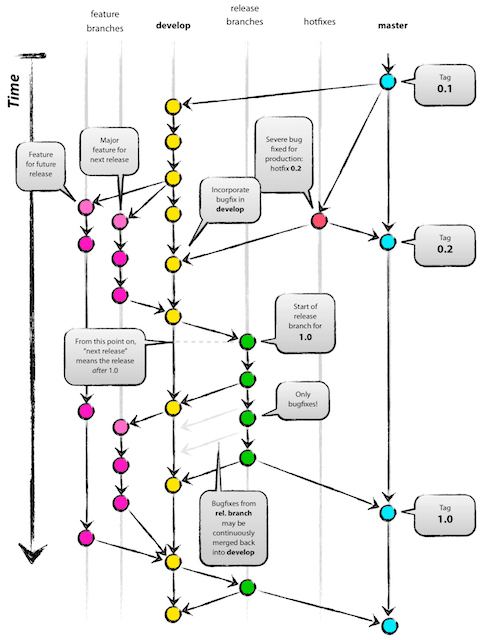
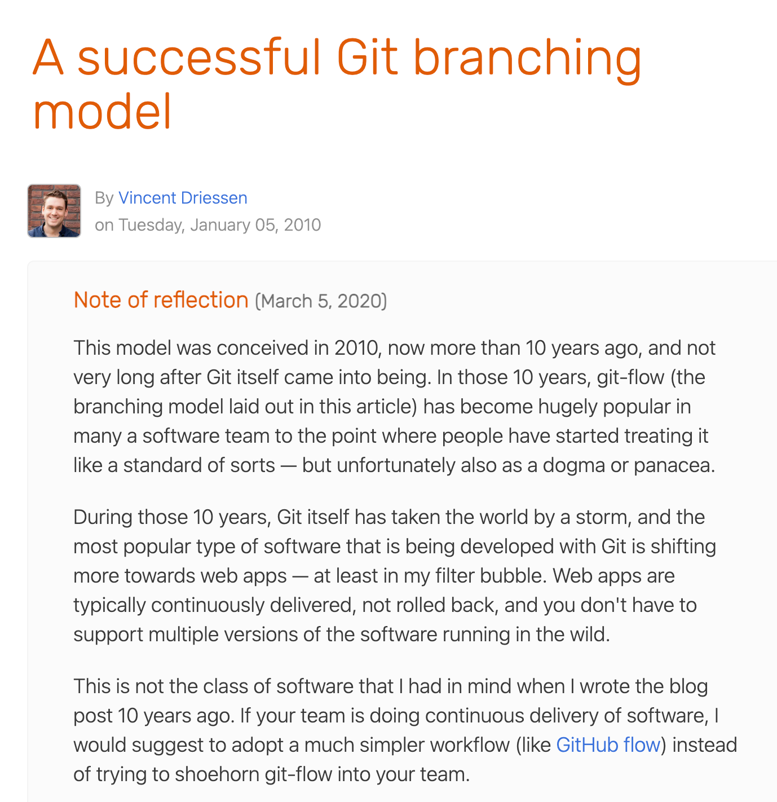
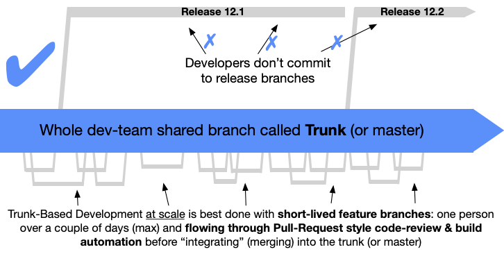
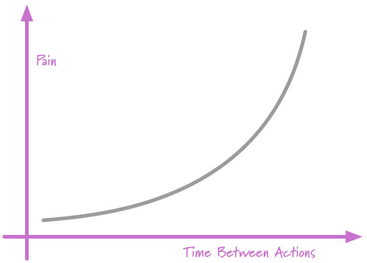

# Branch vs Trunk Based Delivery

## 브랜치 기반 전달

- 절차
    - 릴리즈 브랜치 생성
    - 릴리즈 브랜치에서 배포할 여러가지 기능들을 모아서 검증 & 수정
    - 배포
- 문제점
    - 한번에 한 기능씩 브랜치를 만들어서 전달한다면 대기가 발생하고, 동시에 여러 개의 브랜치에서 전달을 진행하면 통합의 어려움이 있음
    - 그래서 한 개의 브랜치에 여러개의 기능을 모아서 전달하게 되는 경향이 있음
        - 이럴 경우 검증이 복잡하여 시간이 오래 걸림
            - 그로 인해 1주마다 배포하던 것을 2주, 1달로 늘려서 배포하게 됨
        - 배포 후 문제가 발생했을 때 원인 파악이 어려움이 생김
        - 
- 예.
    - 금요일에 배포가 어려우니 목요일 새벽 정도에 여러가지 기능을 모아서 검증 후 배포
        - 배포 후 문제가 생기면 롤백, 다음 주 목요일에 다른 기능 추가하여 다시 시도
        - 더 문제가 발생할 가능성이 높아짐
    - 배포 준비에 소요되는 시간이 많아서 개발할 시간이 부족해짐
    - 배포를 1주가 아니라 2주마다로 변경
    - 더 많은 변경을 검증, 배포해야 해서 배포에 더 많은 위험이 수반됨
- 수백명의 개발자들이 진행하는 프로젝트와 같이 느리더라도 안정적인 대규모 배포에 적합
- 롤백이 어려운 프로젝트에 적합(예. 펌웨어, 하드웨어 등)
- 
    - 이 방식을 만든 사람(2010년에 만듦)도 이 방식은 웹, 앱과 같은 변경이 빈번한 경우 cotinuous delivery 방식이 더 적합하도 함

## 트렁크 기반 전달

> ***일종의 코드 관리 브랜칭 모델이며, 여기서는 개발자들이 ‘트렁크’라고 불리는 단일 브랜치 위에서 협력하고, 오래 유지되는 개발 브랜치를 만들게 하는 압력에 저항하기 위해 위해 설명된 테크닉을 사용합니다. 그러므로 그들은 머지 헬을 피하고, 빌드를 깨트리지 않고, 영원히 행복하게 살아갑니다.***

- 절차
    - 한가지 기능을 코드리뷰, 개발자 테스트 등을 수행한 후 바로 배포
- 장점
    - 한번에 하나의 작은 변경만 반영되므로 문제가 발생했을 때 원인 파악과 롤백이 용이
    - 빠른 상시 배포 가능하여 사용자가 원하는 기능을 빠르게 전달 가능
- 단점
    - 검증에 많은 시간을 투여하지 않으므로 결함이 있는 기능이 배포될 위험이 존재
        - 코드 리뷰를 통한 검증
        - 충분한 검증이 필요한 경우는 스테이지에 배포 후 검증 수행하고 있음
    - 단기에 배포하기 어려운 큰 기능
        - 기능 플래그를 활용해서 덜 준비되더라도 안정적으로 배포하고 있음
- 트렁크 기반 배포는 작은 규모의 프로젝트나 빠른 개발 사이클을 필요로 하는 프로젝트에 적합

## If it hurts, do it more often - 연말 정산

- 큰 문제는 기간 산정도 어렵고, 계획하기도 어렵고, 실행하기도 어려움
- 큰 문제를 작은 문제로 나누면 예측 가능성이 생기고, 실패를 해도 빠르고 복구할 수 있음

## 참고자료
- [Git Flow에서 트렁크 기반 개발으로 나아가기 - 맘시터 기술블로그](https://tech.mfort.co.kr/blog/2022-08-05-trunk-based-development/)