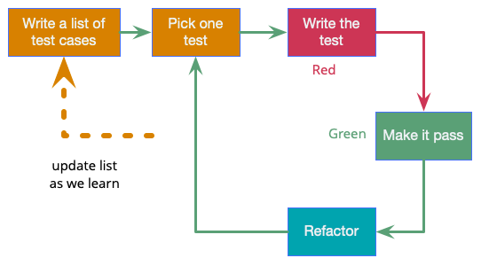
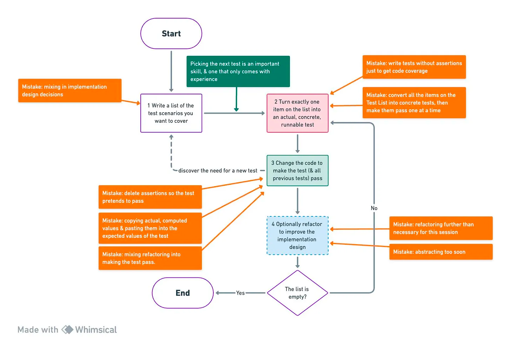

# Canon TDD

- [Canon TDD - by Kent Beck - Software Design: Tidy First?](https://tidyfirst.substack.com/p/canon-tdd)


from [Test Driven Development, Martin Fowler](https://martinfowler.com/bliki/TestDrivenDevelopment.html)


from [Note by Vic Wu on Substack: "I draw a flowchart from the article. Hope you like it. https://whimsical.com/cannon-tdd-M74C15bNBdVmxhkLztnSXa "](https://substack.com/@vicwu/note/c-45235322?r=jumsj)

## Interface/Implementation Split

- TDD를 논의할 때 사람들은 모든 설계를 하나로 묶는 오해를 함
- 2가지 종료의 설계가 있음
    - 특정 행위가 호출(invoke)되는 방법(**interface**)
    - 시스템의 해당 행위를 구현하는 방법(**implementation**)

## TDD 단계

### 1. 다루고자 하는 테스트 시나리오 목록 작성

- Write a list of the test scenarios you want to cover
- 행위 변경이 일어나는 모든 경우에 대한 테스트 목록을 작성
  - 기본적인 경우, 서비스가 시간 초과하는 경우, 키가 아직 데이터베이스에 없는 경우 등
- **행위 분석(behavior analysis)** 단계임
- 이 과정을 누락하면 TDD는 코딩을 시작하게는 하지만 **언제 완료인지 알 수 없음(언제 멈춰야 하는지)**
  - “TDD just launches into coding 🚀. You’ll never know when you’re done.”
- 이 단계에서 발생하는 실수
  - **구현 설계 결정(implementation design decisions)** 과 행위 분석 결절을 혼합함
  - 내부 구현을 어떻게 설계할 지 결정할 시간은 나중에 충분히 있음
  - **테스트 목록 작성에만 집중하면 테스트 목록을 더 잘 작성할 수 있음**
  - 냅킨에 간단한 설계를 할 수도 있지만 실제로는 필요치 않을 수 있음

### 2. 테스트 목록에 있는 테스트 중 정확히 하나의 테스트를 실행 가능한 테스트로 전환
- Turn exactly one item on the list into an actual, concrete, runnable test
- 하나의 테스트를 선택하고 AAA가 포함된 정말 자동화된 테스트를 작성
  - **Assert → Act → Arrange 순**으로 작성하라
- 테스트를 작성하면서 내리는 설계 결정은 주로 **인터페이스 설계(interface design)** 에 관련된 설계 결정임
- **다음 테스트를 선택하는 것**은 중요한 기술임
- 이 단계에서 발생하는 실수
  - 테스트 커버리지 확보를 위해 assert 없는 테스트 작성
  - **테스트 목록의 모든 항목을 한번에 구체적인 테스트로 변환**하고 하나씩 성공시키려 함
    - 첫번째 테스트를 통과시키기 위한 구현으로 인해 모든 예상 테스트에 영향을 미치는 결정을 변경하게 되면 어떻게 되나 ?
      - 재작업을 해야 함
    - 6번째 테스트까지 추가했지만 하나도 동작하지 않으면 어떻게 되나 ?
      - 성취감을 맛 볼 수 없음
    - **모든 테스트 목록을 한번에 추가하지 말고 한번에 하나의 테스트를 추가하고 3,4번 단계를 진행해야 함**

### 3. 코드를 변경하여 테스트(모든 이전 테스트도)통과하도록 만들기(새로운 테스트를 발견하면 테스트 목록에 추가)
- Change the code to make the test (& all previous tests) pass (adding items to the list as you discover them)
- 테스트가 통과되도록 코드를 변경
- 테스트를 성공시키는 과정에서 새로운 테스트가 필요해지면 테스트 목록에 추가
  - 그 테스트 때문에 방해 받지 말고
  - 그 테스트로 인해 이미 구현한 코드가 무효화되는 경우는 현재는 테스트 구현을 계속할지 ? 다시 시작할지 ? 결정해야 함
    - 팁: **다시 시작하되 테스트 구현 순서를 변경하라**
- 테스트 구현을 완료하면 테스트 **목록에 완료 표시**하라
- 이 단계에서 발생하는 실수
    - 성공하는 것처럼 보이도록 assert 삭제
    - 실제 **계산된 값을 복사**하여 예상 값에 붙여넣고 assert
        - 이중 부기의 잇점을 잃음
    - 테스트 성공(구현)과 **리팩터링을 혼합해서** 진행
        - Make it work → Make it right
        - 당신의 두뇌가 감사할 것임

### 4. 선택적으로 리팩터링하여 구현 설계 개선
- Optionally refactor to improve the implementation design
- 구현 설계 결정(implementation design)을 해야 할 단계임
- 이 단계에서 발생하는 실수 {id="mistakes-in-refactoring"}
    - **필요 이상으로 리팩터링**을 함
      - 정리를 하면 기분이 좋아짐, 리팩터링을 안하면 후에 더 어려워질 것 같음
      - [Victor Rentea on X: "Why do we overengineer?](https://twitter.com/victorrentea/status/1754095752773537985)
        ```
        Why do we overengineer?
        - To ease future changes - a junior.
        - Due to waterfall - a medior.
        - Because it's fun - a senior.
        - 🤣 - me.
          (During a #CleanCode workshop this week)
        ```
    - **추상화를 너무 일찍함(Prematured Abstraction)**
      - 중복은 힌트이지 명령은 아님

### 5. 테스트 목록이 비어있을 때까지 2~4단계를 반복
- Until the list is empty, go back to #2