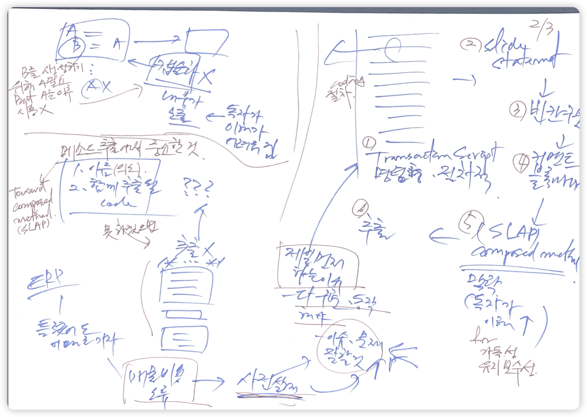

# Cases

- refactoring-cases 프로젝트 소스가 있음

## 메소드를 추출하기 전까지의 개발 과정



## Remove Tagging Variable


- 함수 f1이 있음
- f1은 a,b,c 블록으로 구성됨
- b를 약간 변형하여 b'으로 변경해야 하는 요구사항
- 2가지 쉬운 방법이 존재
    1. f1에 boolean 매개변수를 전달해서 분리를 통해 b, b'을 실행
    2. f1을 복붙해서 f2를 만들고 f2에서는 b 대신 b'을 실행
- 2가지 방법 모두 나쁜 방법

## 전역변수에 대한 의존성 표현하기


## Guard Clause - Early Return

```Java
public void processOrder(Order order) {
    if (order != null) {
        if (order.isComplete()) {
            if (order.isPaid()) {
                // Process the order
            } else {
                // Handle payment processing
            }
        } else {
            // Handle incomplete order
        }
    }
}
```

- 분기문에 return을 추가
- invert-if해서 단순한 경우부터 처리
- indentation이 줄어들어 인지적 복잡도가 줄어듦

## Split Phase

### split-phase-conveyor

```
d82a11f (HEAD -> split-phase-conveyor) make it testable
594e508 rename data structure
364b6de extract 1st step and introduce data structure
84517c6 extract 2nd step
d674afc extract variable
aff20fb introduct parameter
54e8735 add ConveyorService
```

### sproutMethod_stepDownRule

```
2fc19e9 (HEAD -> sproutMethod_stepDownRule) call sprouted method - make it pass
d50d35e add failing test
553c983 subclass and override
73be13c rf - prepare subclass and override method
ec0c3de rf - change test to use OrderController
e05cdd5 rf - move method
df7ac81 rf - prepare move method
b4e4c08 rf - extract isEventProduct method
6abbaea add failing case
f72dae1 rf - move unnecessary steps in stream
c9a0f1d apply "subclass and override method"
fafe435 implement step down rule in test
5aa897e add step down rule
70fd197 (tag: s_sprout_subclass_override) prepare
```

### dry-excel-download

```
878f927 (HEAD -> dry-excel-download) add split-phase-dry.pdf
8e1c199 apply generic
9a1ae83 extract superclass
e0f3478 re-order method - for reading order
3694724 extract variable part for template method
02e7858 extract field
8061714 extract ExcelFormatter
8f8411b rename format method
7453f0b remove static
5e765ad re-order methods for reading order and increasing cohesion
e6708b4 (tag: s_excel_download) add required classes
```

### split-phase-excel-upload

```
8a4ce29 (HEAD -> split-phase-excel-upload) add test
1d32adb inline filter method
50cced4 extract method - conditionals, try-catch
f26ac83 apply generic
e070ccf extract superclass
c470dc5 inline getSheet
d7b943e unwrap if statement
5c0c9ef extract delegate - ExcelToDtoMapper
4be5637 remove unnecessary record
a9ed11e re-order methods - for cohesion
96607cc extract methods - read, filterInvalidCredentials
ea57709 split loop - for SoC
1e7c47e rename getResult to toDto and return type
5a02880 extract method - getResult
cb756a6 exract method - getSheet, createWorkbook
d4c9cbe inline method - createWorkbook, createUserRequest
fcd0a92 (tag: s_excel_upload) add required files
```

### split_phase_from_refactroing_2nd

```
6fcd1dc (HEAD -> split_phase_from_refactroing_2nd) writerside
717f888 extract first-phase to return intermediate DS
cdddf6a add discount to PriceData
36763da add quantity to PriceData
2f10adf safe delete basePrice
58e89d9 add basePrice to PriceData
e4db4d5 introduce intermediate data structure that will communicate between the two phases
d887fe5 extract method - applyShipping
baa3837 (tag: s_split_phase_from_refectoring2nd.ed) add required fils for split_phase from refactoring 2nd ed.
```

### split-phase-commandLineRunner

```
8b24d01 (HEAD -> split-phase-commandLineRunner) extract delegate - split by levels of abstraction
0d06e83 extract parameter
4f41ca0 invert if, remove redundant else
c5ad49a extract method readOrders
f9827c0 inline method, replace anyMatch with contains
b3ed47c move instance method to value object
db797b1 extract method count(2nd phase)
0d0691e extract method parse to introduce value object
2e1d58e extract variable and slide statement
77fc112 extract methods - countReadyOnly
c50d701 add test
0812e60 remove static
54d00fd make it return value for testability
864f3c3 extract method
38a9a14 add CommandLineRunner
```

### split_phase_victor

```
f226b3d (HEAD -> split_phase_victor) make arch unit test works
683da9f add arch unit
0ee3f75 add warning threshold
03a7297 add lombok.config
1472766 add new mock test without excel stuffs
c57ec95 extract parameter to reduce dependency scope
2ee0b53 extract delegate for levels of abtraction
ffcdecd split BL with excel logic
9972deb reorder method
123b414 split phase
c05de52 reorder method
b83958e extract method(BL)
a93f4f4 (tag: s_split_phase_victor) add required files for split phase
```

### split_by_levels_of_abstraction

```
b19d5fe (HEAD -> split_by_levels_of_abstraction) add OrderValidatorTest  [Myeongseok Baek]
85339cb extract delegate - OrderValidator  [Myeongseok Baek]
0622e1e dark magic(partial spy)  [Myeongseok Baek]
d80da04 (tag: s_split_abstraction) add God, GodTest  [Myeongseok Baek]
```

### split-by-abstraction-layer-inventory-transfer

```
30ecfdc (HEAD -> main, split-by-abstraction-layer-inventory-transfer) extract delegate - InventoryTransferFactory  [Myeongseok Baek]
306271b make it work  [Myeongseok Baek]
0be65b0 extract delegate - CreateInventoryTransferValidator  [Myeongseok Baek]
455a590 before split phase - split by abstraction layer  [Myeongseok Baek]
```

### unrelated_complexity

```
73b271a (HEAD -> unrelated_complexity) writerside
6e59a43 extract prod & make it work
fd0132f extract test & make it works
e714df7 remove dup cause - Unnecessary stubbings detected.
376fbea add more test - DRY !!
edf3319 (tag: s_unrelated_complexity) add required files for "split unrelated complexity"
```

## Valuable Value Object

### introduce-parameter-object

```
d14f3f3 (HEAD -> introduce-parameter-object) move instance method
7817acf inline method to move instance method
fa816dc extract method isStock to use stockChecker only
4bc5327 introduce parameter object - StockChecker
88f88ee extract parameter to reduce dependency to request(DTO)
66d35e7 extract method - check. 빵속빵 구조로
a6f1e1c add StockCheckPort
```

### valuable-parameter-object        38abf79 move instance method to value object

```
38abf79 (HEAD -> valuable-parameter-object) move instance method to value object
5007a31 extract methods that uses value object
6a8194f safe delete unused variable
045644d use value object instead of local variable
37b90fe inline this
d4d4591 extract variable shipping
4396534 introduce parameter object
6930e92 add additional parameter
e14b4be add class for extract value object
```

### first-class-collection

```
09350f8 (HEAD -> first-class-collection) move instance method
1d87c29 introduce parameter object
938fd64 add UserCart
```

### entity-fields-to-value-object

```
403c424 (HEAD -> entity-fields-to-value-object, main) extract delegate
06ab3c0 inline getter to extract delegate
2b365b1 add Order
095d08e Merge branch 'split-phase-commandLineRunner'
```

### From Primitive Obsession to Domain Modelling

- [From Primitive Obsession to Domain Modelling](https://blog.ploeh.dk/2015/01/19/from-primitive-obsession-to-domain-modelling/)

```
9b9a4dc (HEAD -> main, primitive-obsession) primitive obsession - inline unnecessary test test createUser
a959a28 primitive obsession - move call to validateUserName from UserNameTest(external) to UserName
ab4fb7a primitive obsession - move 2 static methods to Value Object(UserName)
a42859c primitive obsession - extract method validateUserName in order to move
f06b7ee primitive obsession - make methods static to move
3b50072 primitive obsession - change construction logic
e061317 primitive obsession - extract delegate with getter/setter
697f857 primitive obsession - add getter/setter, remove final for extract delegate
adb9d54 primitive obsession - add normal case
75e1965 primitive obsession - make it works
f22aa28 primitive obsession - add failing test
```

- User entity → User Entity, UserName Value Object = Aggregate

## lift-up-conditional

```
140f159 (HEAD -> lift-up-conditional) lift up condition - for isSulfuras
7ff06b5 lift up condition - for Backstage
2d4ae5d lift up condition 5 - deal with IDE warnings
5afd963 lift up condition 4 - inline
7202d98 lift up condition 3 - surround with if-else
13b69b6 lift up condition 2 - extract method
ba8c25f lift up condition 1 - instroduce conditional variable
46366fd move instance method
3b13ee1 extract method - updateItem
e4431ba deal IDE warnings
b505eac (tag: s_liftup) add CombinationApprovals.verifyAllCombinations
```
