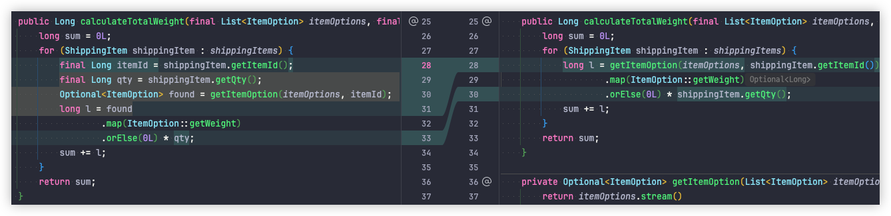

# Cases

- [msbaek/refactoring-cases](https://github.com/msbaek/refactoring-cases): 리팩터링 케이스 소스 리파지토리

## 메소드를 추출하기 전까지의 개발 과정

- [tyding](Techniques.md#simle-tyding)

- 메소드 추출에서 중요한 점
  1. 의도를 나타내는 이름을 붙일 수 있나 ?
     - 좋을 이름을 부여할 수 없다면 다음에 추출해야
  2. 함께 추출할 코드가 있다면 함께 추출
  3. [Composed Method](https://github.com/msbaek/memo/blob/master/refactoring-tech/composed_method.md), [SLAP](https://github.com/msbaek/memo/blob/master/refactoring-tech/composed_method.md#slapsingle-level-of-abstraction-principle)
     를 지향하는 방향으로 메소드 추출
     - 가독성, 유지보수성

## Remove Tagging Variable


- 함수 f1이 있음
- f1은 a,b,c 블록으로 구성됨
- b를 약간 변형하여 b'으로 변경해야 하는 요구사항
- 2가지 쉬운 방법이 존재
  1. f1에 boolean 매개변수를 전달해서 분리를 통해 b, b'을 실행
  2. f1을 복붙해서 f2를 만들고 f2에서는 b 대신 b'을 실행
- 2가지 방법 모두 나쁜 방법

## 전역변수에 대한 의존성 표현하기


- 함수, 메소드에서 전역변수(싱글톤 포함)를 사용하고 있으면 메소드 시그니처에 명시적으로 의존성이 보이도록 개선
- 전역변수를 파라미터로 추출해서 메소드 시그니처에 명시적으로 의존성이 보이도록 개선

## Guard Clause - Early Return

- [Guard (computer science)](<https://en.wikipedia.org/wiki/Guard_(computer_science)>)
- [Replace Nested Conditional with Guard Clauses](https://refactoring.com/catalog/replaceNestedConditionalWithGuardClauses.html)
-

```Java
public void processOrder(Order order) {
    if (order != null) {
        if (order.isComplete()) {
            if (order.isPaid()) {
                // Process the order
            } else {
                // Handle payment processing
            }
        } else {
            // Handle incomplete order
        }
    }
}
```

- invert-if해서 단순한 경우(`order == null`)부터 처리
- 들여쓰기(indentation)가 줄어들어 인지적 복잡도가 줄어듦
- 테스트를 추가할 때 Degenerate Test를 먼저 추가하면 함수의 앞부분에 guard clause가 먼저 추가됨
- 함수는 주요한 로직이 나중에 구현되고, 조건문으로 인한 들여쓰기도 적어지게 되어 복잡도가 감소함

## Split Phase

### split-phase-conveyor

```
d82a11f (HEAD -> split-phase-conveyor) make it testable
594e508 rename data structure
364b6de extract 1st step and introduce data structure
84517c6 extract 2nd step
d674afc extract variable
aff20fb introduct parameter
54e8735 add ConveyorService
```

### sproutMethod_stepDownRule

```
2fc19e9 (HEAD -> sproutMethod_stepDownRule) call sprouted method - make it pass
d50d35e add failing test
553c983 subclass and override
73be13c rf - prepare subclass and override method
ec0c3de rf - change test to use OrderController
e05cdd5 rf - move method
df7ac81 rf - prepare move method
b4e4c08 rf - extract isEventProduct method
6abbaea add failing case
f72dae1 rf - move unnecessary steps in stream
c9a0f1d apply "subclass and override method"
fafe435 implement step down rule in test
5aa897e add step down rule
70fd197 (tag: s_sprout_subclass_override) prepare
```

### dry-excel-download

```
878f927 (HEAD -> dry-excel-download) add split-phase-dry.pdf
8e1c199 apply generic
9a1ae83 extract superclass
e0f3478 re-order method - for reading order
3694724 extract variable part for template method
02e7858 extract field
8061714 extract ExcelFormatter
8f8411b rename format method
7453f0b remove static
5e765ad re-order methods for reading order and increasing cohesion
e6708b4 (tag: s_excel_download) add required classes
```

### split-phase-excel-upload

```
8a4ce29 (HEAD -> split-phase-excel-upload) add test
1d32adb inline filter method
50cced4 extract method - conditionals, try-catch
f26ac83 apply generic
e070ccf extract superclass
c470dc5 inline getSheet
d7b943e unwrap if statement
5c0c9ef extract delegate - ExcelToDtoMapper
4be5637 remove unnecessary record
a9ed11e re-order methods - for cohesion
96607cc extract methods - read, filterInvalidCredentials
ea57709 split loop - for SoC
1e7c47e rename getResult to toDto and return type
5a02880 extract method - getResult
cb756a6 exract method - getSheet, createWorkbook
d4c9cbe inline method - createWorkbook, createUserRequest
fcd0a92 (tag: s_excel_upload) add required files
```

### split_phase_from_refactroing_2nd

```
6fcd1dc (HEAD -> split_phase_from_refactroing_2nd) writerside
717f888 extract first-phase to return intermediate DS
cdddf6a add discount to PriceData
36763da add quantity to PriceData
2f10adf safe delete basePrice
58e89d9 add basePrice to PriceData
e4db4d5 introduce intermediate data structure that will communicate between the two phases
d887fe5 extract method - applyShipping
baa3837 (tag: s_split_phase_from_refectoring2nd.ed) add required fils for split_phase from refactoring 2nd ed.
```

### split-phase-commandLineRunner

```
8b24d01 (HEAD -> split-phase-commandLineRunner) extract delegate - split by levels of abstraction
0d06e83 extract parameter
4f41ca0 invert if, remove redundant else
c5ad49a extract method readOrders
f9827c0 inline method, replace anyMatch with contains
b3ed47c move instance method to value object
db797b1 extract method count(2nd phase)
0d0691e extract method parse to introduce value object
2e1d58e extract variable and slide statement
77fc112 extract methods - countReadyOnly
c50d701 add test
0812e60 remove static
54d00fd make it return value for testability
864f3c3 extract method
38a9a14 add CommandLineRunner
```

### split_phase_victor

```
f226b3d (HEAD -> split_phase_victor) make arch unit test works
683da9f add arch unit
0ee3f75 add warning threshold
03a7297 add lombok.config
1472766 add new mock test without excel stuffs
c57ec95 extract parameter to reduce dependency scope
2ee0b53 extract delegate for levels of abtraction
ffcdecd split BL with excel logic
9972deb reorder method
123b414 split phase
c05de52 reorder method
b83958e extract method(BL)
a93f4f4 (tag: s_split_phase_victor) add required files for split phase
```

### split_by_levels_of_abstraction

```
b19d5fe (HEAD -> split_by_levels_of_abstraction) add OrderValidatorTest  [Myeongseok Baek]
85339cb extract delegate - OrderValidator  [Myeongseok Baek]
0622e1e dark magic(partial spy)  [Myeongseok Baek]
d80da04 (tag: s_split_abstraction) add God, GodTest  [Myeongseok Baek]
```

### split by levels of abstraction - mercury

- port를 구현한 adapter에서 loop를 돌면서
  - 3개의 도메인 객체에 대해서
    - 도메인 객체 생성
    - save domain 객체
  - 를 반복하고 있음
- 객체를 모두 생성해서 Value Object로 담아서 저장하는 로직에 전달하여
- 빵 구조가 나오도록 개선

```
48b861c split-by-abstraction-layer-mercury - add required files
f636402 split-by-abstraction-layer-mercury - slide statements for reading order
d1f55a5 split-by-abstraction-layer-mercury - inline all
57e3122 split-by-abstraction-layer-mercury - replate temp with query
f225997 split-by-abstraction-layer-mercury - replace individual repo call with collection
85e9a4a split-by-abstraction-layer-mercury - slide statement for SoC
1021374 split-by-abstraction-layer-mercury - extract method createProductOption
993ee5f split-by-abstraction-layer-mercury - extract method saveProductOption
4e8e4e1 (HEAD -> split-by-abstraction-layer-mercury) split-by-abstraction-layer-mercury - extract delegate(domain service)
```

- 이후 split by abstraction layer 수행
- adapter가 domain servicef를 호출하는 것은 이상
- createProductOption을 Application Service(Use Case)로 이동

### split-by-abstraction-layer-inventory-transfer

```
30ecfdc (HEAD -> main, split-by-abstraction-layer-inventory-transfer) extract delegate - InventoryTransferFactory  [Myeongseok Baek]
306271b make it work  [Myeongseok Baek]
0be65b0 extract delegate - CreateInventoryTransferValidator  [Myeongseok Baek]
455a590 before split phase - split by abstraction layer  [Myeongseok Baek]
```

### unrelated_complexity

```
73b271a (HEAD -> unrelated_complexity) writerside
6e59a43 extract prod & make it work
fd0132f extract test & make it works
e714df7 remove dup cause - Unnecessary stubbings detected.
376fbea add more test - DRY !!
edf3319 (tag: s_unrelated_complexity) add required files for "split unrelated complexity"
```

## Valuable Value Object

### introduce-parameter-object

```
d14f3f3 (HEAD -> introduce-parameter-object) move instance method
7817acf inline method to move instance method
fa816dc extract method isStock to use stockChecker only
4bc5327 introduce parameter object - StockChecker
88f88ee extract parameter to reduce dependency to request(DTO)
66d35e7 extract method - check. 빵속빵 구조로
a6f1e1c add StockCheckPort
```

- Parameter Object가 적합 한 경우
  1. 일련의 상태에 대해서 동작하는 기능들이 있을 때
  2. 일련의 의존성 객체들을 사용하는 기능이 있을 때

### valuable-parameter-object 38abf79 move instance method to value object

```
38abf79 (HEAD -> valuable-parameter-object) move instance method to value object
5007a31 extract methods that uses value object
6a8194f safe delete unused variable
045644d use value object instead of local variable
37b90fe inline this
d4d4591 extract variable shipping
4396534 introduce parameter object
6930e92 add additional parameter
e14b4be add class for extract value object
```

### first-class-collection

```
09350f8 (HEAD -> first-class-collection) move instance method
1d87c29 introduce parameter object
938fd64 add UserCart
```

### entity-fields-to-value-object

```
403c424 (HEAD -> entity-fields-to-value-object, main) extract delegate
06ab3c0 inline getter to extract delegate
2b365b1 add Order
095d08e Merge branch 'split-phase-commandLineRunner'
```

### From Primitive Obsession to Domain Modelling

- Primitive obsession is a type of code smell that developers can’t identify intuitively.
- It occurs when a primitive value controls the logic in a class and represents complex concepts or behaviors. In simple
  words, when a code relies too much on primitive values.
- Using primitives for everything is certainly a bad practice. This leads to poor readability, validation, and
  abstraction.
- Solutions
  - Replace the data value with the object if the primitive fields logically belong together.
  - ‘Introduce a parameter object’ to represent the data and clean up the code base.
  - ‘Preserve the whole object’ when its state is needed together. Avoid extracting small parts of objects to pass
    around.
- [Understanding Code Smells and How to Avoid Them | by typo | Typo blog | Jan, 2024 | Medium](https://medium.com/beyond-the-code-by-typo/understanding-code-smells-and-how-to-avoid-them-7ea52c295734)
- [From Primitive Obsession to Domain Modelling](https://blog.ploeh.dk/2015/01/19/from-primitive-obsession-to-domain-modelling/)

```
9b9a4dc (HEAD -> main, primitive-obsession) primitive obsession - inline unnecessary test test createUser
a959a28 primitive obsession - move call to validateUserName from UserNameTest(external) to UserName
ab4fb7a primitive obsession - move 2 static methods to Value Object(UserName)
a42859c primitive obsession - extract method validateUserName in order to move
f06b7ee primitive obsession - make methods static to move
3b50072 primitive obsession - change construction logic
e061317 primitive obsession - extract delegate with getter/setter
697f857 primitive obsession - add getter/setter, remove final for extract delegate
adb9d54 primitive obsession - add normal case
75e1965 primitive obsession - make it works
f22aa28 primitive obsession - add failing test
```

- User entity → User Entity, UserName Value Object = Aggregate

## lift-up-conditional

```
140f159 (HEAD -> lift-up-conditional) lift up condition - for isSulfuras
7ff06b5 lift up condition - for Backstage
2d4ae5d lift up condition 5 - deal with IDE warnings
5afd963 lift up condition 4 - inline
7202d98 lift up condition 3 - surround with if-else
13b69b6 lift up condition 2 - extract method
ba8c25f lift up condition 1 - instroduce conditional variable
46366fd move instance method
3b13ee1 extract method - updateItem
e4431ba deal IDE warnings
b505eac (tag: s_liftup) add CombinationApprovals.verifyAllCombinations
```

## repeated-switch

```
04911a8 parrot - add files
f531eb0 parrot - Replace constructor with factory method
9e7ae25 parrot - extract variable parrot
8e7433b parrot - Split into declaration and assignment
7247d54 parrot - apply switch in factory method
1badd1d parrot - add subclasses
1559e4f parrot - use known constant instead of passed argument(type)
ed0788a parrot - Safe delete 'type'
5ffe08d parrot - repeat remove type in constructor in other 2 subclasses
d149d5e parrot - Push Members Down...
124823f parrot - make it work
0dade53 parrot - use constant in switch
4f97715 parrot - Replace with old style 'switch' statement
aabd05d parrot - Remove unreachable branches
9ed89ac parrot - inline unnecessary variable
53e8619 parrot - replace type with constant and remove unreachable branches
bdd00d1 parrot - push members down(getSpeed)
486a5c2 parrot - make it work
8cd4322 parrot - replace type with constant and remove unreachable branches
5818024 parrot - find usage and push members down
1feaefe parrot - make it work. remove unnecessary field, parameter
0fa0889 parrot - find usage, push members down, make it work
2fa8836 (HEAD -> main, parrot) parrot - find usage, push members down, make it work for isNailed
```

### polymorhic enum

```
b723c5a polymorhic-enum: add required files
a174dcb polymorhic-enum: extract method to move
6af490d polymorhic-enum: extract parameter to prepare move method
987db3a polymorhic-enum: move method
cd45eb1 polymorhic-enum: push members down manually(because enum is final)
```

### extract common part

```
8451c17 extract-common-parts - add required files
33df5ff extract-common-parts - replate temp with query before refactoring
d3f85da extract-common-parts - extract method for remove dup.(with keep original signature)
cf65bf4 (HEAD -> main, extract-common-parts) extract-common-parts - Extract common part removing branch
```

### stream api를 loop를 활용해서 개선하기

1. 최초 메소드

- `6f03714 refactor-stream add required files`

```java
public class ConveyorRegistry {
    /**
     * @param itemOptions   검수 단계에서 측정된 실제 무게를 가져오기 위한 아이템 정보
     * @param shippingItems 배송할 아이템 정보
     * @return 전체 무게를 반환.
     */
    public Long calculateTotalWeight(final List<ItemOption> itemOptions, final List<ShippingItem> shippingItems) {
        return shippingItems.stream()
                .mapToLong(shippingItem -> {
                    final Long itemId = shippingItem.getItemId();
                    final Long qty = shippingItem.getQty();
                    return itemOptions.stream()
                            .filter(itemOption -> Objects.equals(itemOption.getId(), itemId))
                            .findFirst()
                            .map(ItemOption::getWeight)
                            .orElse(0L) * qty;
                })
                .sum();
    }
}
```

2. Add Test using Copilot

- `d157346 refactor-stream add test`
  

```java
class ConveyorRegistryTest {
    @Test
    public void testCalculateTotalWeight() {
        ConveyorRegistry conveyorRegistry = new ConveyorRegistry();

        List<ItemOption> itemOptions = Arrays.asList(
                new ItemOption() {
                    public Long getId() {
                        return 1L;
                    }

                    public Long getWeight() {
                        return 2L;
                    }
                },
                new ItemOption() {
                    public Long getId() {
                        return 2L;
                    }

                    public Long getWeight() {
                        return 3L;
                    }
                }
        );

        List<ShippingItem> shippingItems = Arrays.asList(
                new ShippingItem() {
                    public Long getItemId() {
                        return 1L;
                    }

                    public Long getQty() {
                        return 2L;
                    }
                },
                new ShippingItem() {
                    public Long getItemId() {
                        return 2L;
                    }

                    public Long getQty() {
                        return 3L;
                    }
                }
        );

        Long expectedTotalWeight = 2L * 2L + 3L * 3L;
        Long actualTotalWeight = conveyorRegistry.calculateTotalWeight(itemOptions, shippingItems);

        assertEquals(expectedTotalWeight, actualTotalWeight);
    }
}
```

3. apply test data builder

- `7da692b refactor-stream apply test data builder`
- 

4. Replace stream with loop

- `d385a66 refactor-stream replace stream with loop`
- 

5. Extract method getItemOption

- `67eb5b5 refactor-stream extract method - getItemOption`
- 

6. Remove temp, add return

- `0a73e43 refactor-stream extract method - remove temp, add return`
- 

7. Replace with findFirst

- `2c6280c refactor-stream extract method - enhance with findFirst`
- 

8. Inline temp with query

- `42ddca2 refactor-stream extract method - inline temp variables`
- 

9. Extract method subTotal
   `4da312a refactor-stream extract method - extract method subTotal`

- 

10. Enhance subTotal
    `4257b12 refactor-stream extract method - enhance subTotal`

- 

11. Calculate total weight in stream

- `ab368ea refactor-stream refactor calculateTotalWeight with stream api`
- 

12. Extract delegate ShippingWeightCalculatgr

- `f1d1bc8 refactor-stream extract delegate`

13. Safe delete

- `c387b7d refactor-stream safe delete`

14. Change test to use delegate

- `e0db7fa refactor-stream change test to use delegate`

## 참고 사이트

- [Catalog of Refactorings](https://refactoring.com/catalog/)
