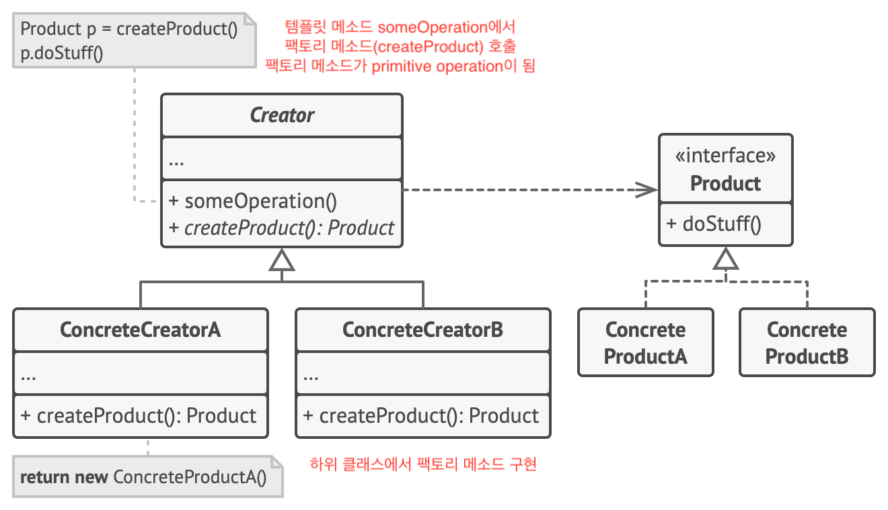
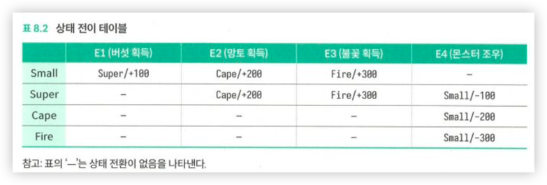

# Design Patterns

## Creational Patterns

### 싱글턴

- 초기화
    - eager
    - lazy
- 잠금
    - 이중 잠금(double checked locking)
    - holder에 의한 잠금(initialization on demand holder idiom)
- 단점
    - 클래스 간의 의존성을 감춤(`Extract Parameter`로 명시화 가능)
    - 코드의 확장성에 영향을 미침
        - 후에 2개 이상의 인스턴스가 필요하면 코드 전면적 수정해야
    - 테스트하기 어렵다
        - 모의객체로 치환 어려움
    - 매개변수가 있는 생성자를 지원하지 않음

### 단순 팩터리 패턴(Simple Factory Pattern)

- 타 로직과 객체 생성 로직을 분리
- 정적 팩토리 메소드

```java
public class RuleConfigSource {
    public RuleConfig load(String ruleConfigFilePath) {
        String ruleConfigFileExtension = getFileExtension(ruleConfigFilePath);
        IRuleConfigParser parser = RuleConfigParserFactory.createParser(ruleConfigFileExtension);
        if (parser == null) {
            throw new InvalidRuleConfigException(
                    "Rule config file format is not supported: " + ruleConfigFilePath);
        }
// ruleConfigFilePath 파일에서 configText로 설정 텍스트 읽기 
        String configText = RuleConfig ruleConfig = parser.parse(configText);
        return ruleConfig;
    }

    private String getFileExtension(String filePath) {
// 파일 이름을 분석하여 확장자 얻기
        return "json";
    }
}

public class RuleConfigParserFaotory {
    public static IRuleConfigParser createParser(String configFormat) {
        IRuleConfigParser parser = null;
        if ("json".equalsIgnoreCase(configFmat)) {
            parser = new JsonRuleConfigParser();
        } else if ("xml".equalsIgnoreCase(configFormat)) {
            parser = new XmlRuleConfigParser();
        } else if ("yaml".equalsIgnoreCase(configFormat)) {
            parser = new YamlRuleConfigParser();
        } else if ("properties".equalsIgnoreCase(configFormat)) {
            parser = new PropertiesRuleConfigParser();
        }
        return parser;
    }
}
```

- 팩터리를 생성해서 Map에 유지해서 캐시

### Factory Method

- 템플릿 메소드에서 팩터리 메소드를 호출
- 팩터리 메소드는 하위 클래스에서 재정의



### Abstract Factory

- 객체 그래프에 대한 인터페이스가 있을 때 구체적인 클래스들을 만드는 팩터리 클래스
- Windows Widget이 인터페이스일 때 Motiff, Mac, MS-Windows 등에 대한 구체적인 클래스를 만드는 팩터리 클래스

## Structural Patterns

### Proxy

- 원본 클래스를 변경하지 않고 프록시를 도입해서 원본 클래스와 **관련 없는 새로운 기능**을 추가
- 성능 통계를 위한 프록시

```java
interface UserApi {
    UserVo login(String telephone, String password);

    UserVo register(String telephone, String password);
}

public class UserController implements UserApi {
    @Override
    public UserVo login(String telephone, String password) {
        // .. 로그인 코드 생략
        return new UserVo();
    }
}

class UserControllerProxy implements UserApi {
    private MetricsCollector metricsCollector;
    private final UserController userController;

    public UserControllerProxy(UserController userController) {
        this.userController = userController;
    }

    @Override
    public UserVo login(String telephone, String password) {
        long startTimetamp = System.currentTimeMillis();
        UserVo vo = userController.login(telephone, password);
        long endTimeStamp = System.currentTimeMillis();
        long responseTime = endTimeStamp - startTimetamp;
        RequestInfo login = new RequestInfo("login", responseTime, startTimetamp);
        metricsCollector.recordRequest(login);
        return new UserVo();
    }
}
```

- 프록시 활용
    - 주요 비즈니스와 관련 없는 요구 사항의 개발(SoC): AOP
    - RPC
    - Cache

### Decorator

- 원본 클래스와 관련이 깊은 부가 기능을 추가

### Adapter

- 호환되지 않는 인터페이스를 호환 가능한 인터페이스로 변환
- 어댑터 패턴은 설계 결함을 교정하는 보상 패턴
- 래퍼패턴
    - 프록시, 데코레이터, 어댑터. 이 세가지 패턴을 일컫는 말

### Bridge

- 추상화와 구현을 디커플링해야만 두 가지가 서로 독립적으로 변화할 수 있다.
- Decouple an abstraction from its implementation so that the two can vary indendently
- 클래스는 독립적으로 변하는 2개 이상의 차원(dimension)이 존재하고, 합성 메소드를 통해 이 클래스를 두개 또는 그 이상의 차원에서 확장할 수 있음
- 폭발적인 상속 해결하기: 브리지 패턴의 주요 용도
    - 예. 자동차
        - 선루프
            - 미장착
            - 장착
                - 수동
                - 자동
                - 파노라마
        - 휠 허브
            - 크롬
            - 카본
    - 2개의 차원이 존재
        - 조합은 4(선루프) x 2(휠) = 8
        - 이 만큼의 서브 클래스 필요
    - 브리지를 사용하면
        - 4개의 선루프 클래스와 2개의 휠 허버 클래스만 설계(4 * 2 → 4 + 2)
        - 합성을 통해 서로 다른 스타일을 결합 가능
          ```java
          class Car {
            private final Sunroop sunroop;
            private final Hub hub;

            Car(Sunroop sunroop, Hub hub) {
                this.sunroop = sunroop;
                this.hub = hub;
            }
          }
          ```

### Facade

- 원리와 구현이 간단하고 사용 대상이 비교적 명확하기 때문에 주로 인터페이스 설계에 사용됨
- 파사드 패턴은 서브 시스템에 대한 통합 인터페이스 세트를 제공하고, 하위 시스템을 더 쉽게 만들기 위한 상위 통합 인터페이스를 제공

### Composite

- 주로 트리 구조의 데이터를 처리하는데 사용
    - 부분-전체 계층 구조로 인식하는 트리구조로 구성된 객체 컬렉션

```java
public class FileSystemNode {
    private final String path;
    private final boolean isFile;
    private List<FileSystemNode> subNodes = new ArrayList<>();

    public FileSystemNode(String path, boolean isFile) {
        this.path = path;
        this.isFile = isFile;
    }

    public int countNumOfFiles() {
        if (isFile) {
            return 1;
        }
        return subNodes.stream()
                .mapToInt(FileSystemNode::countNumOfFiles)
                .sum();
    }

    public long countSizeOfFiles() {
        if (isFile) {
            return 0;
        }
        return subNodes.stream()
                .mapToLong(FileSystemNode::countSizeOfFiles)
                .sum();
    }

    public String getPath() {
        return path;
    }

    public void addSubNode(FileSystemNode fileOrDir) {
        subNodes.add(fileOrDir);
    }

    public void removeSubNode(FileSystemNode fileOrDir) {
        int size = subNodes.size();
        int i = 0;
        for (; i < size; ++i) {
            if (subNodes.get(i).getPath().equalsIgnoreCase(fileOrDir.getPath())) {
                break;
            }
        }
        if (i < size) {
            subNodes.remove(i);
        }
    }
}

abstract class FileSystemNode {
    protected String path;

    public FileSystemNode(String path) {
        this.path = path;
    }

    public abstract int countNumOfFiles();

    public abstract long countSizeOfFiles();

    public String getPath() {
        return path;
    }
}

class File extends FileSystemNode {
    public File(String path) {
        super(path);
    }

    @Override
    public int countNumOfFiles() {
        return 1;
    }

    @Override
    public long countSizeOfFiles() {
        return calculated_file_size;
    }
}

class Directory extends FileSystemNode {
    private final List<FileSystemNode> subNodes = new ArrayList<>();

    public Directory(String path) {
        super(path);
    }

    @Override
    public int countNumOfFiles() {
        return subNodes.stream()
                .mapToInt(FileSystemNode::countNumOfFiles)
                .sum();
    }

    @Override
    public long countSizeOfFiles() {
        return subNodes.stream()
                .mapToLong(FileSystemNode::countSizeOfFiles)
                .sum();
    }

    public void addSubNode(FileSystemNode fileOrDir) {
        subNodes.add(fileOrDir);
    }

    public void removeSubNode(FileSystemNode fileOrDir) {
        int size = subNodes.size();
        int i = 0;
        for (; i < size; ++i) {
            if (subNodes.get(i).getPath().equalsIgnoreCase(fileOrDir.getPath())) {
                break;
            }
        }
        if (i < size) {
            subNodes.remove(i);
        }
    }
}
```

## Behavioral Patterns

### Command

- 간단한 메서드 호출보다 복잡한 형태의 계산 작업에 대한 호출이 필요하다면 어떻게 해야 할까?
    - 계산 작업에 대한 객체를 생성하여 이를 호출
- 의도
    - 요청을 요청에 대한 모든 정보가 포함된 독립실행형 객체로 변환하는 행동 디자인 패턴
    - 다양한 요청들이 있는 메서드들을 인수화 할 수 있도록 하며, 요청의 실행을 지연 또는 대기열에 넣을 수 있도록 하고, 또 실행 취소할 수 있는 작업을 지원할 수 있도록 함

### Template Method

- 작업 순서는 변하지 않지만 각 작업 단위에 대한 미래의 개선 가능성을 열어두고 싶은 경우
- 템플릿 메서드는 초기의 설계에 의해서 얻어지는 것보다는 경험에 의해 발견되는 것이 좋다.

### Mediator

- 중재자 패턴은 객체 컬렉션 간의 상호 작용을 캡슐화하는 별도의 중재자 객체를 정의하고, 객체 간의 직접적인 상호 작요을 피하기 위해 상호 작용을 중재가 객체에게 위임한다.
- 예.항공 제어
    - n개의 비행기
    - 1개의 관제탑
    - 비행기가 서로 간섭하지 않고 비행하려면 모든 비행기는 항상 다른 비행기의 위치를 알고 있어야 하며, 이를 위해 항상 다른 비행기와 통신해야 함
    - 모든 비행기와 직접 통신한다면 통신 네트워크가 매우 복잡해짐
    - 관제탑이라는 중재자를 도입하면 각각의 비행기는 관제탑과 통신하면서 자신의 위치를 전송하고, 관제탑은 모든 항공기의 경로 설정과 일정을 담당함으로써 통신 네트워크를 크게 단순화 가능

### State

1. 분기 판단방법

```java
public class MarioStateMachine {
    private int score;
    private State currentstate;

    public MarioStateMachine() {
        this.score = 0;
        this.currentstate = State.SMALL;
    }

    public void obtainMushRoom() {
        if (currentstate.equals(State.SMALL)) {
            this.currentstate = State.SUPER;
            this.score += 100;
        }
    }

    public void obtainCape() {
        if (currentstate.equals(State.SMALL) || currentstate.equals(State.SUPER)) {
            this.currentstate = State.CAPE;
            this.score += 200;
        }
    }

    public void obtainFireFlower() {
        if (currentstate.equals(State.SMALL) || currentstate.equals(State.SUPER)) {
            this.currentstate = State.FIRE;
            this.score += 300;
        }
    }

    public void meetMonster() {
        if (currentstate.equals(State.SUPER)) {
            this.currentstate = State.SMALL;
            this.score -= 100;
            return;
        }
        if (currentstate.equals(State.CAPE)) {
            this.currentstate = State.SMALL;
            this.score -= 200;
            return;
        }
        if (currentstate.equals(State.FIRE)) {
            this.currentstate = State.SMALL;
            this.score -= 300;
            return;
        }
    }

    public int getScore() {
        return this.score;
    }

    public State getCurrentState() {
        return this.currentstate;
    }
}
```

2. 테이블 조회 방법
   

```java
public enum Event {
    OBTAIN_MUSHROOM(0),
    OBTAIN_CAPE(1),
    OBTAIN_FIRE(2),
    MEET_M0NSTER(3);

    private int value;

    private Event(int value) {
        this.value = value;
    }

    public int getValue() {
        return this.value;
    }
}

public class MarioStateMachine {
    private int score;
    private State currentstate;
    private static final State[][] transitionTable = {
            {SUPER, CAPE, FIRE, SMALL},
            {SUPER, CAPE, FIRE, SMALL},
            {CAPE, CAPE, CAPE, SMALL},
            {FIRE, FIRE, FIRE, SMALL}
    };
    private static final int[][] actionTable = {
            {+100, +208, +300, +0},
            {+0, +200, +300, -100},
            {+0, +0, +0, -200},
            {+0, +0, +0, -300}
    };

    public MarioStateMachine() {
        this.score = 0;
        this.currentstate = State.SMALL;
    }

    public void obtainMushRoom() {
        executeEvent(Event.OBTAIN_MUSHROOM);
    }

    public void obtainCape() {
        executeEvent(Event.OBTAIN.CAPE);
    }

    public void obtainFireFlower() {
        executeEvent(Event.OBTAIN_FIRE);
    }

    public void meetMonster() {
        executeEvent(Event.MEET_MONSTER);
    }

    private void executeEvent(Event event) {
        int stateValue = currentstate.getValue();
        int eventValue = event.getValue();
        this.currentState = transitionTable[stateValue][eventValue];
        this.score += actionTable[stateValue][eventValue];
    }

    public int getScore() {
        return this.score;
    }

    public State getCurrentState() {
        return this.currentstate;
    }
}
```

3. 상태 패턴

```java
public interface IMario {
    State getName();
    void obtainMushRoom(MarioStateMachine stateMachine);
    void obtainCape(MarioStateMachine stateMachine);
    void obtainFireFlower(MarioStateMachine stateMachine);
    void meetMonster(MarioStateMachine stateMachine);
}

public class SmallMario implements IMario {
    private static final SmallMario instance = new SmallMario();

    private SmallMario() {
    }

    public static SmallMario getlnstance() {
        return instance;
    }
    
    @Override
    public State getName() {
        return State.SMALL;
    }

    @0verride
    public void obtainMushRo아n(MarioStateMachine stateMachine) {
        stateMachine.setCurrentstate(SuperMario.getInstance());
        stateMachine.setScore(stateMachine.getScore() + 100);
    }
    
    @Override
    public void obtainCape(MarioStateMachine stateMachine) {
        stateMachine.setCurrentState(CapeMario.getlnstance());
        stateMachine.setScore(stateMachine.getScore() + 200);
    }

    @Override
    public void obtainFireFlower(MarioStateMachine stateMachine) {
        stateMachine.setCurrentState(FireMario.getlnstanceO);
        stateMachine.setScore(stateMachine.getScore() + 300);
    }

    @Override
    public void meetMonster(MarioStateMachine stateMachine) {
        // 여기서는 아무 일도 하지 않으므로 빈 함수
    }
}

// SuperMario, CapeMario, FireMario 클래스 코드 생략 
public class MarioStateMachine {
    private int score;
    private IMario currentstate;

    public MarioStateMachine() {
        this.score = 0;
        this.currentstate = SmallMario.getInstance();
    }

    public void obtainMushRoom() {
        this.currentstate.obtainMushRoom(this);
    }

    public void obtainCape() {
        this.currentstate.obtainCape(this);
    }

    public void obtainFireFlower() {
        this.currentstate.obtainFireFlower(this);
    }

    public void meetMonster() {
        this.currentstate.meetMonster(this);
    }

    public int getScore() {
        return this.score;
    }

    public State getCurrentState() {
        return this.currentstate.getName();
    }

    public void setScore(int score) {
        this.score = score;
    }

    public void setCurrentState(IMario currentstate) {
        this.currentstate = currentstate;
    } 
}
```
## Etc

### Value Object

- 널리 공유해야 하지만 동일성(identity)은 중요하지 않을 때
- 값 객체에 대해 수행되는 연산은 언제나 새로운 객체를 반환
- aliasing을 피하기 위한 방법 중 하나
    1. 객체에 대한 참조를.결코 외부로 알리지 않는 방법
        - 복사본 반환
        - 객체의 상태를 공유하고자 할 때 문제
    2. Observer Pattern
        - 제어 흐름 이해가 어려워짐
        - 의존성 설정/제거 로직이 복잡해짐
    3. 시간의 흐름에 따라 변하는 상태를 제거
        - 객체를 덜 객체답게 다루는 방법

### Null Object(Special Case)

- 객체의 특별한 상황을 표현하고자 할 때

```java
class File {
    public boolean setReadOnly() {
        SecurityManager guard = System.getSecurityManager();
        if (guard != null) {
            guard.canWrite(path);
        }
        return fileSystem.setReadOnly(this);
    }
}

class LaxSecurity {
    public void canWr丄te(String path) {
        // do nothing(special case)
    }
}

class SecurityManager {
    public static SecurityManager getSecurityManager() {
        return security == null ? new LaxSecurity() : security;
    }
}

class File {
    public boolean setReadOnly() {
        SecurityManager guard = System.getSecurityManager();
        guard.canWrite(path); // null check 제거됨
        return fileSystem.setReadOnly(this);
    }
}
```

### Collecting Parameter

- 여러 객체에 걸쳐 존재하는 오퍼레이션의 결과를 수집하려면

## References

- [Test Driven Development: By Example: Beck, Kent: 8601400403228: Amazon.com: Books](https://www.amazon.com/Test-Driven-Development-Kent-Beck/dp/0321146530?dib=eyJ2IjoiMSJ9.fx8V_b9z_Z8-OE_hvyuRU2VAZcEKw9JTf8BRQzKldTAU3GsyKFgUls4tjiVfvkllDnkZvrV7URZ_R7LA8H2bRxzdbea0hivQqx0XBK2xuaIk_Bpq-49Blmb_jL9USLkaPS4IBcSzeMr2bIdMkmTL5DfeH8YJJkfZUny2ZCKzsaqku4FVRDqJMGjnDy_vzG_M7H9T6wgzihXDhWhw_UuYouQ2ibYESauxthQHk7ju3-A.RMbGFQzYPqVm81TpHQ3OyQo-DUzDoLSJoWLl7JBrT9Y&dib_tag=se&keywords=TDD+by+example&qid=1709259335&sr=8-1)
- [리팩터링과 디자인 패턴](https://refactoring.guru/ko)
- [디자인 패턴의 아름다움 - 예스24](https://www.yes24.com/Product/Goods/118859035?pid=123487&cosemkid=go16849206587827416)