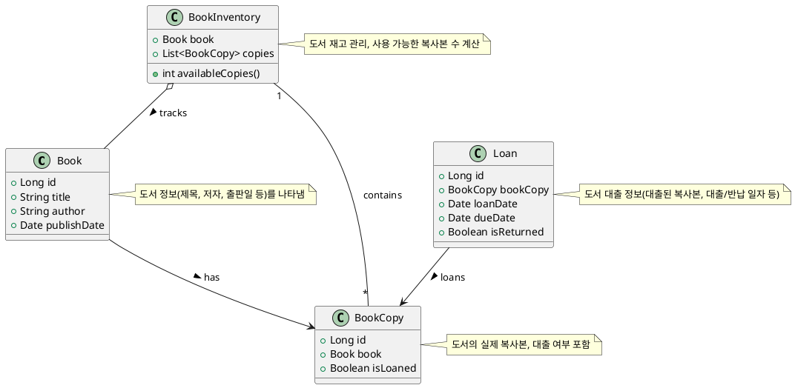

# Example - Book Management

- [Chat-gpt 세션](https://chat.openai.com/share/bb755324-81aa-47c1-8b41-2d0007c186f9)

## 어플리케이션 개요에 대한 설명 및 요구사항

- controller → application servier → domain(entity, value object, domain service, repository interface) → repository implementation 의 구조를 갖는 spring-boot, jpa 등을 이용한 웹 어플리케이션 예제를 만들고 싶어

1. outside in TDD 방식으로 controller에서 domain으로 들어가면서 iteratively discover interface하고,
2. inside out으로 domain에서 controller로 나오면서 1에서 사용한 mock 객체들을 real 객체로 치환

- 하는 것을 보여주고 싶어 어떤 예제가 적합할까 ?
    - interface를 iteratively, incrementally 발견하는 것
    - 알고리즘이 있어서 전통적인 TDD로 구현할 만한 복잡도
    - 리팩터링을 할 수준의 코드들이 있는 것
- 등을 고려해서 예제 어플리케이션을 제안해줘

## "도서 관리 시스템(Book Management System)"

- 이 시스템은 다음과 같은 기능을 포함합니다:
    - 기본 요구 사항
    - 도서 추가, 조회, 수정, 삭제 기능
    - 사용자별로 도서 대여, 반납 기능
    - 도서 검색 기능 (제목, 저자, 출판일 등으로 검색)
- 개발 과정
    - 1단계: Outside-In TDD로 시작
        - Controller Layer: REST API를 통해 도서 관리 기능(추가, 조회, 수정, 삭제)을 제공하는 컨트롤러를 설계합니다. 먼저 @RestController를 이용하여 기본적인 CRUD
          연산을 위한 엔드포인트를 생성합니다. 이 때, 실제 구현체가 아닌 Mock 객체를 사용하여 서비스 레이어의 인터페이스를 iteratively discover하면서 테스트를 작성합니다.
        - Application Service Layer: 도메인 로직을 캡슐화하고, 컨트롤러와 도메인 레이어 사이를 중개합니다. 트랜잭션 관리와 도메인 로직의 실행 순서를 제어합니다. 여기서도 마찬가지로
          실제 구현체 대신 Mock 도메인 객체를 사용합니다.
    - 2단계: Domain Layer 설계
        - Entity & Value Object: Book, User 등의 엔티티와 이를 구성하는 값 객체들을 정의합니다. JPA를 사용하여 엔티티 클래스를 구현하고, 데이터베이스와의 매핑을 설정합니다.
        - Domain Service: 복잡한 도메인 로직이나 여러 엔티티 간의 상호작용을 처리합니다. 예를 들어, 도서 대여 로직을 도메인 서비스로 구현할 수 있습니다.
        - Repository Interface: 도메인 엔티티에 대한 저장소 인터페이스를 정의합니다. 이 단계에서는 실제 구현을 고려하지 않고, 필요한 동작들을 인터페이스로 추상화합니다.
    - 3단계: Inside-Out TDD로 구현 완성
        - Repository Implementation: JPA를 사용하여 인터페이스를 구현합니다. CrudRepository나 JpaRepository를 상속받아 각 엔티티 타입에 맞는 구현체를
          작성합니다.
        - Service Layer & Controller Layer Integration: 실제 도메인 로직과 저장소 구현체를 사용하여 서비스 레이어와 컨트롤러 레이어의 테스트를 리팩토링하고, 모든 단위가
          잘 통합되어 작동하는지 확인합니다.

## 유스케이스를 제안해줘

- 유스케이스 1: 도서 검색 기능
    - 설명: 사용자는 제목, 저자, 출판일 등의 조건을 통해 도서를 검색할 수 있습니다. 이 기능은 다양한 검색 조건을 조합하여 유연한 검색을 지원해야 합니다.
    - TDD 접근 방식:
        - Outside-In: 처음에는 컨트롤러 레벨에서 HTTP GET 요청을 처리하고, 적절한 검색 조건을 수집하여 애플리케이션 서비스 레이어로 전달하는 부분을 모킹하여 시작합니다. 이후, 애플리케이션
          서비스 레이어에서 도메인 로직을 호출하는 부분을 모킹하며, 검색 로직의 인터페이스를 발견합니다.
        - Inside-Out: 도메인 레이어에서 복잡한 검색 로직을 구현합니다. JPA Criteria API나 QueryDSL 같은 기술을 활용하여 동적 쿼리를 생성하는 로직을 구현하고 테스트합니다. 이
          과정에서 실제 데이터를 다루는 리포지토리 구현체로 넘어가게 됩니다.
- 유스케이스 2: 도서 대여 기능
    - 설명: 사용자는 도서를 대여할 수 있으며, 대여 기간은 정해져 있습니다. 사용자가 대여를 원하는 도서가 대여 가능한 상태인지 확인하고, 가능하다면 대여 처리를 합니다.
    - TDD 접근 방식:
        - Outside-In: 컨트롤러에서 도서 대여 요청을 받는 부분부터 시작하여, 대여 서비스 인터페이스를 모킹합니다. 대여 가능 여부를 확인하고, 대여 처리를 위한 로직을 모킹하여 테스트를 작성합니다.
        - Inside-Out: 도서 엔티티에 대여 상태(대여 가능, 대여 중)를 관리하는 로직을 추가하고, 대여 기능을 구현하는 도메인 서비스를 작성합니다. 이후, 실제로 대여 상태를 업데이트하고 관리하는
          리포지토리 메소드를 구현합니다.
- 유스케이스 3: 도서 추가 및 수정 기능
    - 설명: 관리자는 새로운 도서를 시스템에 추가하거나, 기존 도서의 정보(제목, 저자, 출판일 등)를 수정할 수 있습니다.
    - TDD 접근 방식:
        - Outside-In: 컨트롤러에서 도서 추가 및 수정 요청을 처리하는 엔드포인트를 정의합니다. 초기 테스트에서는 도서 정보를 받아 처리하는 서비스 레이어의 메소드를 모킹합니다.
        - Inside-Out: 도서 엔티티에 대한 추가 및 수정 로직을 구현합니다. 이 과정에서 JPA를 사용하여 엔티티가 올바르게 저장되고 업데이트되는지 확인하는 리포지

## 정적 모델링

- "유스케이스 3: 도서 추가 및 수정 기능" 기능을 구현하기 전에 주요 클래스, 속성, 관계 등 정적 모델링을 plantuml로 표현해줘


## 도서 관리 시스템의 불변식

- 도서별 재고 관리
    - 각 도서의 제목과 판본에 대해 별도의 재고를 관리합니다. 즉, 같은 제목의 도서라도 다른 판본이면 별개로 관리됩니다.
- 도서 대출 가능 조건
    - 도서는 재고가 남아있는 경우에 한해 대출할 수 있습니다. 한 권의 도서에 대해 여러 사용자가 대출을 원할 경우, 재고 수량에 따라 대출이 제한됩니다.
- 재고 수량 관리
    - 특정 도서의 재고 수량은 등록된 도서의 총 수량을 초과할 수 없으며, 대출 및 반납이 발생할 때마다 실시간으로 업데이트되어야 합니다. 이는 도서가 대출되었을 때 재고를 감소시키고, 반납될 때 재고를
      증가시키는 로직으로 관리됩니다.
- 도서 정보(제목, 저자 등)는 고유해야 합니다.
    - 시스템 내에서 도서 정보는 유일무이해야 합니다. 똑같은 제목과 저자로 된 도서가 여러 개 등록되어 있을 수는 있지만, 각각의 도서는 고유한 식별자(ID)를 가지고 있어야 합니다.
- 주요 클래스 및 관계

  | 클래스 | 설명 |
                  | --- | --- |
  | Book | 도서 정보를 나타내는 기본 클래스입니다. 제목, 저자, 출판일 등의 필드를 포함합니다. |
  | BookCopy | Book의 실제 복사본을 나타냅니다. 각 복사본은 고유한 ID를 가지며, 대출 상태를 관리합니다. |
  | BookInventory | 도서의 재고 관리를 담당합니다. 특정 Book의 모든 BookCopy를 추적하고, 재고 수량을 관리합니다. |
  | Loan | 도서 대출 정보를 나타내는 클래스입니다. 대출한 BookCopy와 대출자 정보, 대출 기간 등을 포함합니다. |
  | BookRepository | 도서 정보에 대한 저장소 역할을 하는 인터페이스입니다. |
  | BookInventoryRepository | 도서 재고에 대한 저장소 역할을 하는 인터페이스입니다. |
  | LoanRepository | 대출 정보에 대한 저장소 역할을 하는 인터페이스입니다. |
  | BookService | 도서 관련 비즈니스 로직을 처리하는 서비스 클래스입니다. 도서 추가, 도서 정보 수정, 도서 재고 관리 등의 기능을 제공합니다. |
  | LoanService | 도서 대출과 관련된 비즈니스 로직을 처리하는 서비스 클래스입니다. 도서 대출, 반납 등의 기능을 제공합니다. |
  | BookController | 외부에서의 도서 관련 요청을 처리하는 컨트롤러 클래스입니다. |
  | LoanController | 외부에서의 도서 대출 및 반납 요청을 처리하는 컨트롤러 클래스입니다. |

- 제약조건이 반영된 클래스 다이어그램

## 도서 등록하기 유스케이스 시나리오

### Happy Case: 도서 추가 성공

1. 사용자 (관리자)가 시스템에 로그인합니다.
2. 사용자는 "도서 추가" 기능을 선택합니다.
3. 시스템은 도서 정보 입력 폼을 제공합니다.
4. 사용자는 도서의 제목, 저자, 출판일, 재고 수량 등 필요한 정보를 입력합니다.
5. 사용자는 "추가" 버튼을 클릭합니다.
6. 시스템은 입력된 정보를 검증합니다.
7. 시스템은 도서 정보를 데이터베이스에 저장합니다.
8. 시스템은 사용자에게 도서 추가 성공 메시지를 표시합니다.

### Alternative Case 1: 필수 정보 누락

4-a. 사용자가 필수 정보 중 일부를 입력하지 않고 "추가" 버튼을 클릭했습니다.

1. 시스템은 어떤 필수 정보가 누락되었는지를 표시하며, 도서 추가 실패 메시지를 사용자에게 알립니다.
2. 사용자는 누락된 정보를 입력한 후 다시 "추가" 버튼을 클릭할 수 있습니다.
3. 시나리오는 6단계로 돌아갑니다.

### Alternative Case 2: 도서 정보 중복

7-a. 시스템이 입력된 도서 정보가 이미 데이터베이스에 존재하는 것을 발견했습니다.

1. 시스템은 도서 정보 중복 메시지를 사용자에게 알립니다.
2. 사용자는 정보를 수정하거나 취소할 수 있습니다.
3. 사용자가 정보를 수정하여 다시 "추가" 버튼을 클릭하면, 시나리오는 6단계로 돌아갑니다.

### Alternative Case 3: 시스템 오류 또는 네트워크 문제

8-a. 시스템 오류 또는 네트워크 문제로 인해 도서 정보 저장이 실패했습니다.

1. 시스템은 오류 메시지를 사용자에게 알립니다.
2. 사용자는 다시 시도하거나, 문제가 지속될 경우 시스템 관리자에게 문의할 수 있습니다.
3. 사용자가 다시 시도를 선택한 경우, 시나리오는 4단계로 돌아갑니다.

## 구현

- Controller Test
    - [MockMvc Test](#mockmvc-test)
    - [rest-assured test](#rest-assured-test)
    - [Test Data Buiilder](#test-data-buiilder)

- Controller
    - [Rest Controller](#rest-controller)
- Service
    - [BookServiceTest](#bookservicetest)
    - [BookService](#bookservice)
- Domain Classes
    - [Book](#book)

### MockMvc Test

```java
import static org.springframework.test.web.servlet.request.MockMvcRequestBuilders.post;
import static org.springframework.test.web.servlet.result.MockMvcResultMatchers.status;
import static org.springframework.test.web.servlet.result.MockMvcResultMatchers.content;
import static org.mockito.BDDMockito.given;
import static org.mockito.ArgumentMatchers.any;

import org.junit.jupiter.api.Test;
import org.springframework.beans.factory.annotation.Autowired;
import org.springframework.boot.test.autoconfigure.web.servlet.WebMvcTest;
import org.springframework.boot.test.mock.mockito.MockBean;
import org.springframework.http.MediaType;
import org.springframework.test.web.servlet.MockMvc;

import com.example.demo.BookService;
import com.example.demo.BookController;
import com.example.demo.model.Book;
import com.fasterxml.jackson.databind.ObjectMapper;

@WebMvcTest(BookController.class)
class BookControllerTest {

    @Autowired
    private MockMvc mockMvc;

    @MockBean
    private BookService bookService;

    @Autowired
    private ObjectMapper objectMapper;

    @Test
    void addBookSuccess() throws Exception {
        Book book = new Book(1L, "The Great Gatsby", "F. Scott Fitzgerald", new Date(), 5);
        given(bookService.addBook(any(Book.class))).willReturn(book);

        mockMvc.perform(post("/books")
                        .contentType(MediaType.APPLICATION_JSON)
                        .content(objectMapper.writeValueAsString(book)))
                .andExpect(status().isOk())
                .andExpect(content().string(containsString("The Great Gatsby")));
    }

    @Test
    void addBookFailureDueToMissingInformation() throws Exception {
        Book incompleteBook = new Book(null, "", "", null, 0); // Missing required fields

        mockMvc.perform(post("/books")
                        .contentType(MediaType.APPLICATION_JSON)
                        .content(objectMapper.writeValueAsString(incompleteBook)))
                .andExpect(status().isBadRequest()); // Assuming the controller handles this case appropriately
    }

    @Test
    void addBookFailureDueToDuplicateBook() throws Exception {
        // Assuming the service throws a custom exception when trying to add a duplicate book
        given(bookService.addBook(any(Book.class))).willThrow(new DuplicateBookException());

        Book book = new Book(1L, "The Great Gatsby", "F. Scott Fitzgerald", new Date(), 5);

        mockMvc.perform(post("/books")
                        .contentType(MediaType.APPLICATION_JSON)
                        .content(objectMapper.writeValueAsString(book)))
                .andExpect(status().isConflict()); // Assuming the controller handles this case appropriately
    }
}
```

### rest-assured test

```java
import static io.restassured.RestAssured.given;
import static org.hamcrest.Matchers.*;

import io.restassured.http.ContentType;
import org.junit.jupiter.api.Test;
import org.springframework.boot.test.context.SpringBootTest;
import org.springframework.boot.web.server.LocalServerPort;
import org.springframework.http.HttpStatus;

@SpringBootTest(webEnvironment = SpringBootTest.WebEnvironment.RANDOM_PORT)
public class BookControllerRestAssuredTest {

    @LocalServerPort
    private int port;

    @Test
    void addBookSuccess() {
        Book book = new Book(1L, "The Great Gatsby", "F. Scott Fitzgerald", new Date(), 5);

        given()
                .baseUri("http://localhost")
                .port(port)
                .contentType(ContentType.JSON)
                .body(book)
                .when()
                .post("/books")
                .then()
                .statusCode(HttpStatus.OK.value())
                .body("title", equalTo("The Great Gatsby"));
    }

    @Test
    void addBookFailureDueToMissingInformation() {
        Book incompleteBook = new Book(); // Missing required fields

        given()
                .baseUri("http://localhost")
                .port(port)
                .contentType(ContentType.JSON)
                .body(incompleteBook)
                .when()
                .post("/books")
                .then()
                .statusCode(HttpStatus.BAD_REQUEST.value());
    }

    @Test
    void addBookFailureDueToDuplicateBook() {
        Book book = new Book(1L, "The Great Gatsby", "F. Scott Fitzgerald", new Date(), 5);

        // 첫 번째 요청으로 책을 추가
        given()
                .baseUri("http://localhost")
                .port(port)
                .contentType(ContentType.JSON)
                .body(book)
                .post("/books");

        // 동일한 정보로 두 번째 요청을 보냄
        given()
                .baseUri("http://localhost")
                .port(port)
                .contentType(ContentType.JSON)
                .body(book)
                .when()
                .post("/books")
                .then()
                .statusCode(HttpStatus.CONFLICT.value());
    }
}
```

### Rest Controller

```java
import org.springframework.beans.factory.annotation.Autowired;
import org.springframework.http.HttpStatus;
import org.springframework.http.ResponseEntity;
import org.springframework.web.bind.annotation.PostMapping;
import org.springframework.web.bind.annotation.RequestBody;
import org.springframework.web.bind.annotation.RestController;

@RestController
public class BookController {

    private final BookService bookService;

    @Autowired
    public BookController(BookService bookService) {
        this.bookService = bookService;
    }

    @PostMapping("/books")
    public ResponseEntity<?> addBook(@RequestBody Book book) {
        try {
            Book createdBook = bookService.addBook(book);
            return new ResponseEntity<>(createdBook, HttpStatus.OK);
        } catch (MissingInformationException e) {
            return new ResponseEntity<>(e.getMessage(), HttpStatus.BAD_REQUEST);
        } catch (DuplicateBookException e) {
            return new ResponseEntity<>(e.getMessage(), HttpStatus.CONFLICT);
        } catch (Exception e) {
            return new ResponseEntity<>(e.getMessage(), HttpStatus.INTERNAL_SERVER_ERROR);
        }
    }
}
```

### Test Data Buiilder

```java
public class BookBuilder {
    private Long id;
    private String title = "Default Title";
    private String author = "Default Author";
    private Date publishDate = new Date();
    private int quantity = 1;

    public BookBuilder withId(Long id) {
        this.id = id;
        return this;
    }

    public BookBuilder withTitle(String title) {
        this.title = title;
        return this;
    }

    public BookBuilder withAuthor(String author) {
        this.author = author;
        return this;
    }

    public BookBuilder withPublishDate(Date publishDate) {
        this.publishDate = publishDate;
        return this;
    }

    public BookBuilder withQuantity(int quantity) {
        this.quantity = quantity;
        return this;
    }

    public Book build() {
        return new Book(id, title, author, publishDate, quantity);
    }
}
```

### BookServiceTest

```java
import static org.junit.jupiter.api.Assertions.*;
import static org.mockito.ArgumentMatchers.any;
import static org.mockito.Mockito.*;

import org.junit.jupiter.api.BeforeEach;
import org.junit.jupiter.api.Test;
import org.mockito.InjectMocks;
import org.mockito.Mock;
import org.mockito.MockitoAnnotations;

import java.util.Optional;

class BookServiceTest {

    @Mock
    private BookRepository bookRepository;

    @InjectMocks
    private BookService bookService;

    @BeforeEach
    void setUp() {
        MockitoAnnotations.openMocks(this);
    }

    @Test
    void addBookSuccess() {
        Book newBook = new BookBuilder().withTitle("New Book").withAuthor("Author").build();
        when(bookRepository.save(any(Book.class))).thenReturn(newBook);

        Book savedBook = bookService.addBook(newBook);

        assertNotNull(savedBook);
        assertEquals("New Book", savedBook.getTitle());
        verify(bookRepository, times(1)).save(any(Book.class));
    }

    @Test
    void addBookFailureDueToDuplicateBook() {
        Book newBook = new BookBuilder().withTitle("New Book").withAuthor("Author").build();
        when(bookRepository.findByTitleAndAuthor(anyString(), anyString())).thenReturn(Optional.of(newBook));

        assertThrows(DuplicateBookException.class, () -> bookService.addBook(newBook));
    }
}
```

### BookService

```java
import org.springframework.beans.factory.annotation.Autowired;
import org.springframework.stereotype.Service;

import java.util.Optional;

@Service
public class BookService {

    private final BookRepository bookRepository;

    @Autowired
    public BookService(BookRepository bookRepository) {
        this.bookRepository = bookRepository;
    }

    public Book addBook(Book book) throws DuplicateBookException {
        Optional<Book> existingBook = bookRepository.findByTitleAndAuthor(book.getTitle(), book.getAuthor());
        if (existingBook.isPresent()) {
            throw new DuplicateBookException("The book already exists.");
        }
        return bookRepository.save(book);
    }
}
```
