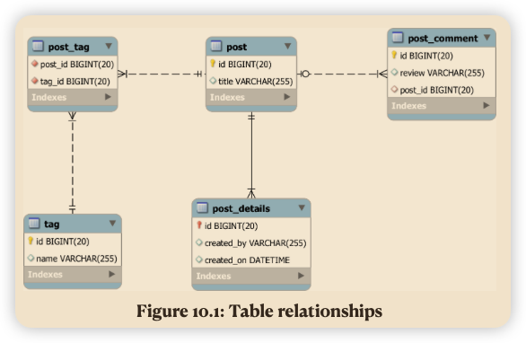

# High Performance Java Persistence

## 10. Relationships



### JPA defines four association mapping constructs:

_ @ManyToOne represents the child-side (where the foreign key resides) in a database one-to-many table relationship.
_ @OneToMany is associated with the parent-side of a one-to-many table relationship.
_ @ElementCollection defines a one-to-many association between an entity and multiple value types (basic or embeddable).
_ @OneToOne is used for both the child-side and the parent-side in a one-to-one table relationship.
_ @ManyToMany mirrors a many-to-many table relationship.’

### 10.2 @ManyToOne

- The @ManyToOne relationship is the most common’
- foreign key is controlled by the child-side, no matter the association is unidirectional or bidirectional.
- unidirectional @ManyToOne


### 10.3 @OneToMany

- @ManyToOne이 most natural mapping
- @OneToMany can also mirror this database relationship, but only when being used as a bidirectional mapping
- unidirectional @OneToMany association uses an additional junction table, which no longer fits the one-to-many table
  relationship semantics.

#### 10.3.1 Bidirectional @OneToMany

- bidirectional @OneToMany association has a matching @ManyToOne child-side mapping


- In a bidirectional association, only one side can control the underlying table relationship.
- it is the child-side @ManyToOne association in charge of keeping the foreign key column value in sync with the
  in-memory Persistence Context
- This is the reason why the bidirectional @OneToMany relationship must define the mappedBy attribute, indicating that
  it only mirrors the @ManyToOne child-side mapping
- bidirectional association must always have both the parent-side and the child-side in sync.
- To synchronize both ends, it is practical to provide parent-side helper methods that add/remove child entities.

```java
public void addComment(PostComment comment) {
    comments.add(comment);
    comment.setPost(this);
}

public void removeComment(PostComment comment) {
    comments.remove(comment);
    comment.setPost(null);
}
```

- major advantages of using a bidirectional association
    - entity state transitions can be cascaded from the parent entity to its children.
- In the following example, when persisting the parent Post entity, all the PostComment child entities are persisted as
  well.

```java
Post post = new Post("First post");
post.addComment(new PostComment("My first review"));
post.addComment(new PostComment("My second review"));
entityManager.persist(post);
```

- ‘When removing a comment from the parent-side collection:
  `post.removeComment(comment1);`
- ‘The orphan removal attribute instructs Hibernate to generate a delete DML statement on the targeted child entity:
  `DELETE FROM post_comment WHERE id = 2’`

#### 10.3.2 Unidirectional @OneToMany

- need for helper methods and the mapping does not feature a mappedBy attribute either.
- not map to a one-to-many table relationship’
    - Hibernate uses a separate junction table to manage the association between a parent row and its child records.
- joining three tables is less efficient than joining just two
    - Because there are two foreign keys, there need to be two indexes (instead of one), so the index memory footprint
      increases
- problems
    - all junction table rows associated with the parent entity are deleted, and then the remaining in-memory records
      are added back again
        - database has way more DML
- Another problem is related to indexes

#### 10.3.3 Ordered unidirectional @OneToMany
- If the collection can store the index of every collection element, the unidirectional @OneToMany relationship may benefit for some element removal operations

#### 10.3.4 @OneToMany with @JoinColumn
- With the @JoinColumn, the @OneToMany association controls the child table foreign key, so there is no need for a junction table.
- Bidirectional @OneToMany with @JoinColumn relationship
  - The @OneToMany with @JoinColumn association can also be turned into a bidirectional relationship, but it requires instructing the child-side to avoid any insert and update synchronization:
    ```java
    @ManyToOne
    @JoinColumn(name = "post_id", insertable = false, updatable = false)
    private Post post;
    ```
    - The redundant update statements are generated for both the unidirectional and the bidirectional association, so the most efficient foreign key mapping is the @ManyToOne association.

#### 10.3.5 Unidirectional @OneToMany Set
- Set을 이용하기 위해 hashCode와 equals 메소드를 구현해야 함
- To avoid using a secondary table, the @OneToMany mapping can use the @JoinColumn annotation.
- unidirectional Set is still less efficient than the bidirectional @OneToMany association.

### 10.4 @ElementCollection
- @ElementCollection is very similar to the unidirectional @OneToMany relationship.
  - To represent collections of basic types (e.g. String, int, BigDecimal) or embeddable types, the @ElementCollection must be used instead.

#### 10.4.1 @ElementCollection List
- Using an @ElementCollection with a List is not very efficient because the association is considered to be a bag, in Hibernate terminology.
  - A bag does not guarantee that elements are uniquely identifiable, hence Hibernate needs to delete and reinsert the elements associated with a given parent entity whenever a change occurs to the @ElementCollection List.

#### 10.4.2 @ElementCollection Set
- On the other hand, when using a Set, the @ElementCollection no longer behaves like a bag, and the generated SQL statements are going to be more efficient.

### 10.5 @OneToOne
- In JPA, the @OneToOne relationship can be either unidirectional or bidirectional.

#### 10.5.1 Unidirectional @OneToOne

#### 10.5.2 Bidirectional @OneToOne

### 10.6 @ManyToMany

#### 10.6.1 Unidirectional @ManyToMany List
- For @ManyToMany associations, CascadeType.REMOVE does not make too much sense when both sides represent independent entities.

#### 10.6.2 Unidirectional @ManyToMany Set

#### 10.6.3 Bidirectional @ManyToMany

#### 10.6.4 The @OneToMany alternative

--- image path 변경