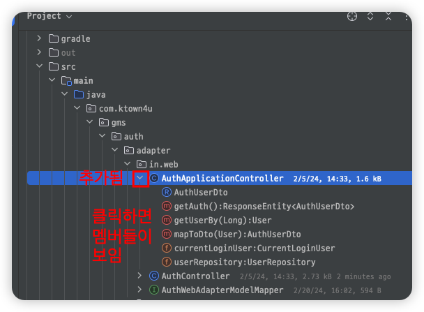
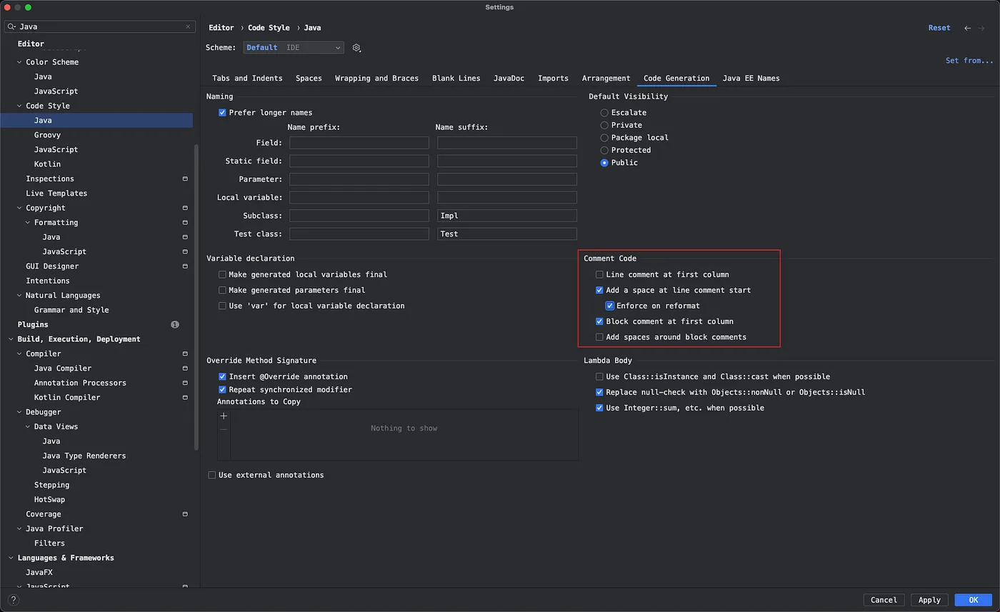
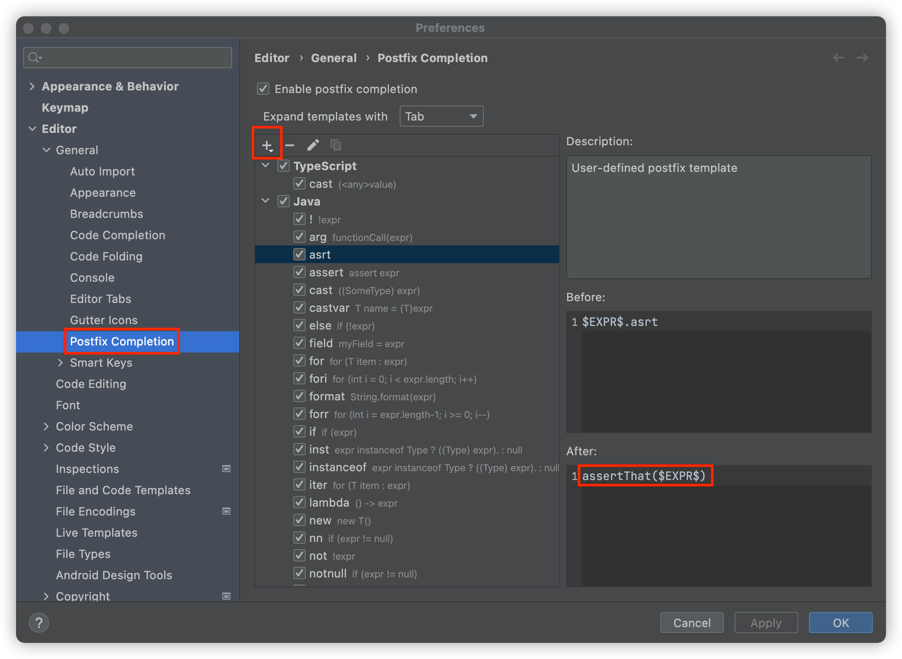

# IntelliJ

## Settings

### View

- Enable ligatures
- View | Appearance: Details in Tree View
- View | Active Editor: Show Indent Guides
- Show tree indent guides
- Show Members
    - 
    - before
        - 
    - after
        - 
- Jump to colors and fonts
    - 
- 커서가 위치한 식별자들에 적용되는 컬러 변경하기
    - 
- Show BreadCrumbs
    - 
- tooltip이 안보일 때
  - `Preferences | Appearance & Behavior | Appearance, Accessibility > Support screen readers` off

### Formatting

- Align when multiline
    - 
- Show Whitespaces
    - 
- 코드블록 포매팅 방지
    - 
  ```java
  //@formatter:off
  reviewDao.updateLikeCount(reviewId,true?1:-1);
  //@formatter:on
  ```
- [Annotations on the same line – IDEs Support (IntelliJ Platform) | JetBrains](https://intellij-support.jetbrains.com/hc/en-us/community/posts/206947645-Annotations-on-the-same-line)
- 
- Comment alignment
  - 

### Edit

- Postfix Completion
    - 
- 변수 생성시 final 지정되도록
    - 
- Template
    - New Method Body
        - 

### Navigation

- previous / next highlighted usage
    - opt + ctrl + 화살표
- Add Selection for Next Occurrences: ctrl + cmd + G
- Select All Occurrences: ctrl + G

### Etc

- before commit
    - 

## Commands

- create launcher script
- Preview file content
    - project view에서 파일 선택하고 spacebar
- Locate Duplicates...

## UML
- VCS 변경을 다이어그램으로 보기 
  - `VCS | Uncommitted Changes| Show Local Changes as UML`
  - `⌘⌥⇧D`
- 다이어그램의 요소들을 리스트업하기 - `⌘F12`
- 수동으로 클래스들 간의 관계를 그릴 수 있음
- layout
  - `F5`: 현 구조에서 다시 그리기
  - `⇧F5`: 자동 정렬
- Show Implementations `⌘⌥B`, Show Parents `⌘⌥P`
- 해당 소스로 가기 `⌘↓`
- Analyze graph: 클래스들을 선택하고, 우클릭해서 Analyze graph
- Measure diagram centrality
  - 중요한 노드 식별 자동으로 하기
  - 우클릭 / `Analyze Graph | Measure Centrality`
  
## Plugins

- [IdeaVim - IntelliJ IDEs Plugin | Marketplace](https://plugins.jetbrains.com/plugin/164-ideavim)
- [GitHub Copilot - IntelliJ IDEs Plugin | Marketplace](https://plugins.jetbrains.com/plugin/17718-github-copilot)
- [CodeMetrics - IntelliJ IDEs Plugin | Marketplace](https://plugins.jetbrains.com/plugin/12159-codemetrics)
- [SonarLint - IntelliJ IDEs Plugin | Marketplace](https://plugins.jetbrains.com/plugin/7973-sonarlint)
- [IntelliJDeodorant - IntelliJ IDEs Plugin | Marketplace](https://plugins.jetbrains.com/plugin/14016-intellijdeodorant)
- [Presentation Assistant for 2023.2 - IntelliJ IDEs Plugin | Marketplace](https://plugins.jetbrains.com/plugin/7345-presentation-assistant-for-2023-2)
- [DTO generator - IntelliJ IDEs Plugin | Marketplace](https://plugins.jetbrains.com/plugin/7834-dto-generator)
- [Lombok - IntelliJ IDEs Plugin | Marketplace](https://plugins.jetbrains.com/plugin/6317-lombok)
- [Grep Console - IntelliJ IDEs Plugin | Marketplace](https://plugins.jetbrains.com/plugin/7125-grep-console)
    - 
    - p6spy를 위한 설정
      

## References
- [victorrentea/intellij-tips](https://github.com/victorrentea/intellij-tips)
- [인텔리J 활용 꿀팁 42가지 정리 | Popit](https://www.popit.kr/%EC%9D%B8%ED%85%94%EB%A6%ACj-%ED%99%9C%EC%9A%A9-%EA%BF%80%ED%8C%81-42%EA%B0%80%EC%A7%80-%EC%A0%95%EB%A6%AC/)
- [IntelliJ Tips, 익숙지 않은 분들을 위한](https://gist.github.com/aafwu00/e48a5b16318ca2c5b3c0f8e32f9da886)
- 
