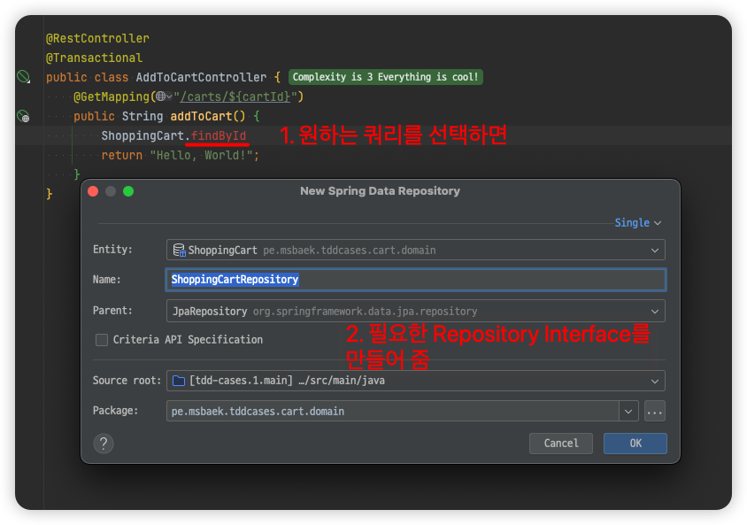

# JPA Buddy

## A Guide to JPA Buddy

- [출처](https://www.baeldung.com/jpa-buddy)

### Create an Entity

- 폴더에서 우클릭 > New > JPA Entity

### JPA Explorer


### JPA Designer


## JPA Buddy – From Zero to Hero

- [JPA Buddy – From Zero to Hero](https://www.youtube.com/watch?v=TpD6bT9M1CE)

### JPA Buddy에 접근하는 4가지 방법

- JPA Explorer view
- Context Dependent: 파일 에디터 상단
    - 
- JPA Designer
- Generate Menu
    - 

### 필드 추가

- OwnerType이라는 enum 타입을 필드로 추가하는 경우
- JPA Designer에서 Attributes / Enum을 더블클릭
    - 

### User:Media = 1:n 관계 추가하기

- Context Dependent에서 Association 클릭
- 
- 타입에서 기존 타입을 선택하거나, 오른쪽 + 버튼을 클릭해서 신규 타입 추가
- 

### add named query(jpql)

- 
- Entity에 named query가 추가됨

### FlyWay

- 의존성 추가
  ```
  implementation 'org.flywaydb: flyway-core'
  implementation 'org.flywaydb:flyway-mysql'
  annotationProcessor 'org.hibernate.orm:hibernate-jpamodelgen'
  ```
- 
- 
- 

### JPA Entity 사용하기

- 
- 

### 자동으로 생성된 긴 jpa query method 이름 줄이기

- 줄이면 jpql 쿼리가 `@Query`로 추출됨
- 메소드 명에서 show context action하고 extract jpql query and configure 선택 후 이름 변경
- 
  ```java
  public interface ShoppingCartRepository extends JpaRepository<ShoppingCart, Long> {
      @Query("""
              select s from ShoppingCart s inner join s.cartItems cartItems
              where s.member.id = ?1 and cartItems.product.id = ?2""")
      List<ShoppingCart> memberAndProduct(Long id, Long id1);
  }
  ```

### Create DTO

- 
- 이후 모델에서 필드명 변경하면 DTO에도 자동으로 반영됨. 동기화가 이뤄짐