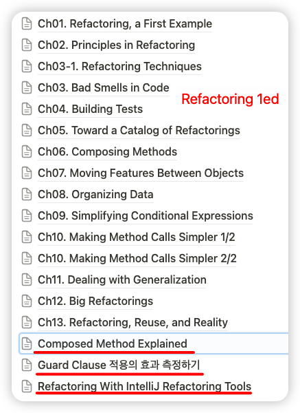
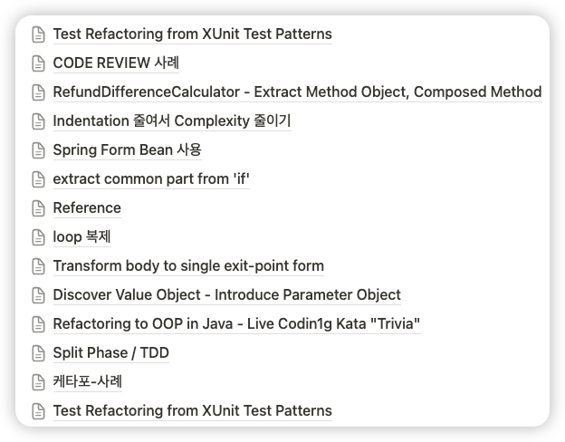

# TODO

## 리팩터링 관련 정리들이 있는 문서들

- 지금은 문서들이 많이 산재해 있음
    - Notion
        - 개인
            - [Stdudy / Refactoring](https://www.notion.so/ctemplate/8c0744e433c44698888a3eca6ee9247d?v=cf502059be82427db14762fbb7d214fa&pvs=4)
                - 
            - [Study / Refactoring Cases](https://www.notion.so/ctemplate/Refactoring-Cases-99d793ab68e64c96b81349ea0d95d2ae?pvs=4)
                - 
            - [강연자료 / Refactoring](https://www.notion.so/ctemplate/Refactoring-ad19620dc9224451a0353e777978ea9a?pvs=4)
            - [Testing and Refactoring Legacy Code (1)](https://www.notion.so/ctemplate/Testing-and-Refactoring-Legacy-Code-1-3ad12cfc15d14e7bb22ff99f1f0d411d?pvs=4)
            - [Approval Testing & Coverage (1)](https://www.notion.so/ctemplate/Approval-Testing-Coverage-1-20c8d4a85f994383bf4047ad042c2bd0?pvs=4)
            - [Exploratory Refactoring](https://www.notion.so/ctemplate/Exploratory-Refactoring-4bc4dd134b364f8c801176779cebeced?pvs=4)
        - 회사
    - Xmind
    - keynote

