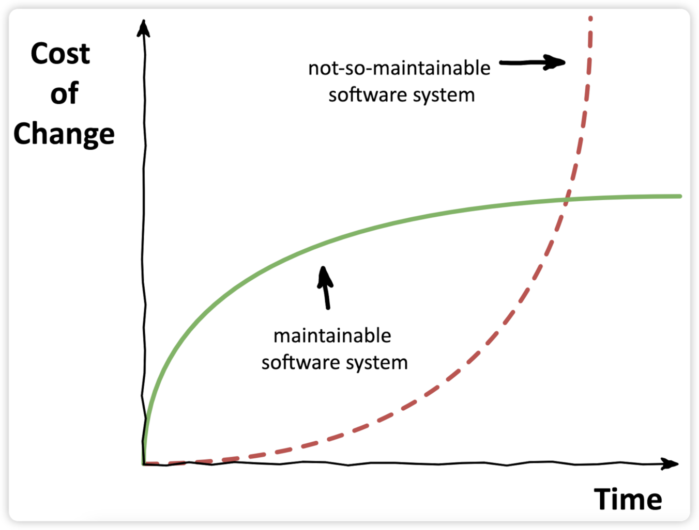
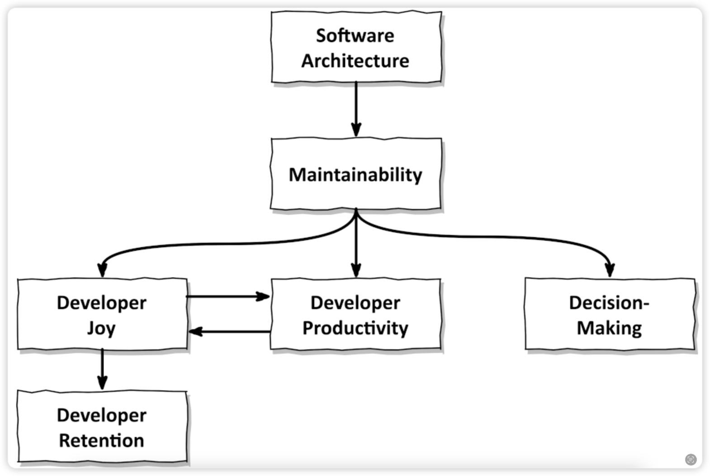

# Software Quality

## 유지보수 용이성

Figure 1.1 - A maintainable software system has a smaller lifetime cost than a not-so-maintainable software system.

Figure 1.5 - Software architecture influences maintainability.

Get Your Hands Dirty on Clean Architecture (2nd edition)