# Spring Modulith with DDD

## Building Modular Monolith Applications with Spring Boot and Domain Driven Design

- [Building Modular Monolith Applications with Spring Boot and Domain Driven Design | by Abhinav Sonkar | ITNEXT](https://itnext.io/building-modular-monolith-applications-with-spring-boot-and-domain-driven-design-d3299b300850)
- [xsreality/spring-modulith-with-ddd at part-1-ddd-solution](https://github.com/xsreality/spring-modulith-with-ddd/tree/part-1-ddd-solution)

### 모듈

- 애플리케이션은 모듈로 구성됨. 각 모듈은 비즈니스 문제의 특정 부분을 해결함
- 모듈은 느슨하게 결합되고, 순환 의존성이 없음
- 모듈의 퍼블릭 인터페이스(다른 모듈에 노출되는 행위)는 유연하고 원자적으로 변경될 수 있음
    - 마이크로서비스와 달리 모듈의 퍼블릭 인터페이스를 변경해야 할 때 해당 인터페이스를 사용하는 다른 모듈들도 함께 변경되고 배포할 수 있음
- “높은 응집도, 낮은 결합도"
    - “함께 변경되는 것은 함께 유지되어야 함"
- 모듈의 경계를 패키지로 하는 경우 Controller, Service, Repository는 같은 패키지에 있어야 함
    - 새로운 기능(aka package-by-feature)을 빌드할 때 항상 함께 변경해야 하기 때문
- 계층별 패키징은 정의상 응집도가 낮으므로 모듈화되지 않음
- from [“Structured Design”](https://www.amazon.com/Structured-Design-Fundamentals-Discipline-Computer/dp/0138544719)

### 모듈 식별하기

- 바운더리 식별은 여전히 중요
- 어떻게 바운더리 경계를 식별하나 ?
    - 경험 상, DDD의 패턴은 이 문제를 해결하는 가장 좋은 도구임

### A Business Problem - "도서관, 도서 대여 프로세스"

#### 요구사항:

- 책은 바코드로 식별됨
- 원하는 책이 존재하는 경우 대여를 할 수 있음
    - 고객은 책을 찾고 대여 데스크에 가서 대여함
- 책을 반납하기 위해서는 고객은 순환 데스크로 가거나, 드롭 존에 책을 놓아두면 됨

#### 도서관 도메인을 [서브 도메인](https://stackoverflow.com/questions/73077578/what-actually-is-a-subdomain-in-domain-driven-design)으로 나누기

- "책을 대여하는 프로세스"
- "도서의 재고"

### Building the Solution

#### 2개의 [Bounded Context](https://martinfowler.com/bliki/BoundedContext.html)

- Borrow, Inventory 바운디드 컨텍스트를 설계하여 서브 도메인 문제를 해결함
    - **바운디드 컨텍스트는 모듈러 모놀리스 애플리케이션의 모듈**이↓기도 함
    - `(+)`가 있는 클래스만 public, 나머지는 package private
  ```
  src/main/java
  └── example
      ├── borrow
      │   ├── Loan
      │   ├── LoanController
      │   ├── (+) LoanDto
      │   ├── (+) LoanManagement
      │   ├── LoanMapper      
      │   ├── LoanRepository
      │   └── LoanWithBookDto
      └── inventory
          ├── Book
          ├── BookController
          ├── (+) BookDto
          ├── (+) BookManagement
          ├── BookMapper
          └── BookRepository
  ```

### Inventory 바운디드 컨텍스트

- [Aggregate Pattern](https://martinfowler.com/bliki/DDD_Aggregate.html)을 활용해서 Inventory 바운디드 컨텍스트를 설계
- 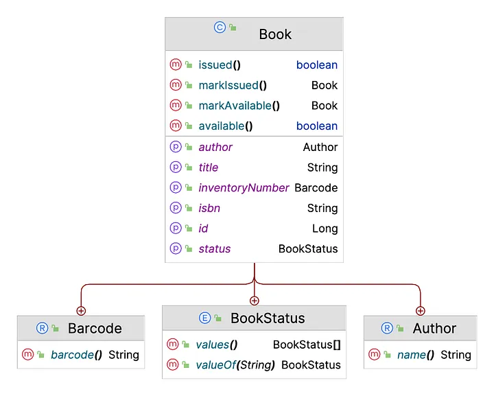

#### 구현

- Entity

```Java 

@Entity
@Getter
@NoArgsConstructor
@Table(uniqueConstraints = @UniqueConstraint(columnNames = {"barcode"}))
class Book {
    @Id
    @GeneratedValue(strategy = GenerationType.IDENTITY)
    private Long id;
    private String title;
    @Embedded
    private Barcode inventoryNumber;
    private String isbn;
    @Embedded
    @AttributeOverride(name = "name", column = @Column(name = "author"))
    private Author author;
    @Enumerated(EnumType.STRING)
    private BookStatus status;
    @Version
    private Long version;

    /* aggregate root
     * any changes to this aggregate (e.g. modifying the status of the Book) must happen
     * via the Book entity only and limited to the module itself
     */
    public Book(String title, Barcode inventoryNumber, String isbn, Author author) {
        this.title = title;
        this.inventoryNumber = inventoryNumber;
        this.isbn = isbn;
        this.author = author;
        this.status = BookStatus.AVAILABLE;
    }

    public boolean isAvailable() {
        return BookStatus.AVAILABLE.equals(this.status);
    }

    public boolean isIssued() {
        return BookStatus.ISSUED.equals(this.status);
    }

    public Book markIssued() {
        if (this.status.equals(BookStatus.ISSUED)) {
            throw new IllegalStateException("Book is already issued!");
        }
        this.status = BookStatus.ISSUED;
        return this;
    }

    public Book markAvailable() {
        this.status = BookStatus.AVAILABLE;
        return this;
    }

    /* thress value objects */
    public record Barcode(String barcode) {
    }

    public record Author(String name) {
    }

    public enum BookStatus {
        AVAILABLE, ISSUED
    }
    /* thress value objects */
}
```

- Repository

```Java
interface BookRepository extends JpaRepository<Book, Long> {
    Optional<Book> findByIsbn(String isbn);

    Optional<Book> findByInventoryNumber(Book.Barcode inventoryNumber);

    List<Book> findByStatus(Book.BookStatus status);
}
```

- Bookmanagement Service

```Java

@Transactional
@Service
@RequiredArgsConstructor
public class BookManagement {
    private final BookRepository bookRepository;
    private final BookMapper mapper;

    public BookDto addToInventory(String title, Book.Barcode inventoryNumber, String isbn, String authorName) {
        var book = new Book(title, inventoryNumber, isbn, new Book.Author(authorName));
        return mapper.toDto(bookRepository.save(book));
    }

    public void removeFromInventory(Long bookId) {
        var book = bookRepository.findById(bookId)
                .orElseThrow(() -> new IllegalArgumentException("Book not found!"));
        if (book.issued()) {
            throw new IllegalStateException("Book is currently issued!");
        }
        bookRepository.deleteById(bookId);
    }

    public void issue(String barcode) {
        var inventoryNumber = new Book.Barcode(barcode);
        var book = bookRepository.findByInventoryNumber(inventoryNumber)
                .map(Book::markIssued)
                .orElseThrow(() -> new IllegalArgumentException("Book not found!"));
        bookRepository.save(book);
    }

    public void release(String barcode) {
        var inventoryNumber = new Book.Barcode(barcode);
        var book = bookRepository.findByInventoryNumber(inventoryNumber)
                .map(Book::markAvailable)
                .orElseThrow(() -> new IllegalArgumentException("Book not found!"));
        bookRepository.save(book);
    }

    @Transactional(readOnly = true)
    public Optional<BookDto> locate(Long id) {
        return bookRepository.findById(id)
                .map(mapper::toDto);
    }

    @Transactional(readOnly = true)
    public List<BookDto> issuedBooks() {
        return bookRepository.findByStatus(Book.BookStatus.ISSUED)
                .stream()
                .map(mapper::toDto)
                .toList();
    }
}
``` 

- 주목할 사항
    - BookManagement Service는 Book 엔터티 대신 [DTO](Terms.md#dto)를 반환함
        - 서비스 계층에서 DTO만 반환함으로써, 도메인 모델(엔터티)가 컨트롤러나 프리젠테이션 계층으로 누출되지 않도로 보호함
    - BookManagement(퍼블릭 API)넌 DTO를 제외하고는 다른 모듈에서 접근 가능한 유일한 클래스임

- REST API for clients

```Java

@RestController
@RequiredArgsConstructor
class BookController {
    private final BookManagement books;

    @PostMapping("/books")
    ResponseEntity<BookDto> addBookToInventory(@RequestBody AddBookRequest request) {
        var bookDto = books.addToInventory(request.title(), new Barcode(request.inventoryNumber()), request.isbn(), request.author());
        return ResponseEntity.ok(bookDto);
    }

    @DeleteMapping("/books/{id}")
    ResponseEntity<Void> removeBookFromInventory(@PathVariable("id") Long id) {
        books.removeFromInventory(id);
        return ResponseEntity.ok().build();
    }

    @GetMapping("/books/{id}")
    ResponseEntity<BookDto> viewSingleBook(@PathVariable("id") Long id) {
        return books.locate(id)
                .map(ResponseEntity::ok)
                .orElse(ResponseEntity.notFound().build());
    }

    @GetMapping("/books")
    ResponseEntity<List<BookDto>> viewIssuedBooks() {
        return ResponseEntity.ok(books.issuedBooks());
    }

    record AddBookRequest(String title, String inventoryNumber,
                          String isbn, String author) {
    }
}
```      

- Inventory 바운디드 컨텍스트를 처음 2가지 요구사항을 완료했음
- 나머지 2개의 요구사항은 Borrow 바운디드 컨텍스트에 의해 구현됨

### Borrow 바운디드 컨텍스트

- 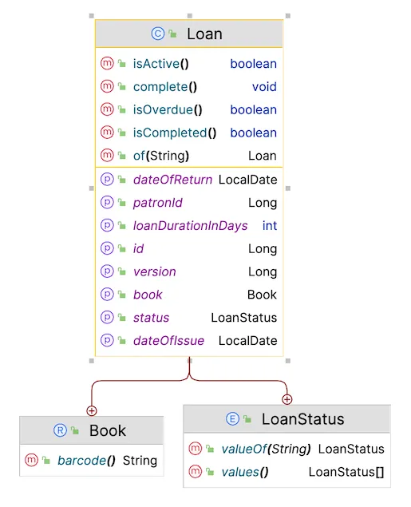

#### Loan 엔터티

- 오래 지속되는 엔터티임

```Java

@Entity
@Getter
@Setter
@NoArgsConstructor
public class Loan {
    @Id
    @GeneratedValue(strategy = GenerationType.IDENTITY)
    private Long id;
    @Embedded
    @AttributeOverride(name = "barcode", column = @Column(name = "book_barcode"))
    private Book book;
    private Long patronId;
    private LocalDate dateOfIssue;
    private int loanDurationInDays;
    private LocalDate dateOfReturn;
    @Enumerated(EnumType.STRING)
    private LoanStatus status;
    @Version
    private Long version;

    Loan(String bookBarcode) {
        this.book = new Book(bookBarcode);
        this.dateOfIssue = LocalDate.now();
        this.loanDurationInDays = 14;
        this.status = LoanStatus.ACTIVE;
    }

    public static Loan of(String bookBarcode) {
        return new Loan(bookBarcode);
    }

    public boolean isActive() {
        return LoanStatus.ACTIVE.equals(this.status);
    }

    public boolean isOverdue() {
        return LoanStatus.OVERDUE.equals(this.status);
    }

    public boolean isCompleted() {
        return LoanStatus.COMPLETED.equals(this.status);
    }

    public void complete() {
        if (isCompleted()) {
            throw new IllegalStateException("Loan is not active!");
        }
        this.status = LoanStatus.COMPLETED;
        this.dateOfReturn = LocalDate.now();
    }

    public enum LoanStatus {
        ACTIVE, OVERDUE, COMPLETED
    }

    public record Book(String barcode) {
    }
}
```

- 주목할 사항
    - book entity에 대한 foreign key 참조가 없음
    - 대신 Book을 barcode만 갖는 value object로 모델링(`@Embedded`)
        ```Java
        @Embedded
        @AttributeOverride(name = "barcode", column = @Column(name = "book_barcode"))
        private Book book;
        // ...
        public record Book(String barcode) {
        }
        ```
        - `메모리 참조` → `repository룰 통한 참조(id)`
    - Loan과 Book 사이에는 ManyToOne JPA 관계가 없음

#### LoanManagement Service

```Java

@Transactional
@Service
@RequiredArgsConstructor
public class LoanManagement {
    private final LoanRepository loanRepository;
    private final BookManagement books;
    private final LoanMapper mapper;

    public LoanDto checkout(String barcode) {
        books.issue(barcode);
        var loan = Loan.of(barcode);
        var savedLoan = loanRepository.save(loan);
        return mapper.toDto(savedLoan);
    }

    public LoanDto checkin(Long loanId) {
        var loan = loanRepository.findById(loanId)
                .orElseThrow(() -> new IllegalArgumentException("No loan found"));
        books.release(loan.getBook().barcode());
        loan.complete();
        return mapper.toDto(loanRepository.save(loan));
    }

    @Transactional(readOnly = true)
    public List<LoanWithBookDto> activeLoans() {
        return loanRepository.findLoansWithStatus(LoanStatus.ACTIVE);
    }

    @Transactional(readOnly = true)
    public Optional<LoanDto> locate(Long loanId) {
        return loanRepository.findById(loanId)
                .map(mapper::toDto);
    }
}
```

- 주목할 점
    1. **LoanManagement 서비스가 BookManagement 서비스에 의존함**
    2. checkout, checkin의 구현이 어떠한 불변식 조사도 하지 않음
        - 단순히 Loan 애그리것이나 Bookmanagement 서버스로 **위임**(호출)만 하고, 이후에 불변식 조사가 일어남
        - 결과적으로 매우 명확하고, 이해하기 쉬운 LoanManagement 서비스가 구현됨
    3. BookManagement 처럼 서비스는 엔터티 대신 DTO를 반환함

### 몇가지 개선할 사항

- 바운디드 컨텍스트간 **강결합**
    - **Borrow 바운디드 컨텍스트와 Inventory 바운디드 컨텍스트가 강결합됨**
        - Inventory 바운디드 컨텍스트가 사용이 불가할 때 Borrow 바운디드 컨텍스트도 작동 불가
    - 결제 요청은 단일 txn에서 2개의 aggregate를 갱신함
        - **하나의 txn은 하나의 aggregate를 갱신해야 함**
- 바운디드 컨텍스트간의 **독립적인 테스트 불가**
    - Borrow 바운디드 컨텍스트를 테스트하려면 의존성이 있는 바운디드 컨텍스트인 Inventory도 처리해야 함
    - checkout에 대한 테스트는 대여된 도서의 상태가 `ISSUED`로 갱신되었는지 확인해야 함
    - BookManagement 서비스를 Mocking하거나 DI하지 않도고 테스트할 수 있으면 좋을 것임
  ```Java
  @Transactional
  @SpringBootTest
  class LoanManagementIT {
      @Autowired LoanManagement loan;
      @Autowired BookManagement books;

      @Test
      void shouldCreateLoanAndIssueBookOnCheckout() {
          var loanDto = loans.checkout("13268510");
          assertThat(loanDto.status()).isEqualTo(LoanStatus.ACTIVE);
          assertThat(loanDto.book().barcode()).isEqualTo("13268510");
          assertThat(books.locate(1L).get().status()).hasToString("ISSUED");
      }

      @Test
      void shouldCompleteLoanAndReleaseBookOnCheckin() {
          var loan = loans.checkin(10L);
          assertThat(loan.status()).isEqualTo(LoanStatus.COMPLETED);
          assertThat(books.locate(2L).get().status()).hasToString("AVAILABLE");
      }
  }
  ```
- **바운디드 컨텍스트 간의 인터페이스 제어**
    - 각 바운디드 컨텍스트는 다른 바운디드 컨텍스트에서 사용할 수 있는 특정 클래스만 노출(DTO 및 서비스 클래스)
    - 이들은 바운디드 컨텍스트의 인터페이스 역할을 함
    - 이를 위해서는 신중하고 지속적인 주의가 필요함

## Improving Modular Monolith Applications with Spring Modulith

- https://itnext.io/improving-modular-monolith-applications-with-spring-modulith-edecc787f63c

### 새로운 비즈니스 요구사항

- 고객이 도서 대여를 요청하면 바로 issued(대여됨) 상태가 됨
- 하지만 고객의 실제로 수령했는지 알 수 없음
- 따라서 보류됨(hold) 상태 추가가 필요해짐

### 도메인 모델을 다시 생각하기

#### 기존의 서브도메인

- 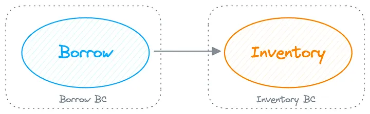
- 기존의 동기식 강결합(tightly coupling)을 비동기식 약결합(loosely coupling)으로 변경하고자 함
    - 강결합: 고객의 책을 대여하면 Inventory의 책 상태는 동기식으로 대여됨으로 변경됨

#### 드러나는 새로운 서브도메인

- Inventory 서브 도메인은 도서관에서 대여 가능한 모든 책을 추적하는 역할도 담당
    - 즉 도서관의 모든 카탈로그를 관리하여 도서가 대여되고, 반납될 때 변경되는 대영 가능 여부를 추적함
- 실제로 2개의 서브 도메인이 하나로 모델링된 경우 어떻게 해야 할까 ?

- 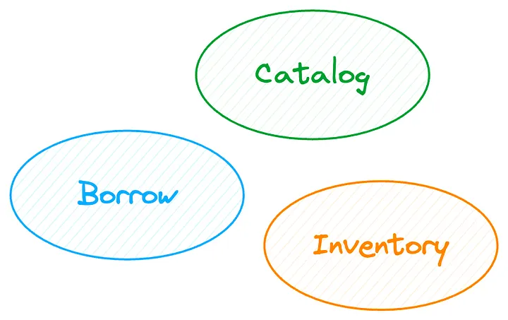
- Catalog 서브도메인은 Inventory 서브 도메인이 담당할 가용성에 대한 걱정 없이 책의 메타데이터를 캡쳐하는 역할을 담당함
- 바운드 컨텍스트도 3개가 있어야 할까 ?
    - Borrow 및 Inventory 바인딩된 컨텍스트는 여전히 동일한 의존성을 공유
    - 도메인 이벤트를 사용하여 최종적인 일관성(eventual consistency)을 가진 의존성을 모델링하면 어떨까?
- **도메인 이벤트**를 이용해서 의존성 개선
    - Borrow 바운디드 컨텍스트: **BookCheckoutRequested** 이벤트를 발생
    - Inventory 바운디드 컨텍스트: 해당 이벤트를 수신하면 책이 가용한지 확인하고 **BookAvailable**나 **BookUnavailable** 이벤트 발생
    - Borrow 바운디드 컨텍스트: Inventory 바운디드 컨텍스트가 발생시킨 이벤트에 따라 대여 상태를 갱신(**ACTIVE or REJECTED**)

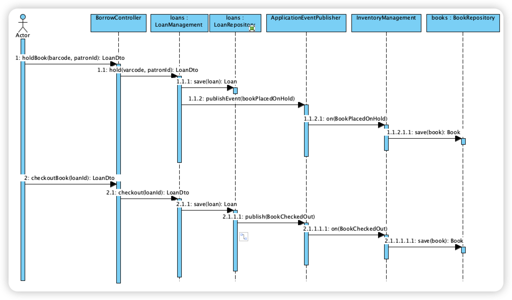

### 2개의 서브도메인, 하나의 바운디드 컨텍스트

- 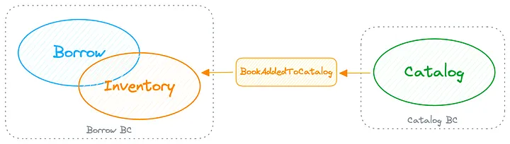
- 바운디드 컨텍스트는 언어적 경계(linguistic boundary)임
    - 모델의 의미는 바운디드 컨텍스트 내에서 변하지 않음
    - Borrow와 Inventory에서 도서의 의미는 동일함
    - Inventory 바운디드 컨텍스트에서 도서의 가장 중요한 속성은 사용 가능 상태임
    - Borrow 바운디드 컨텍스트에서 책을 빌리고 반납할 때 책의 사용 가능 상태가 영향을 받음
    - 도서라는 모델은 두 바운디드 컨텍스트 간에 동일함
- 도서관(카탈로그)에 새 책이 추가되면 Borrow 바운디드 컨텍스트는 Inventory를 갱신하기 위해 이 사실을 알아야 함
- 이 이벤트를 다음과 같이 모델링 할 수 있음
    - Catalog 바운디드 컨텍스트
        - Borrow 바운디드 컨텍스트에 의해 소비되는 BookAddedToCatalog 이벤트를 발생시킴
        - Borrow 바운디드 컨텍스트는 지역 재고(local inventory)를 갱신하여 새로운 책을 대여할 수 있음을 나타냄
    - 이벤트를 통해 비동기적으로 통신할 때 대여 프로세스가 더이상 카탈로그에 의존하기 않아서 Catalog 바운디드 컨텍스트와 Borrow 바운디드 컨텍스트는 느슨하게 결합됨

### Borrow 바운디드 컨텍스트(with new Insights)

- 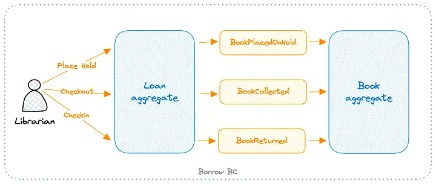
- LoanManagement 서비스가 유스케이스가 실행됨에 따라 이벤트를 발생시킴

```Java

@Transactional
@Service
@RequiredArgsConstructor
public class LoanManagement {
    private final LoanRepository loans;
    private final BookRepository books;
    private final ApplicationEventPublisher events;
    private final LoanMapper mapper;

    public LoanDto hold(String barcode, Long patronId) {
        var book = books.findByInventoryNumber(new Barcode(barcode))
                .orElseThrow(() -> new IllegalArgumentException("Book not found!"));

        if (!book.available()) {
            throw new IllegalStateException("Book not available!");
        }

        var dateOfHold = LocalDate.now();
        var loan = Loan.of(barcode, dateOfHold, patronId);
        var dto = mapper.toDto(loans.save(loan));
        events.publishEvent(
                new BookPlacedOnHold(
                        book.getId(),
                        book.getIsbn(),
                        book.getInventoryNumber().barcode(),
                        loan.getPatronId(),
                        dateOfHold));
        return dto;
    }
}

public record BookPlacedOnHold(Long bookId,
                               String isbn,
                               String inventoryNumber,
                               Long patronId,
                               LocalDate dateOfHold) {
}
```

- InventoryManagement 서비스는 이벤트를 리슨하고 책을 보류(hold) 상태로 만듦

```Java

@Transactional
@Service
@RequiredArgsConstructor
public class InventoryManagement {
    private final BookRepository books;

    @ApplicationModuleListener
    public void on(BookPlacedOnHold event) {
        var book = books.findById(event.bookId())
                .map(Book::markOnHold)
                .orElseThrow(() -> new IllegalArgumentException("Book not found!"));
        books.save(book);
    }
}
```

- `@ApplicationModuleListener`에 주의하라
    - `@TransactionalEventListener, @Async, @Transactional(propagation = Propagation.REQUIRES_NEW)`
    - 별도의 트랜잭션에서 별도의 쓰레드로 이벤트 리스터가 동작하도록 함
    - 리스너와 무관하게 이벤트를 트리거링하는 코드는 항상 완료됨
- 새로운 이슈
    - 이벤트를 트리거한 코드이 이미 완료된 상태에서 리스너 실행이 실패되면...

### Spring Modulith Event Publication Registry

- **spring-modulith-starter-core, spring-modulith-starter-jpa** 의존성 사용
    - spring-modulith-starter-jpa 의존성은 이벤트 발행 레지스트리를 활성화함
        - **EVENT_PUBLICATION 테이블**을 생성함(ID, COMPLETION_DATE, EVENT_TYPE, LISTENER_ID, PUBLICATION_DATE,
          SERIALIZED_EVENT)
    - COMPLETION_DATE를 이용해서 리스너 실행이 실패하면 이벤트가 손실되지 않고 리스터 실행이 성공할 때까지 다시 트리거됨(application이 재실행될 때 재처리됨)

### 격리된 모듈 테스트

- 모듈 간이 통신에 이벤트를 도입하여 독립된 테스트가 가능해짐

```Java

@Transactional
@ApplicationModuleTest // automatically restricts the Spring Application context to the package (representing the module) under test and nothing else
class LoanIntegrationTests {
    @DynamicPropertySource
    static void initializeData(DynamicPropertyRegistry registry) {
        registry.add("spring.sql.init.data-locations", () -> "classpath:borrow.sql");
    }

    @Autowired
    LoanManagement loans;

    @Test
    void shouldCreateLoanOnPlacingHold(Scenario scenario) {
        scenario.stimulate(() -> loans.hold("13268510"))
                .andWaitForEventOfType(BookPlacedOnHold.class)
                .toArriveAndVerify((event, dto) -> {
                    assertThat(event.inventoryNumber()).isEqualTo("13268510");
                    assertThat(dto.status()).isEqualTo(LoanStatus.HOLDING);
                });
    }
}
```

- `@ApplicationModuleTest`: 모듈을 나타내는 패키지에 대한 스프링 애플리케이션 컨텍스트만 로딩되도록 제한
- [integration testing with Spring Modulith](https://docs.spring.io/spring-modulith/reference/testing.html)

### 스프링 모듈리스를 통한 더 강한 모듈 경계

- Spring 모듈리스에서는 모든 최상위 패키지가 모듈로 간주
    - API 패키지라고 함
    - 이 패키지의 모든 클래스는 다른 모듈(최상위 패키지)에서 자동으로 사용할 수 있음
    - 최상위 패키지의 하위 패키지는 내부에 있으며 다른 모듈에서 액세스할 수 없음

```
src/main/java
└── example
    ├── borrow ← API Package(module)
    │   ├── book
    │   │   ├── Book
    │   │   ├── BookCollected
    │   │   ├── BookPlacedOnHold
    │   │   ├── BookRepository
    │   │   ├── BookReturned
    │   │   └── InventoryManagement
    │   └── loan
    │       ├── BorrowController
    │       ├── Loan        
    │       ├── LoanDto
    │       ├── LoanManagement
    │       ├── LoanMapper      
    │       └── LoanRepository      
    ├── catalog ← API Package(module)
    │   ├── internal
    │   │   ├── BookDto
    │   │   ├── BookMapper
    │   │   ├── CatalogBook
    │   │   ├── CatalogController
    │   │   ├── CatalogManagement
    │   │   └── CatalogRepository
    │   └── BookAddedToCatalog
    └── LibraryApplication
```

- 이러한 제약은 아래와 같은 테스트를 통해 강화될 수 있음

```java
class SpringModulithTests {
    ApplicationModules modules = ApplicationModules.of(SpringModulithWithDddApplication.class);

    @Test
    void verifyPackageConformity() {
        modules.verify();
    }
}
```

- 모듈의 내부 클래스에 접근하면 아래와 같은 예외가 발생

```java
org.springframework.modulith.core.Violations:-Module 'borrow'
depends on
non-
exposed type
example.catalog.internal.BookAddedToCatalog within
module 'catalog'!
        BookAddedToCatalog declares parameter BookAddedToCatalog.on(BookAddedToCatalog)in(InventoryManagement.java:0)
```

### 모듈 문서화

- 스프링 모듈리스에서는 문서 스니핏과 모듈 간의 관계를 표현하는 C4 다이어그램을 생성할 수 있음

```Java
class SpringModulithTests {
    ApplicationModules modules = ApplicationModules.of(SpringModulithWithDddApplication.class);

    @Test
    void createModulithsDocumentation() {
        new Documenter(modules).writeDocumentation();
    }
}
```

- $PROJECT_ROOT/target/spring-modulith-docs 디렉토리에 산출물이 생성됨
- C4 diagram of our application modules
- 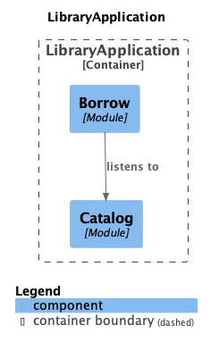
- The test also generates documentation snippets for each module (bounded context).
- 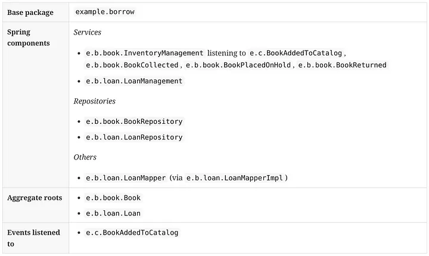

## Adopting Domain-First Thinking in Modular Monolith with Hexagonal Architecture

- [Adopting Domain-First Thinking in Modular Monolith with Hexagonal Architecture | by Abhinav Sonkar | Feb, 2024 | ITNEXT](https://itnext.io/adopting-domain-first-thinking-in-modular-monolith-with-hexagonal-architecture-f9e4921ac18d)
    - https://github.com/xsreality/spring-modulith-with-ddd/tree/part-3-hexagonal-architecture
- Spring Data Repository: Java 인터페이스로 정의되지만 동적 프록시를 통해 구현을 결합하므로 실제로는 인터페이스가 아님
    - 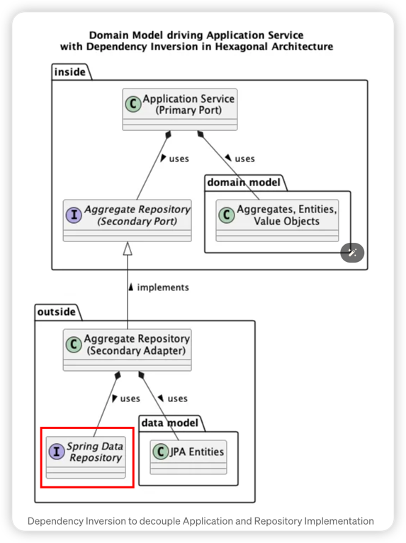
    - 의존성을 반전시키는 데 사용되는 인터페이스는 포트, 인터페이스 구현은 어댑터
    - 도메인 모델에 의해 구동되므로 구동형(driven) 또는 보조형(secondary)
    - 유스 케이스를 구현하는 데 사용되는 애플리케이션 서비스도 포트
        - 차이점은 Java 인터페이스가 아니라 일반 클래스라는 점
        - 또한 사용 사례(REST API, GraphQL, Lambda 등)에 액세스하기 위해 기술을 결합하는 해당 어댑터도 있음
        - 이러한 포트와 어댑터는 도메인 모델을 사용하므로 드라이버 또는 기본 이라고도 함
        - 그들은 우리 모델의 사용을 주도함
    - Ports are not always interfaces and Adapters are not always implementations
        - Primary port can be a class while Primary Adapter uses this class
        - Secondary port must be an interface while Secondary adapter its implementation to inverse the dependency.
        - 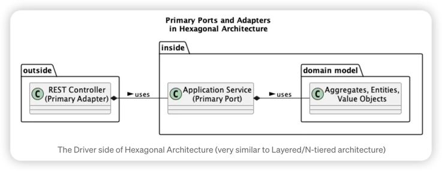
        - 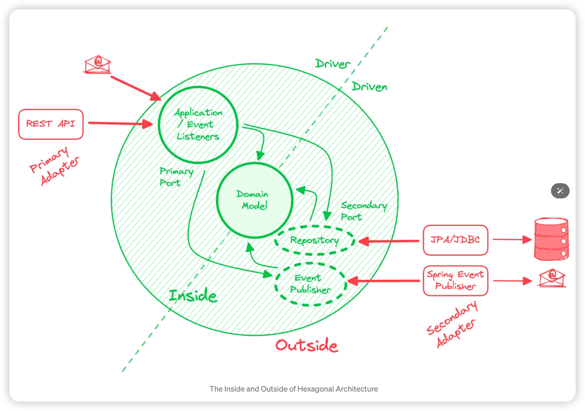

### 이러한 아키텍처의 장점

- Core Business Logic is free of implementation details
    - 새로운 기능 요청을 작성해야 합니까? 이를 도메인 모델에 구현하고 단위 테스트를 통해 검증합니다. Spring Boot 또는 Hibernate를 업데이트해야 합니까? 걱정하지 마세요. 도메인 모델은 영향을
      받지 않습니다.
- Domain Model drives the implementation
- 도메인 모델은 아키텍처의 핵심입니다. 다른 모든 것은 도메인 모델을 따릅니다. 이는 비즈니스 로직의 구현을 주도합니다. 이전에 구현을 주도했던 데이터 모델은 이제 지속성에만 관련된 사소한 세부 사항입니다. 기타
  인프라 문제(REST API가 필요하고, 야간 점검을 수행하기 위한 스케줄러가 필요하며, AWS Lambda를 트리거해야 함)는 모두 도메인 모델과 관련이 없습니다.
- Delayed Decisions
- 사용 사례에 Relational을 사용해야 할지, NoSQL을 사용해야 할지 잘 모르시나요? REST와 GraphQL을 사용하는 것에 대한 질문에 설계자가 돌아오지 않았나요? 이것이 비즈니스 로직 구현을
  중단해서는 안 됩니다.

### The Borrow Bounded Context (implemented with Hexagonal Architecture)

- organize the Borrow module with below package structure
- 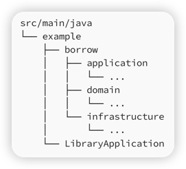
    - application and domain package represent the “inside” of the Hexagon while infrastructure package represents the
      “outside” of the Hexagon.
- 패키지에 관해 준수하려는 규칙
    - domain package
        - will contain the domain models (Aggregates, Entities, Value Objects) and Secondary / Driven ports that provide
          an interface for infrastructure to implement
        - We will restrict ourselves to only use standard Java, Lombok (to reduce verbose code) and JMolecules (to
          document stereotypes) libraries only.
    - application package
        - contain Primary / Driver ports that implement the use cases of the application
        - We will allow ourselves to use Spring @Transactional and Modulith @ApplicationModuleListener annotations.
    - infrastructure package
        - contain the code to build the REST APIs and JPA adapters
        - This is the Wild West, the outside.
        - No restrictions apply, all libraries are fair game here.

#### use case: placing hold on a book

- Use Case
  ```java
  @PrimaryPort
  public class CirculationDesk {
    
      private final BookRepository books;
      private final HoldRepository holds;
      private final HoldEventPublisher eventPublisher;

      @Transactional
      public HoldDto placeHold(PlaceHold command) {
          books.findAvailableBook(command.inventoryNumber())
                  .orElseThrow(() -> new IllegalArgumentException("Book not found"));

          return Hold.placeHold(command)
                  .then(holds::save)
                  .then(eventPublisher::holdPlaced)
                  .to(HoldDto::from);
      }
    
      record PlaceHold(Barcode inventoryNumber, 
                       String patronId, 
                       LocalDate dateOfHold) {
      }
  }  
  ```
- To inverse the dependency, we introduce a Repository interface (not to be confused with Spring Data) for all
  Aggregates.
  ```java
  @SecondaryPort
  interface BookRepository {
      Optional<Book> findAvailableBook(Book.Barcode inventoryNumber);
      Optional<Book> findOnHoldBook(Book.Barcode inventoryNumber);
      Book save(Book book);
      Optional<Book> findByBarcode(String barcode);
  }

  @SecondaryPort
  interface HoldRepository {
      Hold save(Hold hold);
      Optional<Hold> findById(Hold.HoldId id);
      List<Hold> activeHolds();
  }
  ```
- Triggering Domain Events from Aggregates
    - One outcome of a use case is to persist the updated state of the Aggregate
        - Another outcome can be to fire a domain event so that other modules in the monolith (or other aggregates in
          the same module) can react on it.
    - Both persisting the aggregate (using Repository) and firing an event (using Event Publisher) are secondary/driven
      ports in Hexagonal architecture
        - The implementation is irrelevant to the business logic.
    - An event BookPlacedOnHold is fired after the execution of our use case
        - This event is consumed by the Book aggregate to update the status of the book in the database
        - The handling of the event is the responsibility of the primary/driver port as it is core part of the business
          logic.
      ```java
      // the event publisher interface with no implementation knowledge 
      // of how the event is actually published.
      @SecondaryPort
      public interface HoldEventPublisher {
  
          void holdPlaced(BookPlacedOnHold event);
  
          default Hold holdPlaced(Hold hold) {
              BookPlacedOnHold event = new BookPlacedOnHold(hold.getId().id(), hold.getOnBook().barcode(), hold.getDateOfHold());
              this.holdPlaced(event);
              return hold;
          }
      }
  
      // the event handler using Spring Modulith listener 
      // to reliably react to the event.
      @PrimaryPort
      class CirculationDeskEventHandler {
  
          private final BookRepository books;
          private final HoldEventPublisher eventPublisher;
  
          @ApplicationModuleListener
          public void handle(BookPlacedOnHold event) {
              books.findAvailableBook(new Book.Barcode(event.inventoryNumber()))
                      .map(Book::markOnHold)
                      .map(books::save)
                      .orElseThrow(() -> new IllegalArgumentException("Duplicate hold?"));
          }
      }
      ```
- Unit Testing the “Inside” (Business Logic) in Hexagonal
    - 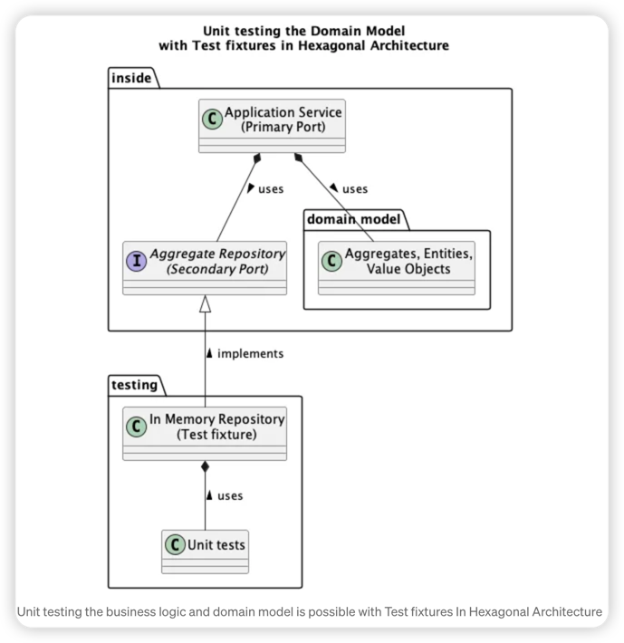
    - A big advantage of implementing business logic without framework dependencies
        - able to unit test the code without needing integration tests.A big advantage of implementing business logic
          without framework dependencies is to be able to unit test the code without needing integration tests.
      ```java
      class CirculationDeskTest {
          CirculationDesk circulationDesk; // Application Service
          BookRepository bookRepository; // Secondary Port
          HoldRepository holdRepository; // Secondary Port
  
          @BeforeEach
          void setUp() {
              bookRepository = new InMemoryBooks();
              holdRepository = new InMemoryHolds();
              circulationDesk = new CirculationDesk(bookRepository, holdRepository, new InMemoryHoldsEventPublisher());
          }
  
          @Test
          void patronCanPlaceHold() {
              var command = new Hold.PlaceHold(new Book.Barcode("12345"), LocalDate.now());
              var holdDto = circulationDesk.placeHold(command);
              assertThat(holdDto.getBookBarcode()).isEqualTo("12345");
              assertThat(holdDto.getDateOfHold()).isNotNull();
          }
  
          @Test
          void bookStatusUpdatedWhenPlacedOnHold() {
              var command = new Hold.PlaceHold(new Book.Barcode("12345"), LocalDate.now());
              var hold = Hold.placeHold(command);
              circulationDesk.handle(new BookPlacedOnHold(hold.getId().id(), hold.getOnBook().barcode(), hold.getDateOfHold()));
              //noinspection OptionalGetWithoutIsPresent
              var book = bookRepository.findByBarcode("12345").get();
              assertThat(book.getStatus()).isEqualTo(ON_HOLD);
          }
      }
  
      // Test Fixture (acts as Secondary Adapter implementing the Secondary Port)
      class InMemoryBooks implements BookRepository {
          private final Map<String, Book> books = new HashMap<>();
  
          public InMemoryBooks() {
              var booksToAdd = List.of(
                      Book.addBook(new Book.AddBook(new Book.Barcode("12345"), "A famous book", "92972947199")),
                      Book.addBook(new Book.AddBook(new Book.Barcode("98765"), "Another famous book", "98137674132"))
              );
              booksToAdd.forEach(book -> books.put(book.getInventoryNumber().barcode(), book));
          }
  
          ...
      }
  
      // Test Fixture (acts as Secondary Adapter implementing the Secondary Port)
      class InMemoryHolds implements HoldRepository {
        // similar to InMemoryBooks above
        ...
      }
      ```
        - Since our domain model is relying on an interface for persisting the aggregate or triggering an event, the
          unit test needs a test fixture to be able to execute the interface methods. An implementation for every
          Secondary/Driven ports is required for the unit tests to work.
- Unit Testing the Architecture rules
  ```java
  @AnalyzeClasses(packages = "example.catalog")
  public class CatalogJMoleculesTests {

      @ArchTest
      ArchRule dddRules = JMoleculesDddRules.all();

      @ArchTest
      ArchRule layering = JMoleculesArchitectureRules.ensureLayering();
  }

  @AnalyzeClasses(packages = "example.borrow")
  public class BorrowJMoleculesTests {

      @ArchTest
      ArchRule dddRules = JMoleculesDddRules.all();

      @ArchTest
      ArchRule hexagonal = JMoleculesArchitectureRules.ensureHexagonal();
  }
  ```
- Integration Testing the “Outside” in Hexagonal
    - The outside where technologies interface with our domain model should be tested with Integration test to verify
      their behaviour
  ```java
  // from CirculationDeskIT
  @Test
  void patronCanPlaceHold(Scenario scenario) {
      var command = new Hold.PlaceHold(new Book.Barcode("13268510"), LocalDate.now());
      scenario.stimulate(() -> circulationDesk.placeHold(command))
              .andWaitForEventOfType(BookPlacedOnHold.class)
              .toArriveAndVerify((event, dto) -> {
                  assertThat(event.inventoryNumber()).isEqualTo("13268510");
              });
  }

  // from CirculationDeskControllerIT
  @Test
  void placeHoldRestCall() throws Exception {
      mockMvc.perform(post("/borrow/holds")
                      .contentType(MediaType.APPLICATION_JSON)
                      .content("""
                              {
                                "barcode": "64321704",
                                "patronId": 5
                              }
                              """))
              .andExpect(status().isOk());
  }
  ```
- Visualizing Class Stereotypes with jMolecules
    - [jMolecules support - IntelliJ IDEs Plugin | Marketplace](https://plugins.jetbrains.com/plugin/15166-jmolecules-support)

### Avoid Purist implementations of Hexagonal architecture

- Hexagon 내부는 핵심 비즈니스 로직 구현으로 육각형 외부에서 사용되는 프레임워크와 기술이 없어야 합니다.
    - 나는 이 규칙을 종교적으로 따르려고 시도하여 프레임워크와 싸우는 복잡한 코드로 이어지는 일부 구현을 보았습니다.

### Merging detached JPA entities built from Domain model

```java
public HoldDto placeHold(Hold.PlaceHold command) {
    ...

    Hold.placeHold(command) // creates Hold domain model object
            .then(holds::save) // converts to JPA entity to persist it in database
            .then(eventPublisher::holdPlaced) // triggers HoldPlaced event

    ...
  );
}
```

- The holds::save is a call on the Secondary port interface which will trigger the Secondary adapter implementation:

### Code

- 도메인 객체 생성에 필요한 커맨드를 해당 도메인 객체에 innner record로 정의

```java
public class Book {
    private Book(AddBook addBook) {
        this.id = new BookId(UUID.randomUUID());
        this.inventoryNumber = addBook.barcode();
        this.title = addBook.title();
        this.isbn = addBook.isbn();
        this.status = BookStatus.AVAILABLE;
    }


    /**
     * Command to add a new book
     */
    public record AddBook(Barcode barcode, String title, String isbn) {
    }
}
```

- dto#from(domainModel) factory method가 존재

```java
public static HoldDto from(Hold hold) {
    return new HoldDto(
            hold.getId().id().toString(),
            hold.getOnBook().barcode(),
            hold.getDateOfHold());
}
```

- persistence entity와 domain model 분리

```java
package example.borrow.infrastructure.out.persistence;

@Entity
public class HoldEntity {
    @Embedded
    @AttributeOverride(name = "barcode", column = @Column(name = "bookBarcode"))
    private Book.Barcode book;

    @Enumerated(EnumType.STRING)
    private HoldStatus status;

    @Version
    private Long version;

    public Hold toDomain() {
        if (this.status == HoldStatus.HOLDING) {
            return Hold.placeHold(new Hold.PlaceHold(book, dateOfHold));
        } else {
            return null;
        }
    }

    public static HoldEntity fromDomain(Hold hold) {
        var entity = new HoldEntity();
        entity.id = hold.getId().id();
        entity.book = hold.getOnBook();
        entity.dateOfHold = hold.getDateOfHold();
        entity.status = HoldStatus.HOLDING;
        entity.version = 0L;
        return entity;
    }
}

enum HoldStatus {
    HOLDING, ACTIVE, COMPLETED
}
```
- Adapter가 Jpa Repository Interface를 사용

```java
@SecondaryAdapter
@Component
@Transactional
@RequiredArgsConstructor
public class BookRepositoryAdapter implements BookRepository {

    private final BookJpaRepository books;
```

- 도메인 객체를 fluent하게 사용하기 위한 헬퍼 함수

```java
class Hold {
    public Hold then(UnaryOperator<Hold> function) {
        return function.apply(this);
    }
}
```

### 전통적인 Hexagonal과 비교


----

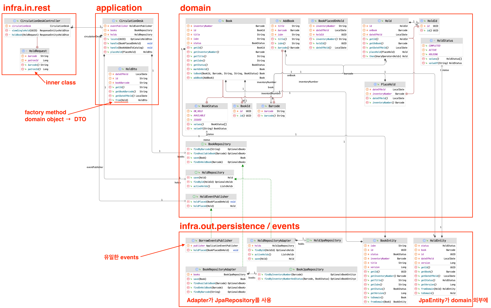

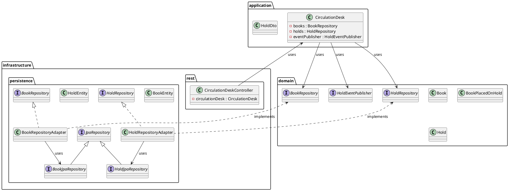
### issues

- entity를 adapter에
    - 이래서 단위 테스트가 순수해 졌음
    - entity <-> model 어떻게 하나 ?
    - lazy loading, dirty check ?
    - optimistic locking은 ?

## 메모

- 테이블에 constraint 걸기
  `@Table(uniqueConstraints = @UniqueConstraint(columnNames = {"barcode"}))`

- Entity의 속성을 Value Object로 매핑하기

```java
class Book {
    @Embedded
    private Barcode inventoryNumber;
    @Embedded
    @AttributeOverride(name = "name", column = @Column(name = "author"))
    private Author author;
    @Enumerated(EnumType.STRING)
    private BookStatus status;

    public record Barcode(String barcode) {
    }

    public record Author(String name) {
    }

    public enum BookStatus {AVAILABLE, ISSUED}
}
```

- aggregate root
    - 애그리것에 대한 모든 변경(예: 도서의 상태 수정)은 Book 엔티티를 통해서만 이루어져야 하고, 모듈 자체로 제한되어야 함

- 상태 변경을 유발하는 메소드의 이름 명명 규칙(markXXX)
    - `Book::markIssued`: 대여됨으로 상태 변경
    - `Book::markAvailable`: 대여 가능 상태로 변경

- Bounded Context > Sub domains > application + domain + ui
    - 하나의 바운디드 컨텍스는 1개 이상의 서브 도메인을 가질 수 있음
        - 바운디드 컨텍스트가 모듈이고 배포의 단위인 듯
    - 서브 도메인은 application, infra, domain, ui 등의 패키지를 가질 수 있음

- Provided Interface
    - 다른 모듈에 노출되는 API
    - 스프링 빈이나 모듈에 의해 발행되는 애플리케이션 이벤트에 의해 구현

- Required Interfaces
    - 스프링 빈, 애플리케이션 이벤트의 형태로 다른 모듈이 노출하는 API에 대한 참조

- spring modulith의 패키지들
    - 메인 패키지: @SpringBootApplication으로 어노테이션된 클래스가 있는 패키지
    - 애플리케이션 모듈 패키지: 메인 패키지의 하위 패키지
        - API 패키지 = 애플리케이션 모듈 패키지 ← → internal 패키지

- 발행된 이벤트 재처리
    - 완료되지 않은 이벤트는 애플리케이션 재시작 시 재처리됨
    - 완료되지 않은 이벤트를 일정 시간 후에 재처리 하는 것도 가능
    - 또, 완료된 이벤트를 DB에서 제거하거나 아카이브 저장소로 이동도 가능
    - CompletedEventPublications
        - 이 인터페이스는 완료된 모든 이벤트 발행물에 액세스할 수 있으며, 데이터베이스에서 모든 발행물을 즉시 제거하거나 지정된 기간(예: 1분)보다 오래된 완료된 발행물을 제거하기 위한 API를 제공
    - IncompleteEventPublications
        - 이 인터페이스는 모든 완료되지 않은 이벤트 발행물에 액세스하여 지정된 조건과 일치하거나 원래 발행 날짜를 기준으로 지정된 기간보다 오래된 발행물을 다시 제출할 수 있도록 함

- 이벤트 발행 로그 활성화
    - EventPublicationRepository(spring-modulith-starter-jpa)가 제공됨
    - spring.modulith.events.jdbc-schema-initialization.enabled=true

- Externalizing Events
    - Kafka, AMQP, JMS, SQS, SNS

- Bootstrap Modes
    - STANDALONE(default): Runs the current module only.
    - DIRECT_DEPENDENCIES: Runs the current module as well as all modules the current one directly depends on.
    - ALL_DEPENDENCIES: Runs the current module and the entire tree of modules depended on.