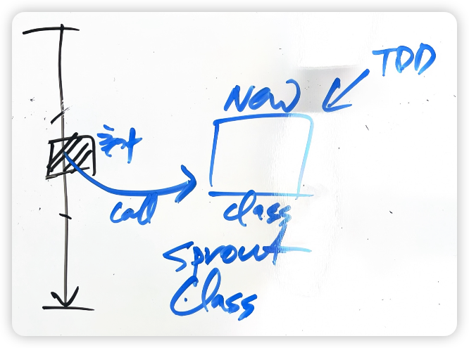

# Sprout Class

1. 새로운 기능을 새로운 클래스에 TDD로 구현한다.
2. 코드를 추가할 곳에서 새로운 클래스로의 호출을 추가한다.

- 클래스가 거대해지는 이유
  - 새로운 기능을 추가할 때 유사한 기능을 제공하는 클래스에 추가하게됨 
  - 그 클래스가 가지고 있는 다름 기능을 사용할 수 있어서
  - 하지만 이런 행위가 반복되면 God Class가 됨
  - 기존 클래스에 TDD로 기능을 추가하기는 어려움