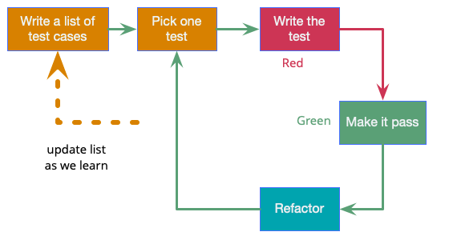

# TDD

> with TDD, I am First User of my code

## [Canon TDD](https://tidyfirst.substack.com/p/canon-tdd)

1. Write a list of the test scenarios you want to cover
2. Turn exactly one item on the list into an actual, concrete, runnable test
3. Change the code to make the test (& all previous tests) pass
4. Optionally refactor to improve the implementation design
5. Until the list is empty, go back to #2

## Write as list of test cases


from https://martinfowler.com/bliki/TestDrivenDevelopment.html

## Add Failing Test - Red
### 테스트 추가하는 순서
- 단위 테스트의 대상은 행위(요구사항, 유스케이스, 사용자 스토리 등)임
- 제일 먼저 작성할 것은 High Level Test. 이 테스트가 나중에 우리가 원하는 설계가 됨. target model
    - high level outline을 커멘트로 작성
  ```java
  // 1. validate user & followed
  // 2. check if not following
  // 3. create follower
  // 4. send notification
  ```
- 그런데 이러한 High Level Test를 짧은 시간에 통과시킬 수 없음
- 커멘트 처리하고 사소한 테스트 케이스부터 처리
- 이때 테스트에서 온전히 메소드를 구현한 후 제품코드의 클래스로 Move Instance Method를 하거나, Extract Delegate
    - 제품코드가 생겼을 때 이미 테스트 코드가 존재하게됨

### Degenerate Test
- 테스트에 degenerate case부터 추가해야 제품 코드가 단순해짐. guard clause를 준수하게 되어서 들여쓰기가 줄어들어 인지적 부담을 줄일 수 있음

## Make It Work - Blue
- Duck Tape Programming을 해서라도 빠르게 동작하도록 만들어야
- 이렇게 구현을 해 봐야 문제를 제대로 이해할 수 있음
- TPP(Transformation Priority Premise)를 따라서 구현

## Make It Better - Green
- 기술부채가 생기지 않도록 다음 기능 구현 전에 반드시 리팩터링을 해야함
- 중복, 코드 악취 등을 제거하고 패턴을 적용할 시점

## 단위 테스트와 개발자 테스트
### 단위 테스트(sociable)
- 서로 격리된(isolated) 테스트로서 행위에 대한 것임(어떤 클래스의 메소드에 대한 것이 아님)
- 모듈의 단일진입점(single entry point)에 대한 테스트
- 시스템의 행위가 어떤 것인지에 대한 이야기여야

### 개발자 테스트(solitary)
- 단위 테스트를 한번에 구현하기 어려워서 개발을 용이하게 하기 위한 테스트
- mock등 사용 가능
- 기능 구현 후에 향후 유지보수 용이성을 위해 삭제 가능

## why clean code
- Eng.와 SE의 특성
- 비직관적인 품질과 비용의 관계
- 그린 필드보다 브라운 필드에서 일하게 됨
- 브라운 필드에서 일하는 것이 더 실력이 필요한 영역임
- 먼저 설계가 나쁘더라도 빨리 동작하게 해서 피드백을 받아보고, 설계를 개선할 지 여부를 결정하자
    - 실력이 부족하면 처음부터 설계에 시간을 들여도 좋은 설계를 만들 수 없다.
    - 하지만 누구라도 동작하게까지는 빨리 할 수 있을 것