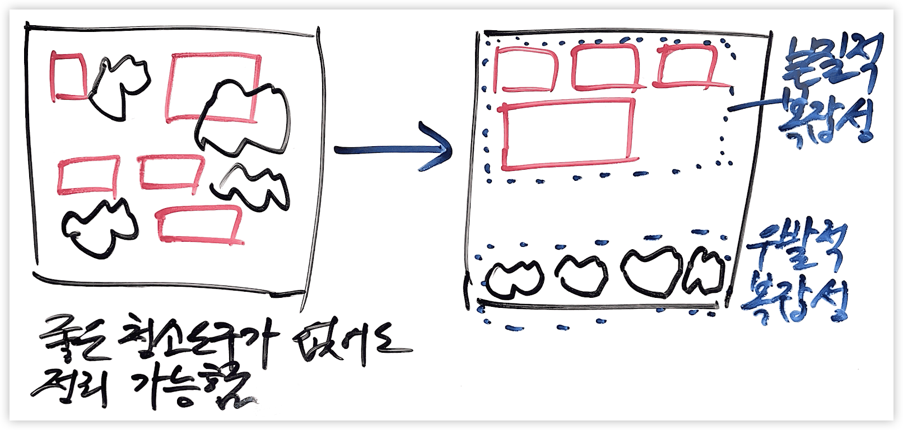
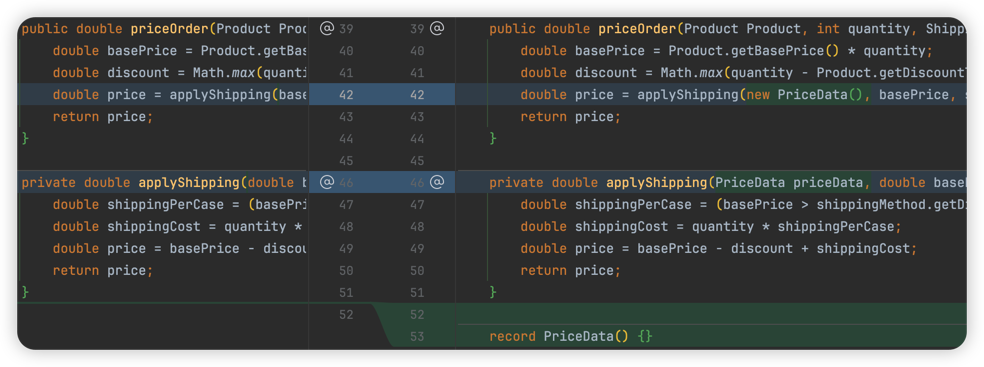
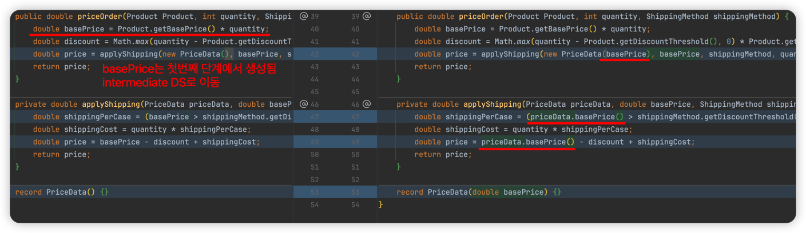
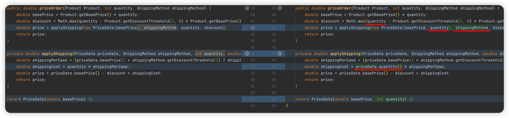
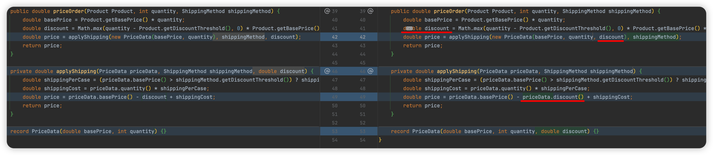
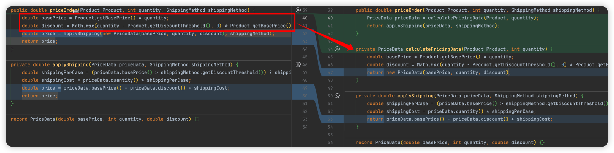
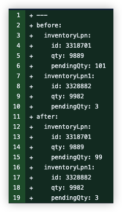

# Techniques

<!-- TOC -->

* [Overall Refactoring](#overall-refactoring)
    * [Tyding](#simle-tyding)
    * [Refactoring Levels](#refactoring-levels)
* [Naming](#naming)
    * [규칙](#naming-rules)
* [묵시적 의존성 명시화하기](#explicify-implicit-dependency)
* [Repeated Switches](#repeated-switches)
* [Lift up conditional](#lift-up-conditional)
* [유사한 기능을 추가하는 절차](#add-similar-feature)
* [loop is one thing - SRP](#loop-is-one-thing---srp)
* [Split Phase](#split-phase)
* [Split by Levels of Abstraction](#split-by-levels-of-abstraction)
* [Split Unrelasted Complexity](#split-unrelasted-complexity)
* [Imperative Shell / Functional Core Segregation](#imperative-shell--functional-core-segregation)
* [combinational approval test](#combinational-approval-test)
* [Approval Test를 위한 Printer](#approval-test-printer)
* [TDD Refactoring](#TDD-Refactoring)
* [Tips](#tips)
    * [반드시 단순해야 하는 구문들](#Syntax-that-must-be-simple)
    * [Compare with clipboard](#Compare-with-clipboard)

<!-- TOC -->

## Overall Refactoring

### Tyding { id="simle-tyding" }

- 절차적, 명령형 스타일로 개발이 되었고, 테스트가 존재할 때
    - 제일 먼저 이렇게 하는 이유
        - 구현을 완료해봐야 **문제를 정확히 이해**하고, 사전에 **예측하기 어려운 이슈를 발견**할 수 있음

1. Reorder - slide statements

    - reading / cohesion order
    - `Move declaration of 'xxx' closer to usages`

2. Chunk Statements

    - 관련된 코드 블록을 그룹핑(빈 라인을 삽입)

3. Explaining Comment ← 필수1
4. Explaining Variable / Method towards Composed Method ← 필수2(**좋은 이름을 붙일 수 있으면**)
5. application에 있는 로직을 최대한 domain logic으로(discover domain service and value object - first class collection,
   paremterized object, field of entity) ← 충분히 연습이 되었다면
6. trimming ← 충분히 연습이 되었다면

### Refactoring Levels

1. 가독성, 유지보수성
    - 최소한의 리팩터링
    - 
    - 청소기나 빗자루, 쓰레받이 등의 청소도구가 없어도 손과 종이 등을 이용해서 청소를 할 수 있음
    - 객체지향 원칙, 디자인 패턴, 리팩터링 기법 등을 모르더라도 깨끗해야 하는 코드(본질적 복잡성)와 지저분할 수 있는 코드(우발적 복잡성)을 분리할 수는 있다
2. 중복 제거
3. 악취 제거
4. Toward Patterns
    - split by abtraction layer
    - split unrelated complexity

- [리패터링 단계에서 자주하는 실수](Canon-TDD.md#mistakes-in-refactoring)

## Naming

- 처음부터 좋은 이름이 떠오르지는 않는다.
- 구현을 먼저 하면서 좋은 이름으로 계속 바꿔간다.
    - 처음에 지은 나쁜 이름을 계속 유지하면 다른 사람(2주 후의 나)이 이해하기 어렵다.
    - 커뮤니케이션하기 어려워진다
- invoice → invocing
    - 패키지명을 명사가 아니라 동사구로
    - BC로 인해 invoicing에 있는 Customer는 InvoicingCustomer

### 규칙 {id="naming-rules"}

- factory method
    - from: 인자가 1개
    - of: 인자가 2개 이상
- 상태 변경을 유발하는 메소드
    - markXXX
        - `Book::markIssued`: 대여됨으로 상태 변경
        - `Book::markAvailable`: 대여 가능 상태로 변경
    - 과거형
        - ex. ordered, shipped, delivered

- 검증하는 메소드
    - canXXX: boolean 반환
    - validateXXX: exception 발생

## 묵시적 의존성 명시화하기 { id="explicify-implicit-dependency" }

- 전역 변수나 싱글톤을 메소드에서 사용하는 경우
- 해당 변수를 파라미터로 추출해서 메소드 시그니처에 명시적으로 의존성이 보이도록 개선

## Repeated Switches

- [Repeated Switches](https://sammancoaching.org/code_smells/repeated_switches.html)
- polymorphism을 유도하는 방법
    1. client(test) 코드에서
    2. replace constructor with factory method 후에 factory method에서

- [예제](Cases.md#repeated-switch)

## Lift up conditional

- indentation에 깊게 들어가며 동일 조건문이 2곳 이상에서 사용되는 경우 조건문을 단순화 하기 위해
- 절차
    1. 중복 조건문을 변수로 추출
    2. 추출된 변수를 사용하는 블록을 메소드로 추출
    3. 추출된 메소드를 surround with if-else
        ```java
        if(condition) {
            extracted(true);
        } else {
            extracted(false);
        }
        ```
    4. inline extracted
    5. deal with IDE warnings
    6. 1~6을 중복 조건문에 대해서 수행

- [예제](Cases.md#lift-up-conditional)

## 유사한 기능을 추가하는 절차 { id="add-similar-feature" }

1. 복붙
2. Programming by difference
3. Template Method pattern
   3.1 by Inheritance
   3.2 by delegation

## loop is one thing - SRP

- try-catch도
- 반복문, 조건문 바디에서 2가지 이상을 일을하는 경우가 있음
- 리팩터링에 방해가 됨

## Split Phase { id="split-phase" }

- from Refactoring 2nd ed.
- 의도
    - 서로 다른 두 가지를 다루는 코드가 있을 때 이를 별도의 모듈로 분리
    - 이렇게 분리하면 변경이 필요할 때 두 가지 주제를 따로 처리할 수 있고 두 가지를 머릿속에 함께 담을 필요가 없기 때문임
- 절차
  -
        1. Extract Method
           
    -
        2. Introduce intermediate data structure that will communicate between the two phases
           
    -
        3. Examine each parameter of the extracted second phase.

        - If it is used by first phase, move it to the intermediate data structure.
        - 3.1 basePrice
          
        - 3.2 shippingMethod
            - 첫번째 단계애서 사용되지 않았기 때문에 스킵
        - 3.3 quantity
            - 첫번째 단계에서 사용은 되지만, 생성은 다른 곳에 되었음
            - 이런 경우 파라미터 목록에 유지해도 됨
            - 하지만 개인적인 선호는 최대한 많이 intermediate DS로 옭김
            - 
        - 3.4. discount
            - 
    -
        4. extract first-phase to return intermediate DS

        - PriceData를 먼저 variable로 추출
        - PriceData를 반환하도록 첫번째 단계를 메소드로 추출(이를 위해 먼저 intermediate DS를 variable로 추출)
        - 

## Split by Levels of Abstraction

- d80da045776fa263468cd657726696b5cbbdd139
- high level과 low level의 코드가 섞여 있을 때
- low level 코드 호출 없이 high level 테스트는 partial mock이 필요
- low level을 **Extract Delegate**
- Test도 분리

## Split Unrelasted Complexity

- edf3319a6a78e84dd239b5d82d1113dcb3c74993
- 서로 다른 의존성을 갖는 기능들이 한 클래스에 있을 때
- 테스트 케이스에서 의존성 설정의 중복을 없애려고 setup으로 의존성 설정을 옮기면(for DRY) 테스트 오류 발생
    - 요구되는 상호작용(when)이 호출되지 않아서 - `Unnesessary stubbings detected`
- 절차
    - 테스트 분리: test method, setUp
    - 상용 코드 분리

## Imperative Shell / Functional Core Segregation

- 8f89bdf198ca341a282c674e5fab1699de22c008
- duplicate loop
    - 중간 결과를 담을 변수를 추가해서 함수로 추출 시 부작용이 없도록
- split p↓hase
- extract functional core
- add functional core test

## combinational approval test

- b505eac73ab5abe2fb55b10e884e2fb76cec55d3
- 인자들을 조합해서 호출하기 위해 객체 배열(not int but Integer)을 갖는 테스트 메스드를 작성
- CombinatorialApprovals.verifyAllCombinations이 이 메소드를 호출하도록

## Approval Test를 위한 Printer

- [Feature/gms 2572 delta update of picking group #1255](https://github.com/HMInternational/gms-java-api/pull/1255/files#diff-62118102df5985db1fa24d98e3f674db22f15f050a5d13f6df8305c41a5d50ef)
- 

## TDD Refactoring { id="TDD-Refactoring" }

- Test에 모든 로직을 우선 구현한 후에 리팩터링을 통해 적합한 구조를 만들기

1. 모든 로직을 테스트에 구현
2. AAA 형태의 테스트 코드에서 Act를 메소드로 추출
3. Act 사용하는 의존성 객체가 있다면
   3.1 `Introduce Parameter`를 통해 메소드의 파라미터로 추출
   3.2 `Introduct Parameter Object`를 수행하여 파라미터를 객체(Application Service)로 추출
    - 이렇게 하면 의존성을 갖는 객체들이 Application Service의 **생성자를 통해 전달되어 의존성 주입**이 가능해짐
4. Act 사용하는 의존성 객체가 없다면 `Extract Delegate`를 통해 Application Service로 추출
5. Application Service에서 `Slide Statements`를 통해 [빵구조](Terms.md#functional-core--imperative-shell) 확보
6. Application Service에서 `Extract Method`를 통해 도메인 로직을 메소드로 추출
7. 분리된 도메인 로직을 `Extract Delegate`, `Move Instance Method` 등을 통해 domain 계층으로 이동

## Tips

### 반드시 단순해야 하는 구문들 { id="Syntax-that-must-be-simple" }

- 3항 연산자
- 스트림 파이프 라인
- 조건문

### Compare with clipboard

- 중복으로 의심되는 코드 조사에 유용한 IntelliJ 기능
- 클립보드에 코드 블록을 복사 한 후 다른 코드 블록을 선택하고 `Compare with clipboard`를 실행하면 차이점을 보여줌
- [Compare with clipboard](https://www.jetbrains.com/help/idea/pro-tips.html#compare-with-clipboard)