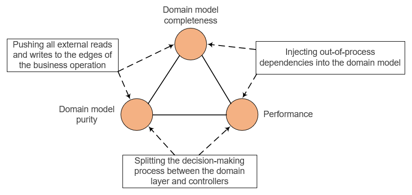
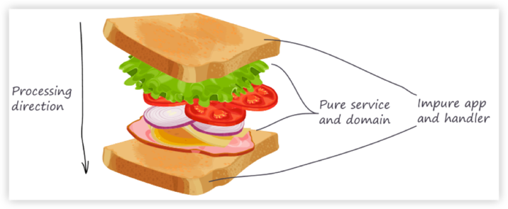
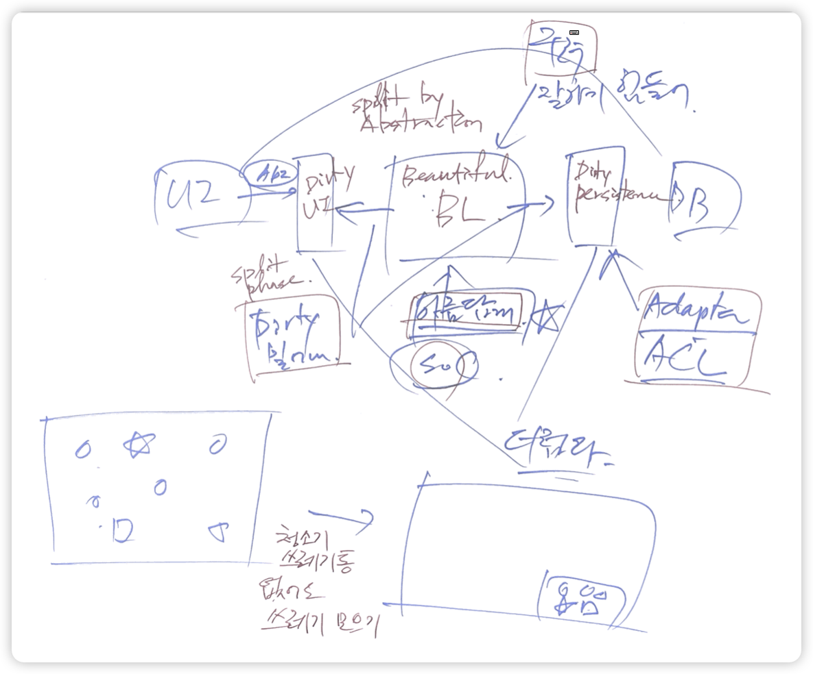

# Terms

## DDD Trilemma



- 빵 구조에 맞도록 로직을 구현하려다 보면 "Domain model encapsulation", "Domain model purity", "Application performance" 등 3개의 속성을 모두
  만족시킬 수 없는 상황이 발생함
    - Domain model encapsulation: domain model completeness. 애플리케이션의 모든 도메인 로직이 도메인 계층에 존재해야. 즉 파편화되지 않아야
    - Domain model purity: 도메인 외부에 의존성을 가지고 않아야
    - Application performance
- 하나를 희생해서 2개만 만족시킬 수는 있음

## DTO

- [Data Transfer Object (DTO) in Spring Boot | by Anand Rathore | Nov, 2023 | Towards Dev](https://towardsdev.com/data-transfer-object-dto-in-spring-boot-c00678cc5946)
- DTO
    - design pattern
    - 서로 다른 계층 간에 데이터를 전송하거나 캡슐화하기 위해 사용
    - 비즈니스 로직을 포함하지 않음
    - 예. FE/BE간, MSA간 데이터 전송
- DTO의 잇점
    - data isolation
    - reduced overhead
    - versioning and compatibility
    - improved security
    - enhanced testing
- mapping
    - manual
    - modelMapper
    - lombok
- formatting different types of values in DTOs
    - @JsonFormat
    - custom method
- Additional Considerations and Best Practices
    - Validation in DTOs

```Java
  @PostMapping("/create")
  public ResponseEntity createUser(@Valid @RequestBody UserDTO userDTO) {
  // Your validation logic is automatically triggered
```

## Event and Commands

- [이벤트와 명령](https://gyuwon.github.io/blog/2023/12/31/events-commands.html)
- 이벤트: 시스템 상에서 발생한 사실을 묘사
- 명령: 생산자가 소비자에게 바라는 바를 기술

## Functional Core & Imperative Shell



[impure-pure-impure 샌드위치](https://fullsteak.dev/posts/fullstack-rescript-architecture-overview/)

- 애플리케이션 로직은
    1. 처리할 데이터를 읽어오기 - **빵**
    2. 데이터 처리(검증, 변경 등) - **속/토핑**
    3. 필요 시 저장 / 결과 반환 - **빵**
- 의 구조를 가지고 있음
- 데이터를 읽고, 저장하는 것과 같은 불순한 빵과 순수 서비스, 도메인 로직을 갖는 속을 분리하자
    - 1, 3번은 Imperative Shell 혹은 Mutable Shell이라고 불림(나는 샌드위치의 빵이라고 부름)
    - 2번은 Functional Core라고 불림(나는 빵의 속 혹은 토핑이라고 부름)
- 이런 구조가 되면 리팩터링, 테스트, 가독성 측면에서 잇점이 있음
- 속/토핑: entity, aggregate root, domain service 등으로 구현
- 이런 구조를 만들려고 할 때 장애물이 나타남: [DDD Trilemma](Terms.md#ddd-trilemma)

## Module

- Application is organized into modules. Each module solves a distinct part of the business problem.
- Modules are loosely coupled. No cyclic dependencies
- Controller, Service, Repository etc of a thing should be in the same package (if package is used for module boundary)
  as they always need to change together when building a new feature aka package-by-feature.
- Packaging by layers (packages like controllers, models, repositories etc) are by definition low in cohesion and would
  not be modular
- from [“Structured Design”](https://www.amazon.com/Structured-Design-Fundamentals-Discipline-Computer/dp/0138544719)

## Pure Function

- No side effects
- No external data source
- calculate only
- 동일 입력 → 동일 출력

## SoC

- 비즈니스 로직 vs 객체 생성, 조립 로직
- 상위 수준 정책 vs 하위 수준 상세
- 본질적 복잡성 vs 우발적 복잡성
- 함수형 코어 / 명령형 껍질

- 뛰어난 역량(리팩터링, 디자인 패턴 등)이 없더라도 위에서 언급한 구분되는 코드들을 구분해 놓을 수는 있음
    - 마치 좋은 청소 도구가 없더라도 손으로 쓰레기를 방의 한 구석에 모아둘 수 있는 것처럼
- 지저분한 것을 완전히 제거는 불가하다
    - 다만 깨끗한 것과 분리해 두어야 하는 것임
    
-  SoC for UI, DB



