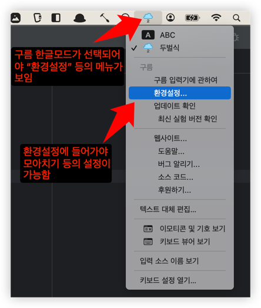
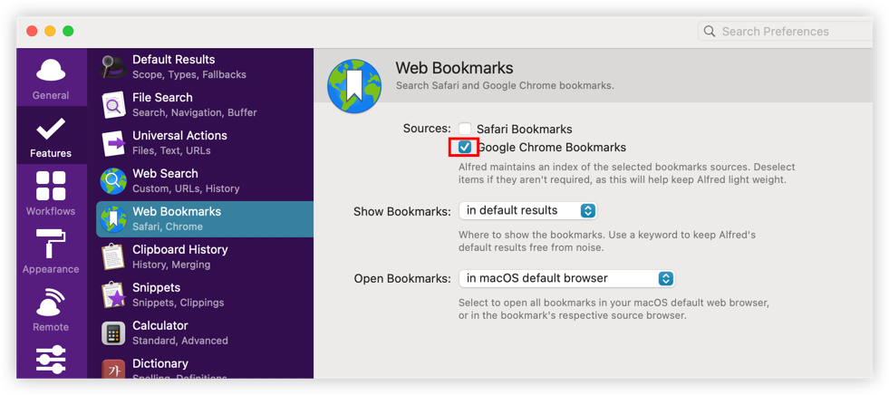

# Tools

> "Give me six hours to chop down a tree and I will spend the first four sharpening the axe."
> - 나무를 베는데 6시간을 준다면, 4시간은 도끼 날을 가는 데 쓰겠다. (에이브러햄 링컨)

## Useful Brew Commands

| command | description                                                              |
|---------|--------------------------------------------------------------------------|
| duf     | Disk Usage/Free Utility                                                  |
| dust    | Like du but more intuitive                                               |
|         | dust -H -r ~/Downloads/                                                  |
| gdu     | go DiskUsage                                                             |
|         | gdu -d# show all mounted disks                                           |
| rg      | (ripgrep)recursively searches the current directory for a regex pattern. |
|         | -c count                                                                 |
|         | -i ignore case                                                           |
|         | --json json result                                                       |
|         | -n line number                                                           |
|         | -p pretty                                                                |
|         | -e pattern                                                               |
|         | -r replace                                                               |
|         | -l, --files-with-matches                                                 |
|         | -z search zip                                                            |

## Mac Settings


## brew

- https://brew.sh/

```shell
/bin/bash -c "$(curl -fsSL https://raw.githubusercontent.com/Homebrew/install/HEAD/install.sh)"
```

### Karabiner Elements

- Simple Modifications
    - 
    - Apple Internal Keyboard: caps_lock → left_control
- Complex Modifications
    - 

## Key Settings


- 구름 입력시 설치 후 반드시 재부팅을 해야 함
- [[맥App]맥북 유저 - 구름입력기(모아치기)](https://dalkomlife.tistory.com/26)
  

## Dracula Theme

- [dracula_theme](https://draculatheme.com)
- intellij, chrome

## iTerm2

- `$ brew install iterm2`
- [iTerm2에 Dracular 테마 적용하기](https://jojoldu.tistory.com/428)
- [iterm - How to export iTerm2 Profiles - Stack Overflow](https://stackoverflow.com/questions/22943676/how-to-export-iterm2-profiles)
    - load할 폴더를 지정해야 export 가능함

## oh-my-zsh

- https://ohmyz.sh/

```
brew install zsh-completions
sh -c "$(curl -fsSL https://raw.githubusercontent.com/robbyrussell/oh-my-zsh/master/tools/install.sh)"
git clone https://github.com/zsh-users/zsh-autosuggestions $ZSH_CUSTOM/plugins/zsh-autosuggestions
```

- [iterm & zsh 설치 및 테마 적용 (dracula)](https://medium.com/@keen0927/iterm-zsh-%EC%84%A4%EC%B9%98-%EB%B0%8F-%ED%85%8C%EB%A7%88-%EC%A0%81%EC%9A%A9-dracula-15252641171)

- [oh-my-zsh 테마 및 유용한 플러그인 정리](https://proni.tistory.com/entry/oh-my-zsh-%ED%85%8C%EB%A7%88-%EB%B0%8F-%EC%9C%A0%EC%9A%A9%ED%95%9C-%ED%94%8C%EB%9F%AC%EA%B7%B8%EC%9D%B8-%EC%A0%95%EB%A6%AC)
- zsh plugins
    ```shell
    zsh-autosuggestions
    zsh-syntax-highlighting
    web-search
        > google zsh
    autojump
    ```

## powerlevel10k

- [romkatv/powerlevel10k: A Zsh theme](https://github.com/romkatv/powerlevel10k)
- https://github.com/romkatv/powerlevel10k?tab=readme-ov-file

```
git clone --depth=1 https://github.com/romkatv/powerlevel10k.git ~/powerlevel10k
echo 'source ~/powerlevel10k/powerlevel10k.zsh-theme' >>~/.zshrc
```

```shell
p10k configure
```

    - rainbow
    - angled
    - sharp
    - flat
    - two lines
    - SOLID
    - full
    - lightest
    - sparse
    - many icons
    - concise
    - transient - n
    - verbose

## brew Formulae

- autojump
    - j ktown4u ; 최근 방문한 디렉토리중 ktown4u가 포함된 디렉토리로 이동
    - jo ktown4u; finder에서 열기
- bat
    - `alias cat='bat --plain --wrap character'`
- chezmoi
    - [Quick start - chezmoi](https://www.chezmoi.io/quick-start/)
- cheat
    - terminal에서 command에 대한 cheat sheet를 보여줌
- bottom
    - `btm`
    - 터미널에서 CPU, Memeory, Network 상태를 그래픽하게 보여줌
- devtoys
    - Converters, Encoders / Decoders, Formatter, Generators, Text(diff)
- [diff-so-fancy](https://github.com/so-fancy/diff-so-fancy)
    - git이 diff 결과에 diff-so-fancy을 사용하도록 설정 변경
      ```shell
      git config --global core.pager "diff-so-fancy | less --tabs=4 -RFX"
      git config --global interactive.diffFilter "diff-so-fancy --patch"
      ```
    - 컬러 최적화
      ```shell
      git config --global color.ui true
  
      git config --global color.diff-highlight.oldNormal    "red bold"
      git config --global color.diff-highlight.oldHighlight "red bold 52"
      git config --global color.diff-highlight.newNormal    "green bold"
      git config --global color.diff-highlight.newHighlight "green bold 22"
  
      git config --global color.diff.meta       "11"
      git config --global color.diff.frag       "magenta bold"
      git config --global color.diff.func       "146 bold"
      git config --global color.diff.commit     "yellow bold"
      git config --global color.diff.old        "red bold"
      git config --global color.diff.new        "green bold"
      git config --global color.diff.whitespace "red reverse"
      ```
- duf
    - Disk Usage/Free Utility
- dust
    - Like du but more intuitive
    - `dust -H -r ~/Downloads/`
- gdu
    - go DiskUsage
    - `gdu-go -d` # show all mounted disks
- exa
    - `exa -l -a -s modified --git`
    - `exa -D -1 -l`
- fig
- figlet
- gh
    - GitHub on the command line
- [hammerspoon](https://www.hammerspoon.org/)
    - esc 눌리면 영문 모드로 강제 변경
      ```
      -- key mapping for vim
      -- Convert input soruce as English and sends 'escape' if inputSource is not English.
      -- Sends 'escape' if inputSource is English.
      -- key bindding reference --> https://www.hammerspoon.org/docs/hs.hotkey.html
      -- local inputEnglish = "com.apple.keylayout.ABC" -- 구름 입력
      -- local inputEnglish = "com.apple.keylayout.Roman" -- default
      local inputEnglish = "com.apple.keylayout.ABC"
      local esc_bind
  
      function convert_to_eng_with_esc()
          local inputSource = hs.keycodes.currentSourceID()
          if not (inputSource == inputEnglish) then
              hs.eventtap.keyStroke({}, "right")
              hs.keycodes.currentSourceID(inputEnglish)
          end
          esc_bind:disable()
          hs.eventtap.keyStroke({}, "escape")
          esc_bind:enable()
      end
  
      function input_eng()
          -- local input_source = hs.keycodes.currentSourceID()
          -- if not (input_source == inputEnglish) then
          hs.keycodes.currentSourceID(inputEnglish)
          -- end
      end
  
      -- hs.hotkey.bind({}, 'tab', input_eng)
  
      esc_bind = hs.hotkey.new({}, "escape", convert_to_eng_with_esc):enable()
      ```
- httpie
    - `http https://www.hammerspoon.org/`
- icdiff
    - `git config --global icdiff.options '--highlight --line-numbers'`
- iterm2
- jq
- [maciejwalkowiak/brew/just](https://just.maciejwalkowiak.com/)
    - `just run`
    - `just kill -p 8080`
- marp-cli
    - `marp -w --theme ~/theme/dracula.css xxx.md`
- neovim
- ngrok
- rectangle
- [ripgrep](https://blog.burntsushi.net/ripgrep)
    - ripgrep (rg) recursively searches the current directory for a regex pattern.
    - `rg`
    - -c count
    - -i ignore case
    - --json json result
    - -n line number
    - -p pretty
    - -e pattern
    - -r replace
    - -l, --files-with-matches
    - -z search zip
- ripgrep-all
    - rga is a line-oriented search tool that allows you to look for a regex in a multitude of file types.
    - `rga "hello" deom/`
    - `fzf` 설치 후 [fzf-Integration](https://github.com/phiresky/ripgrep-all/wiki/fzf-Integration)
        - `rga-fzf data` # search data in all files. 파일 간 이동 가능
- sloth
- tokyo-cabinet
- tree
- truncate
    - `truncate -s0 HM.log`
- [walk - a terminal navigator](https://github.com/antonmedv/walk)
    - `walk`
        - preview mode: Space
        - delete file or directory: dd / undo: u
        - Display icons: Install Nerd Fonts and add --icons flag.
- yazi: Blazing Fast Terminal File Manager
- youtype
    - 한영 모드가 뭔지 보여줌
    - input Source pro와 같이 사용

## Alfred

- web search
- file search
- bookmarks
  - 
- clipboard history
- snippets
- system
- terminal
- workflows
    - [gallery](hhttps://alfred.app/workflows/alfredapp/alfred-gallery/): Alfred Gallery
    - [fs](https://alfred.app/workflows/alfredapp/simple-folder-search/): Simple Folder Search
    - [fzf](https://alfred.app/workflows/yohasebe/fzf/): Fuzzy find files and folders
    - [atop](https://alfred.app/workflows/chrisgrieser/atop/): System Monitoring and Process Management
        - Processes
        - Network
        - Bluetooth
        - Removable Volumes
        - Uptime
        - Speedtest
        - DNS
    - [;](https://alfred.app/workflows/fedecalendino/emoji-mate/): Emoji Mate. Search for emoji
    - [http](https://alfred.app/workflows/rknightuk/http-status-codes/): Search for HTTP status codes
    - [Dash](https://alfred.app/workflows/kapeli/dash/)
    - [13km in inches](https://alfred.app/workflows/biatidigital/calculate-anything/)
    - [ip](https://alfred.app/workflows/alexchantastic/ip-address/): Get your local and external IP addresses
    - [elink](https://alfred.app/workflows/sepulchra/mail-link/): Mail Link. Create link to selected message in Apple
      Mail
    - [Calculate Anything](https://alfred.app/workflows/biatidigital/calculate-anything/): Convert measurements,
      currencies, time, and more using natural language
        - `123 usd in krw`
        - `13cm inches`
        - `time now + 3 workdays`
    - [Network](https://alfred.app/workflows/mrodalgaard/network/): Show and change your network settings
        - wifi / eth / wifilist / vpn / dns
    - [netquality](https://alfred.app/workflows/alfredapp/network-quality/): Network Quality
    - [qr](https://alfred.app/workflows/torreybetts/qr-code/): QR Code. Generates QR codes
    - [rf](https://alfred.app/workflows/jygh/recent-files/): Recent Files. List the most recently created or modified
      files
    - [screen recording](https://alfred.app/workflows/vitor/start-recording/): Start Recording. Shortcuts to record your
      Mac’s audio, screen, or webcam
    - [timer](https://alfred.app/workflows/colomolo/timer/): Timer. Set short timers and pomodoros
        - `timer 40m` / `timers` / `pomodoro`
    - [notion-search-alfred5-workflow](https://github.com/wrjlewis/notion-search-alfred-workflow)
    - [alfred-workflow-jira-search-utilities](https://github.com/scarstens/alfred-workflow-jira-search-utilities)
    - [Add to calendar](https://github.com/toysmoon/alfred-korean-calendar-workflow)

## Arc

- 주요 기능
    - pin tabs to save for later: never auto archive
    - Favorites: Pinned Tabs that are accessible in every Space
    - spaces
    - split view
    - Air Traffic Control: Route Links to the Right Space Automatically
        - Command-T and type "Open Link Preferences", or
        - Go to Arc > Settings > Links
        - url 패턴으로 어떤 스페이스에 열지 지정 가능
        - 디폴트 스페이스도 지정 가능
    - site search
        - history, bookmark, youttube, X, ...
- 주소창에 다양한 명령을 입력해서 OS를 다루는 느낌
    - “Add Right Split”, “Add Left Split”, “Add Top Split” or “Add Bottom Split”.
- Max
    - Ask on Page: ⌘F
    - 5-Second Previews: ⇧ + Hover
- 주요 Shortcuts
    - ^tab 후에 shift+tab+화살표로 열려 있는 탭 이동

| Desc                     | Shortcuts |
|--------------------------|-----------|
| Add **Split** View       | ^\        |
| Capture **Full Page**    | ⌥⇧⌘F      |
| Copy URL as **Markdown** | ⌥⌥⌘C      |
| Developer Tools          | ⌥⌘I       |
| JavaScript Console       | ⌥⌘J       |
| New Note                 | ^⇧N       |
| New **Note(Split)**      | ^⌥N       |
| Next **Space**           | ⌥⌘→       |
| Next/Prev **Tab**        | ⌥⌘↑/↓     |
| Next/Prev **Split View** | ^⇧]/[     |
| **Pin**/Unpin Tab        | ⌘D        |
| popup                    | ⇧+click   |
| Show/Hide **Sidebar**    | ⌘S        |
| Show/Hide **Toolbar**    | ⇧⌘D       |
| View Library 열기          | ⇧⌘L       |

## Chrome Extentiosn

- Vimium
    - gmail
    - PR
- Clip to DEVONthink
- Save to Pocket
- Tab Switcher: 전체 탭 목록을 보여줌. 검색 가능
- Tab to Window/Popup: 현재 탭을 별도의 윈도우로

## Fig

- autocomplete
- scripts
- servers

## AstroNvim

- 설치
    - `git clone --depth 1 https://github.com/AstroNvim/AstroNvim ~/.config/nvim`
    - `git clone git@github.com:msbaek/astrovim_config.git ~/.config/nvim/lua/user`
- explorer
- Todos
- find

## marp

## Things

## DevonThink

## Applications

- Alfred 5.app
- AppCleaner.app
- AWS VPN Client
- CakeBrew.app
    - `brew install cakebrew`
- CheatSheet.app
- DeepL.app
- DEVONthink Pro.app
- DevToys.app
- Disk Diag.app
- draw.io.app
- Evernote.app
- Fantastical 2.app
- Fig.app
- Folx.app
- Gifski.app
- Hammerspoon.app
- iShot.app
- iTerm.app
- [Input Source Pro](https://inputsource.pro/?fbclid=IwAR1rMqROZ4yDQQPTusrCyeeZ2ieCcSNUaZX5B_vgkEXV-z0assd5V81S4Lw)
- Karabiner-Elements.app
- Karabiner-EventViewer.app
- MacX YouTube Downloader.app
- Obsidian.app
- OnyX
- Pocket.app
- Postman.app
- Presentify.app
- Pro Mouse.app
- Rectangle.app
- Shottr.app
- SnippetsLab.app
- SwitchHosts.app
- TextSnipper.app: OCR
- Things3.app
- Timeline 3D.app
- Visual Paradigm.app
- VLC.app
- Vrew.app
- WorkSpaces.app
- Xmind.app
- zoom.us.app
- ZoomMe.app
- [KHOJ](https://github.com/khoj-ai/khoj)
- [youtype](https://github.com/freefelt/YouType) & [inputsource.pro](https://inputsource.pro/)

## Obsidian

- Advanced Slides
- Advanced Tables
- Autocomplete
- Clear Unused Images
- Commander
- Completr
- Dataview
- Dynamic Table of Contents
- Editor Syntax Highlight
- ExcaliBrain
- Excalidraw
- Icon Folder
- MAKE.md
- Outliner
- Paste URL into selection
- Projects
- QuickAdd
- Recent Files
- Zoottelkeeper